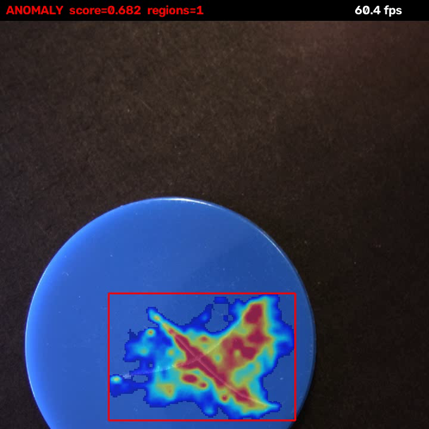

# FastFlow Anomaly Detector

## Metadata

| Field | Value |
| --- | --- |
| Category | anomaly-detection |
| Difficulty | Intermediate |
| Tags | anomaly-detection, fastflow, segmentation, rtsp, insight |
| Languages | C++, Python |
| Status | stable |
| Binary Name | fastflow-anomaly-detector |
| Model | fastflow_demo |

## Concept

Flags surface defects on parts in one RTSP stream with an anomaly model trained on good parts only, and sends Insight the video with a defect heatmap drawn on it.

The decoded frame leaves the graph together with its anomaly map, so the application can paint the heatmap onto the pixels it came from and send the finished picture to Insight as H.264 video. Setting `output.save_dir` writes the same annotated frames as JPEGs.

```
RTSP decode (NV12) --> branch --> frame ------------+
                            \--> model (CVU preprocess + MLA FastFlow) --> anomaly map
                                                    |
    frame + map --> heatmap, boxes and verdict drawn on the frame --> video_sender
                                                        (H264 RTP/UDP -> Insight)
```

FastFlow returns a 256x256 map with the probability that each pixel does not belong to a good part. Connected regions at or above `inference.threshold` that cover at least `inference.min_region_px` map pixels are the defects; smaller ones are the speckle a good part produces. The heatmap covers only those regions, each gets a box, and a banner carries the verdict, the highest probability in the frame and the live frame rate. A good part therefore shows the plain picture with a green `OK`.

A FastFlow package knows one product. The packaged model knows the blue discs of the sample clip; for your own product, train with anomalib and plug the compiled package in, see [Use Your Own Model](#use-your-own-model).

## Preview



## Prerequisites

- `sima-cli` ([documentation](https://developer.sima.ai/software/tools/sima-cli/)) on a supported Modalix or DevKit target.
- An RTSP H.264 source with a square picture and an [Insight](https://developer.sima.ai/software/tools/insight/) URL reachable from the target. Insight can host the sample clip `assets/datasets/blue-discs/discs_demo.mp4`.

## Install Apps

Install the latest Neat Apps runtime and enter the installed bundle:

```bash
sima-cli neat install apps
cd prebuilt-apps
APP_DIR=examples/anomaly-detection/fastflow-anomaly-detector
```

Run the remaining commands from `prebuilt-apps/`.

## Prepare the Model

| Model package | Role | Source |
| --- | --- | --- |
| `fastflow_demo_mpk.tar.gz` | Default | Direct artifact (Model Zoo `fastflow_demo`) |
| `<your-model>_mpk.tar.gz` | Supported | Compiled from an anomalib FastFlow export, see [Use Your Own Model](#use-your-own-model) |

Model packages come from the Model Zoo release below, which can differ from the installed platform version.

```bash
export MODELZOO_VERSION="2.1.3"
mkdir -p models
cd models
sima-cli download "https://docs.sima.ai/pkg_downloads/SDK${MODELZOO_VERSION}/model_zoo/gen2/anomaly_detection/fastflow_demo/fastflow_demo_mpk.tar.gz"
cd ..
```

Set `model.path` in the config to the downloaded package.

## Prepare Insight

[Insight](https://developer.sima.ai/software/tools/insight/) can host the input stream and show the annotated video. Upload `assets/datasets/blue-discs/discs_demo.mp4` under *RTSP Source* in the Insight Web UI, or use a clip of your own parts.

In the Insight Web UI, start the stream and copy its source URL. From a board, replace the container port shown in the URL with the published host port that `neat --json` reports.

## Configure

Open `${APP_DIR}/src/common/config.yaml`. Set `model.path`, `source.rtsp_url` and `output.insight.host`. If Insight uses a nondefault video port, set `output.insight.video_port` to the port reported by `neat --json`.

`output.heat_max` and `output.alpha` control the overlay: the first is the probability drawn at full colour, the second the opacity over the frame.

The stream must carry a square picture: the model input is square and its preprocess letterboxes anything else, which flattens the map. Keep `inference.frames` at `0` to run until you stop the application.

## Run

### C++

```bash
./${APP_DIR}/src/cpp/pre-built/fastflow-anomaly-detector \
  --config ${APP_DIR}/src/common/config.yaml
```

### Python

```bash
source ~/pyneat/bin/activate
python3 ${APP_DIR}/src/python/main.py \
  --config ${APP_DIR}/src/common/config.yaml
```

## Expected Result

Both applications print one line when the pipeline is up, then run silently:

```
rtsp=rtsp://<insight-host-ip>:8554/src1 stream=720x720@30 map=256x256 threshold=0.5 min_region_px=300 insight=<insight-host-ip> video=9000 channel=0
```

Open the Insight Video Viewer for channel 0. The sample clip alternates defective and good discs, so the heatmap and the red `ANOMALY` banner appear and disappear every few discs. Stop with Ctrl-C; the application prints a summary:

```
processed=1080 flagged=590 video_sender=<insight-host-ip>:9000
```

Set `runtime.profile` to `true` for a rolling frame-rate line. Both applications keep up with a 720x720 stream at 30 fps on a Modalix.

## Troubleshooting

- Verify stream reachability if the first frame times out. From a board, use the published host port instead of the container port.
- Verify the Insight host and video port if no video arrives.
- Verify `model.normalize` and the stream aspect ratio if defective parts show no heatmap: a wrong normalisation or a letterboxed frame flattens the map.
- Raise `inference.min_region_px` if good parts are flagged.

## Use Your Own Model

**1. Train and export with anomalib.** Train FastFlow on square photos of good parts with [anomalib](https://github.com/open-edge-platform/anomalib), using its `Fastflow` model and `Folder` dataset. Set `flow_steps: 4` and `conv3x3_only: true` in the model config: anomalib's default of 8 steps loses pixel accuracy in bfloat16 on the MLA, 4 steps keep it. Export at 256x256:

```bash
anomalib export --model Fastflow --ckpt_path model.ckpt --export_type onnx --input_size "[256, 256]"
```

**2. Compile.** On the development host, in the Model Compiler environment, from a clone of this repository (the compile helper is not part of the installed bundle):

```bash
activate-model-compiler
python3 examples/anomaly-detection/fastflow-anomaly-detector/scripts/compile_model.py \
  --model model.onnx --calib-images /data/my_product/train/good
```

The script converts the network to bfloat16 and writes `build/model/model_mpk.tar.gz`. It patches two constructs in anomalib's export that the Model Compiler mishandles, the per-image LayerNorm and the 5-D map average; without the patches the package produces noise or does not load. There is no INT8: FastFlow's coupling blocks amplify 8-bit error until the map saturates on every image.

`--calib-images` needs photographs of real good parts even though bfloat16 fits no quantisation scales. Compiled from a synthetic input instead, the same export scores image AUROC 0.50 with the map saturated on every image, against 0.99 with the photographs.

**3. Plug in.** Copy the package to `models/` and change three keys in `config.yaml` together:

```yaml
model:
  path: models/model_mpk.tar.gz
  normalize:                 # anomalib packages normalise inside the graph, so zeros and ones;
    mean: [0.0, 0.0, 0.0]    # the demo package needs its blue-disc mean instead
    stddev: [1.0, 1.0, 1.0]
inference:
  min_region_px: 1000        # smallest region that counts as a defect; per product
```

For `min_region_px`, run the application on good parts and raise the value until the summary reports `flagged=0`, then check that defective parts are still flagged. Measured on MVTec AD bottle on a Modalix, the 4-step model keeps image AUROC 0.99 and pixel AUROC 0.97, and a package runs at about 7 ms per inference.

## Source Files

- C++ reference source: `src/cpp/main.cpp`
- Python source: `src/python/main.py`
- Shared config: `src/common/config.yaml`

The packaged C++ source is an implementation reference. Run the executable under `src/cpp/pre-built/`; the installed bundle does not include CMake files.

## Development From Source

To modify, compile, or test this example, use the [Apps contributor workflow](https://github.com/sima-neat/apps/blob/main/CONTRIBUTING.md).
