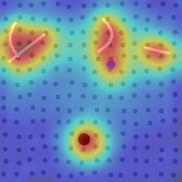

# PatchCore Anomaly Detector

## Metadata

| Field | Value |
| --- | --- |
| Category | anomaly-detection |
| Difficulty | Advanced |
| Tags | anomaly-detection, patchcore, wide-resnet50-2, memory-bank, calibration |
| Languages | C++, Python |
| Status | stable |
| Binary Name | patchcore-anomaly-detector |
| Model | patchcore_wide_resnet50_2 |

## Concept

Detects visual anomalies in industrial images or video using a compiled WideResNet-50 patch-feature extractor and a host-side coreset memory bank calibrated from your own known-good images.

## Preview



## Prerequisites

- `sima-cli` ([documentation](https://developer.sima.ai/software/tools/sima-cli/)) on a supported Modalix or DevKit target.
- To run the Python variant: the Neat runtime's Python virtual environment at `~/pyneat`, created once when the Neat runtime is installed on the target (part of standard DevKit/SDK setup, not this app's install step) -- see the `sima-cli` documentation above.
- For full `video_file`/`rtsp` frame rate in the Python variant: `~/pyneat`'s numpy needs a real BLAS backend. Some DevKit images ship an apt-installed numpy linked against plain reference BLAS (no threading, no vectorized matmul), not a PyPI wheel's bundled OpenBLAS -- check with `python3 -c "import numpy; numpy.show_config()"` (look for `openblas` under `found: true`; a build with only `blas`/`lapack` and no BLAS library listed is the reference build). If so, `source ~/pyneat/bin/activate && pip install numpy==1.26.4` (the newest version still within pyneat's own `numpy<2,>=1.24` pin) swaps in a real OpenBLAS build; this app's own single-threaded-BLAS default (see `main.py`'s top-of-file `OPENBLAS_NUM_THREADS`) is safe either way -- it's a no-op against reference BLAS and roughly doubles video/rtsp throughput against OpenBLAS on hardware this was measured on.
- For `source.type: rtsp`, an RTSP H.264, H.265, or MJPEG source reachable from the target.
- For `source.type: video_file` or `rtsp`, [Insight](https://developer.sima.ai/software/tools/insight/) (or another RTP receiver) to view the live annotated stream.

## Install Apps

```bash
sima-cli neat install apps
cd prebuilt-apps
APP_DIR=examples/anomaly-detection/patchcore-anomaly-detector
```

Run the remaining commands from `prebuilt-apps/`.

## Prepare the Model

```bash
mkdir -p models
cd models
export MODELZOO_VERSION="2.1.3"
sima-cli download "https://docs.sima.ai/pkg_downloads/SDK${MODELZOO_VERSION}/models/modalix/patchcore_wide_resnet50_2_bf16_mla.tar.gz"
cd ..
```

Set `model.path` in the example config to the downloaded package.

## Prepare the memory bank

Before scoring anything, build a memory bank from a directory of known-good ("nominal") images of your own inspection target. The bundled `assets/datasets/patchcore/` set exists only to make this demo reproducible without your own images, and is not a substitute for your own target's data:

- `nominal/` -- 16 real known-good reference images. `calibration.nominal_images_dir` points here by default; this is what `--calibrate` below builds the shipped memory bank from.
- `held_out_normal/` -- 4 further real known-good images, deliberately excluded from calibration, used only by this example's own test suite to check that genuinely normal images the bank never saw still score below the threshold.
- `images/` -- an image-directory scoring input: one normal-looking image (`plain_0.png`) and four images with synthetic scratch defects (`scratch_0.png`-`scratch_3.png`), for exercising `source.type: image_dir` end to end.

To calibrate against your own inspection target instead, point `calibration.nominal_images_dir` at a directory of your own known-good images (a few dozen is a reasonable starting point) before running `--calibrate`.

```bash
./${APP_DIR}/src/cpp/pre-built/patchcore-anomaly-detector --calibrate --config ${APP_DIR}/src/common/config.yaml
```

or, with the Python variant:

```bash
source ~/pyneat/bin/activate
pip install -r ${APP_DIR}/src/python/requirements.txt
python3 ${APP_DIR}/src/python/main.py --calibrate --config ${APP_DIR}/src/common/config.yaml
```

Both write `memory_bank.path` / `memory_bank.meta_path` from `calibration.nominal_images_dir`, and share the same on-disk format -- a bank built with one binary loads and scores in the other. Re-run `--calibrate` whenever `model.path` changes, the inspection target changes, or you change `calibration.threshold_percentile`.

## Configure

Open `${APP_DIR}/src/common/config.yaml`. Set `model.path`, `source.type` and its matching source fields, `memory_bank.path` / `memory_bank.meta_path`, and `calibration.nominal_images_dir` before the first `--calibrate` run. For `source.type: video_file` or `rtsp`, also set `output.insight.host` to the machine running Insight. For `source.type: rtsp` with `codec: h265` or `mjpeg`, also set `source.rtsp.width`/`height` (see Troubleshooting).

## Run

### C++

```bash
./${APP_DIR}/src/cpp/pre-built/patchcore-anomaly-detector \
  --config ${APP_DIR}/src/common/config.yaml
```

### Python

```bash
source ~/pyneat/bin/activate
pip install -r ${APP_DIR}/src/python/requirements.txt
python3 ${APP_DIR}/src/python/main.py \
  --config ${APP_DIR}/src/common/config.yaml
```

Every processed image/frame prints its score, the configured threshold, and the pass/fail verdict. `image_dir` writes annotated heatmap overlays to `output.dir`; `video_file`/`rtsp` additionally stream the live overlay to Insight (`output.insight.host`/`video_port`) and, if `output.save_every > 0`, also save periodic snapshots to `output.dir`.

```
assets/datasets/patchcore/images/scratch_0.png: score=30.8839 threshold=19.4000 verdict=ANOMALOUS (mla=42.1ms host=6.7ms)
...
Done: 10 images processed -- overlays written to sandbox/patchcore-anomaly-detector
```

## Troubleshooting

- `memory bank not found`: run `--calibrate` first.
- `memory bank was built against a different model package`: `model.path` changed since the last `--calibrate`; rebuild the bank.
- `bank_meta.json is missing patch_threshold`: bank was built before this field existed; recalibrate.
- Confirm `source.image_dir` / `source.video_path` / `source.rtsp.url` matches the configured `source.type`.
- `rtsp`: `failed to resolve source geometry` -- the stream wasn't reachable, or (for `codec: h265`/`mjpeg`) didn't expose probeable width/height; set `source.rtsp.width`/`height` explicitly.
- Nothing appears in Insight: confirm `output.insight.host` is reachable and Insight is listening on the configured `video_port`/`channel`.
- `--calibrate` looks stalled on a large nominal set: it prints progress every 10 images; lowering `calibration.coreset_ratio` reduces both build time and per-frame scoring cost.

## Source Files

- C++ reference source: `src/cpp/main.cpp`, `src/cpp/patchcore_memory_bank.h`/`.cpp`
- Python source: `src/python/main.py`, `src/python/patchcore_scoring.py`
- Shared config: `src/common/config.yaml`

The packaged C++ source is an implementation reference. Run the executable under `src/cpp/pre-built/`; the installed bundle does not include CMake files.

## Development From Source

To modify, compile, or test this example, use the [Apps contributor workflow](https://github.com/sima-neat/apps/blob/main/CONTRIBUTING.md).

## Known limitations

- MVTec AD is not vendored into this repo or used for the shipped memory bank (its license is non-commercial research use); build your own bank from a nominal set captured on your own target.
- A live camera input is out of scope for this example; `source.type` covers image directories, video files, and RTSP/encoded streams only.
