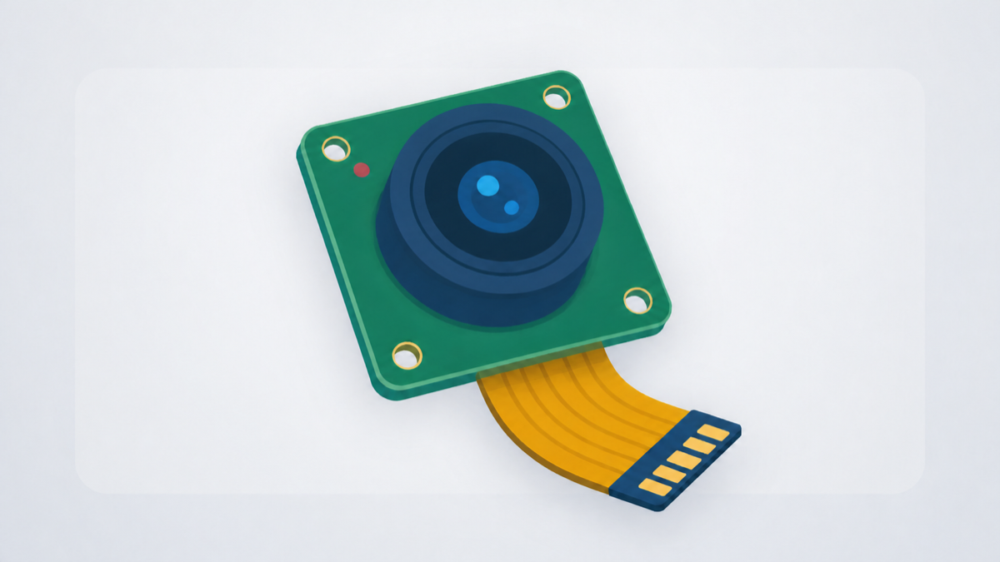

# MIPI Camera Capture

## Metadata

| Field | Value |
| --- | --- |
| Category | benchmarking |
| Difficulty | Beginner |
| Tags | camera, mipi, libcamera, zero-copy, diagnostics |
| Languages | Python |
| Status | stable |
| Binary Name | mipi-camera-capture |
| Model | None |

## Concept

Captures NV12 frames from a MIPI camera and saves selected frames with timing and luminance diagnostics. It uses Neat CameraInput with a zero-copy DMA-BUF path.

The camera-to-Neat path remains zero-copy. Copying occurs only for the explicitly selected snapshots written by the Python application.

## Preview



## Prerequisites

- `sima-cli` ([documentation](https://developer.sima.ai/software/tools/sima-cli/)) on a supported Modalix or DevKit target.
- A MIPI camera supported by the installed kernel, libcamera pipeline, and IPA configuration.
- A Neat Library and libcamera release that supports downstream-owned camera capture buffers.

List the camera names visible to libcamera:

```bash
cam -l
```

## Install Apps

Install the latest Neat Apps runtime and enter the installed bundle:

```bash
sima-cli neat install apps
cd prebuilt-apps
APP_DIR=examples/benchmarking/mipi-camera-capture
```

Run the remaining commands from `prebuilt-apps/`.

## Prepare the Model

This camera capture example does not use a model. No model download or compilation is required.

## Configure

Open `${APP_DIR}/src/common/config.yaml`. Set `camera.name` to a name reported by `cam -l`, or leave it empty to use the default camera. Change the capture duration, sample times, or output directory if needed.

Keep `camera.strict_zero_copy` enabled to report an error instead of silently copying frames when zero-copy capture is unavailable.

## Run

```bash
source ~/pyneat/bin/activate
pip install -r ${APP_DIR}/src/python/requirements.txt
python3 ${APP_DIR}/src/python/main.py \
  --config ${APP_DIR}/src/common/config.yaml
```

The output directory contains sampled NV12 frames and `summary.json`. A Modalix
DevKit does not ship `ffmpeg`, so copy a frame to a workstation with FFmpeg
installed and convert it there for visual inspection:

On the target, pick a frame and copy it out. The exact filename includes the
observed capture time, so take the one the application printed:

```bash
FRAME="$(realpath "$(find sandbox/mipi-camera-capture -name 'frame_00_*.nv12' -print -quit)")"
echo "${FRAME}"
```

From the workstation, copy that file over and convert it there:

```bash
scp <user>@<target>:<path-printed-above> ./frame.nv12
ffmpeg -f rawvideo -pixel_format nv12 -video_size 1920x1080 \
  -i frame.nv12 \
  -frames:v 1 frame.png
```

## Expected Result

The application prints `CAPTURE` records for the requested sample times and one final `SUMMARY` record. A healthy run reports frames, zero timeouts, `error: null`, and stable luminance percentiles.

## Troubleshooting

- If camera discovery fails, confirm that `cam -l` reports the configured name.
- If strict allocation negotiation fails, confirm that the installed Neat Library, libcamera plugin, and pipeline handler were built from compatible releases.
- If the requested format is adjusted or rejected, select a resolution, frame rate, and NV12 layout supported by the sensor and ISP.
- Set `strict_zero_copy: false` only when a diagnostic run may use Neat's explicit CPU-copy fallback.

## Source Files

- Python source: `src/python/main.py`
- Shared runtime configuration: `src/common/config.yaml`

## Development From Source

To modify or test this example, use the [Apps contributor workflow](https://github.com/sima-neat/apps/blob/main/CONTRIBUTING.md).
