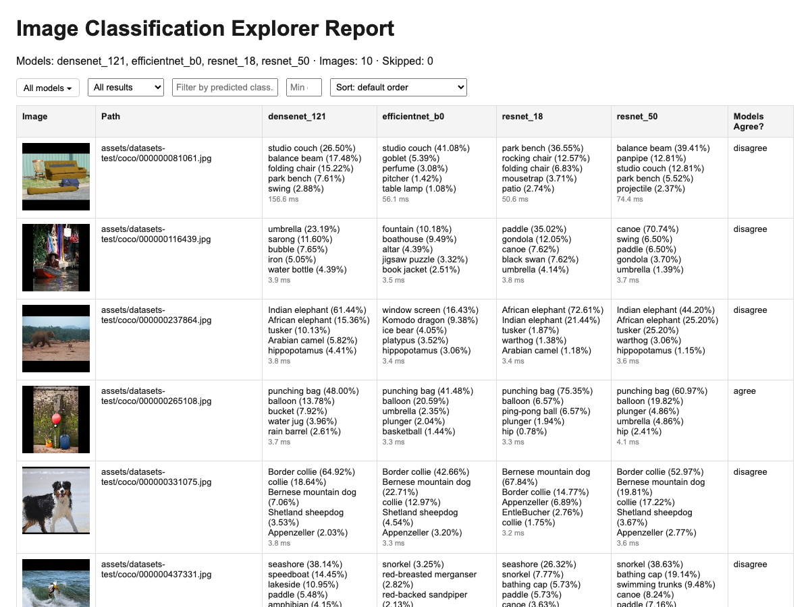

# Image Classification Explorer

## Metadata

| Field | Value |
| --- | --- |
| Category | classification |
| Difficulty | Beginner |
| Tags | classification, model, mpk, report |
| Languages | C++, Python |
| Status | stable |
| Binary Name | image-classification-explorer |
| Model | resnet_50, resnet_18, efficientnet_b0, densenet_121 |

## Concept

Classifies a single image or a folder of images with one or more models and shows predictions,
confidence, and where models agree or disagree in a browsable HTML report with JSON and CSV
results.

## Preview

The pipeline classifies this goldfish image by default:


## Prerequisites

- `sima-cli` ([documentation](https://developer.sima.ai/software/tools/sima-cli/)) on a supported Modalix or DevKit target.

## Install Apps

Install the latest Neat Apps runtime and enter the installed bundle:

```bash
sima-cli neat install apps
cd prebuilt-apps
APP_DIR=examples/classification/image-classification-explorer
```

Run the remaining commands from `prebuilt-apps/`.

## Prepare the Model

| Model package | Model Zoo name |
| --- | --- |
| `resnet_50_mpk.tar.gz` | `resnet_50` |
| `resnet_18_mpk.tar.gz` | `resnet_18` |
| `efficientnet_b0_mpk.tar.gz` | `efficientnet_b0` |
| `densenet_121_mpk.tar.gz` | `densenet_121` |

Model packages come from the Model Zoo release below, which can differ from the installed platform version.

```bash
export MODELZOO_VERSION="2.1.3"
mkdir -p models
cd models
sima-cli modelzoo -v "${MODELZOO_VERSION}" get resnet_50
sima-cli modelzoo -v "${MODELZOO_VERSION}" get resnet_18
sima-cli modelzoo -v "${MODELZOO_VERSION}" get efficientnet_b0
sima-cli modelzoo -v "${MODELZOO_VERSION}" get densenet_121
cd ..
```

Each model is its own profile in the config; add more supported classification models the same
way by adding another entry under `models`.

## Configure

Open `${APP_DIR}/src/common/config.yaml`:

- `models.<name>.path` — path to each downloaded model package.
- `io.input` — a single image path or a directory of images. Leave empty to classify the bundled
  sample goldfish image (downloads it on first run; needs network access).
- `io.output_dir` — where `report.html`, `report.json`, and `report.csv` are written.

Remove a `models` entry to run with fewer models, or add one to compare an additional model. Each
profile is fully self-contained:

| Field | Meaning |
| --- | --- |
| `path` | Compiled model package. |
| `input_width` / `input_height` | Model input dimensions. |
| `preprocess` | Preprocessing preset. Only `imagenet` (standard ImageNet normalization) is implemented. |
| `output` | Output interpretation. Only `softmax` is implemented: the model produces raw per-class scores, softmax is applied, and index `i` maps to `label_map[i]`. |
| `num_classes` | Number of classes the model outputs. |
| `label_map` | Path to a text file with one label per line (line index = class id). Omit for numeric labels. |
| `top_k` | How many predictions to keep per image. |

`preprocess` and `output` exist so a future model that needs different normalization or output
handling can declare it explicitly instead of being silently misinterpreted; adding support for a
new value is a small, explicit code change in both `main.py` and `main.cpp`.

## Run

### C++

```bash
./${APP_DIR}/src/cpp/pre-built/image-classification-explorer \
  --config ${APP_DIR}/src/common/config.yaml
```

### Python

```bash
source ~/pyneat/bin/activate
pip install -r ${APP_DIR}/src/python/requirements.txt
python3 ${APP_DIR}/src/python/main.py \
  --config ${APP_DIR}/src/common/config.yaml
```

## Understanding the Report

Each run writes to `io.output_dir` (default `report/`):

| File | Contents |
| --- | --- |
| `report.html` | Browsable report: thumbnails, per-model predictions and confidence, agreement/disagreement, filtering, sorting. |
| `report.json` | Same results in machine-readable form: predictions, timing, per-class summary, skipped files. |
| `report.csv` | Flat per-image, per-model rows: top-1 class, confidence, inference time, full top-k. |
| `thumbnails/` | Small JPEG copies of each classified image, referenced by `report.html`. |

Open `report.html` in a browser. It lists every classified image with a thumbnail and each
selected model's top predictions and confidence. Use the controls above the table to:

- Check or uncheck models to show or hide their columns and recompute agreement for just the
  models you pick.
- Filter by result (all / agreement / disagreement / errors), by predicted class (text search), or
  by a minimum confidence threshold.
- Sort by confidence, predicted class, or result.

Example report (4 models against a directory of images):



Files that could not be read or have an unsupported extension are listed separately and do not
stop the run.

## Troubleshooting

- Verify each `models.<name>.path` if a model fails to load.
- Set `io.input` to a readable local image or directory if downloading or decoding the fallback
  image fails.
- Check `report.json`'s `skipped` list and each image's `error` field for files that failed to
  process.

## Source Files

- C++ reference source: `src/cpp/main.cpp`
- Python source: `src/python/main.py`
- Shared config: `src/common/config.yaml`
- Bundled ImageNet label map: `src/common/imagenet_labels.txt`

The packaged C++ source is an implementation reference. Run the executable under `src/cpp/pre-built/`; the installed bundle does not include CMake files.

## Development From Source

To modify, compile, or test this example, use the [Apps contributor workflow](https://github.com/sima-neat/apps/blob/main/CONTRIBUTING.md).
