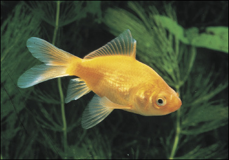

# Simple Image Classification Pipeline

## Metadata
| Field | Value |
| --- | --- |
| Category | classification |
| Difficulty | Beginner |
| Tags | classification, model, mpk |
| Status | experimental |
| Binary Name | simple-image-classification-pipeline |
| Model | resnet_50 |

## Concept
Minimal Model API usage with a compiled ResNet50 model package. The example loads the package, runs single-image inference, and prints top-1/top-5 classification output.

## Preview
The pipeline is trying to classify this goldfish image.



## Supported Models
Primary model: `resnet_50`

Download into `assets/models/`:
- `mkdir -p assets/models && cd assets/models && sima-cli modelzoo -v 2.0.0 get resnet_50 && cd ../..`

## Prerequisites
- Installed Neat SDK.
- Model artifacts are user-managed and should be downloaded into `assets/models/`.
- Download command: `mkdir -p assets/models && cd assets/models && sima-cli modelzoo -v 2.0.0 get resnet_50 && cd ../..`

## Important Behavior
- Runtime settings live in `common/config.yaml`.
- If `io.image` is null, the example downloads a sample goldfish image automatically.
- `validation.min_probability` controls the pass/fail threshold for the expected class probability.

## Command-Line Options
### C++
- Invocation:
  `./build/examples/classification/simple-image-classification-pipeline/simple-image-classification-pipeline [--config <path>]`
- Required arguments:
  None. Defaults to `common/config.yaml`.
- Optional arguments:
  `--config <path>`

### Python
- Invocation:
  `python examples/classification/simple-image-classification-pipeline/python/main.py [--config <path>]`
- Required arguments:
  None. Defaults to `common/config.yaml`.
- Optional arguments:
  `--config <path>`

## Build
### Build From The Apps Repo
```bash
cd <apps-repo-root>
./build.sh
```

Binary output:
```bash
./build/examples/classification/simple-image-classification-pipeline/simple-image-classification-pipeline
```

### Build This Example Directly With CMake
```bash
cd <apps-repo-root>/examples/classification/simple-image-classification-pipeline
cmake -S cpp -B build
cmake --build build -j
```

Binary output:
```bash
./build/simple-image-classification-pipeline
```

## Run
### C++
```bash
./build/examples/classification/simple-image-classification-pipeline/simple-image-classification-pipeline \
  --config examples/classification/simple-image-classification-pipeline/common/config.yaml
```

### Python
```bash
source ~/pyneat/bin/activate
pip install -r examples/classification/simple-image-classification-pipeline/python/requirements.txt
python examples/classification/simple-image-classification-pipeline/python/main.py \
  --config examples/classification/simple-image-classification-pipeline/common/config.yaml
```

## Debugging Notes
- If you see a model load error, verify the model file exists at `assets/models/resnet_50_mpk.tar.gz`.
- If image decode fails, set `io.image` in the config.
- If top-1 validation fails, try lowering `validation.min_probability` for debug runs.

## Source Files
- C++ source: `cpp/main.cpp`
- Python source: `python/main.py`
- Shared config: `common/config.yaml`
