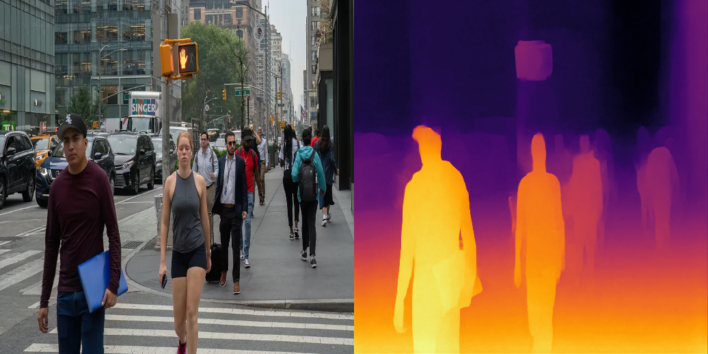

# Image Folder Depth Estimator

## Metadata
| Field | Value |
| --- | --- |
| Category | depth-estimation |
| Difficulty | Intermediate |
| Tags | depth-estimation |
| Status | experimental |
| Binary Name | image-folder-depth-estimator |
| Model | depth_anything_v2_vits |

## Concept
Depth-map generation for image folders. The example runs inference per image and writes visual depth outputs.

## Preview
Snippet from a pipeline run:



## Supported Models
Primary model: `depth_anything_v2_vits`

Download into `assets/models/`:
- `mkdir -p assets/models && cd assets/models && sima-cli modelzoo -v 2.0.0 get depth_anything_v2_vits && cd ../..`

## Prerequisites
- Installed Neat SDK.
- Model artifacts are user-managed and should be downloaded into `assets/models/`.
- Download command: `mkdir -p assets/models && cd assets/models && sima-cli modelzoo -v 2.0.0 get depth_anything_v2_vits && cd ../..`

## Important Behavior
- Runtime settings are read from `common/config.yaml` by default.
- Input directory is scanned for common image extensions.
- Output files are written to the configured output directory.

## Command-Line Options
### C++
- Invocation:
  `./build/examples/depth-estimation/image-folder-depth-estimator/image-folder-depth-estimator [--config <path>]`
- Optional arguments:
  `--config <path>`: YAML config path. Defaults to `common/config.yaml`.

### Python
- Invocation:
  `python examples/depth-estimation/image-folder-depth-estimator/python/main.py [--config <path>]`
- Optional arguments:
  `--config <path>`: YAML config path. Defaults to `common/config.yaml`.

## Build
### Build From The Apps Repo
```bash
cd <apps-repo-root>
./build.sh
```

Binary output:
```bash
./build/examples/depth-estimation/image-folder-depth-estimator/image-folder-depth-estimator
```

### Build This Example Directly With CMake
```bash
cd <apps-repo-root>/examples/depth-estimation/image-folder-depth-estimator
cmake -S cpp -B build
cmake --build build -j
```

Binary output:
```bash
./build/image-folder-depth-estimator
```

## Run
Edit `examples/depth-estimation/image-folder-depth-estimator/common/config.yaml` to point at the model and image folder.

### C++
```bash
./build/examples/depth-estimation/image-folder-depth-estimator/image-folder-depth-estimator
```

### Python
```bash
source ~/pyneat/bin/activate
pip install -r examples/depth-estimation/image-folder-depth-estimator/python/requirements.txt
python examples/depth-estimation/image-folder-depth-estimator/python/main.py
```

## Debugging Notes
- Check model path first if startup fails.
- If no outputs are produced, verify `input_dir` has valid images.
- Check write permissions on `output_dir`.

## Source Files
- C++ source: `cpp/main.cpp`
- Python source: `python/main.py`
- Shared config: `common/config.yaml`
