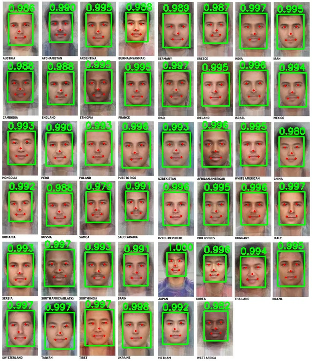

# Face Detector

## Metadata

| Field | Value |
| --- | --- |
| Category | face-detection |
| Difficulty | Beginner |
| Tags | retinaface, face-detection |
| Languages | C++, Python |
| Status | stable |
| Binary Name | face-detector |
| Model | retinaface_mobilenet25 |

## Concept

Finds faces in a folder of images with RetinaFace, then saves annotated results with confidence scores and five facial landmarks.

The application decodes the model output, removes weak and duplicate detections, and writes annotated images.

## Preview



## Prerequisites

- `sima-cli` ([documentation](https://developer.sima.ai/software/tools/sima-cli/)) on a supported Modalix or DevKit target.

## Install Apps

Install the latest Neat Apps runtime and enter the installed bundle:

```bash
sima-cli neat install apps
cd prebuilt-apps
APP_DIR=examples/face-detection/face-detector
```

Run the remaining commands from `prebuilt-apps/`.

## Prepare the Model

| Model | Role | Source |
| --- | --- | --- |
| `retinaface_mobilenet25_mod_0_mpk.tar.gz` | Default | Direct artifact |

This model comes from the direct SDK artifact release below, which can differ from the installed platform version.

```bash
export MODELZOO_VERSION="2.1.3"
mkdir -p models
cd models
sima-cli download "https://docs.sima.ai/pkg_downloads/SDK${MODELZOO_VERSION}/models/modalix/retinaface_mobilenet25_mod_0_mpk.tar.gz"
cd ..
```

Set `model.path` in the config to the downloaded package.

## Configure

Open `${APP_DIR}/src/common/config.yaml` and set `model.path`, `io.input_dir`, and `io.output_dir`. You can also change the confidence threshold or turn facial landmarks off.

## Run

### C++

```bash
./${APP_DIR}/src/cpp/pre-built/face-detector \
  --config ${APP_DIR}/src/common/config.yaml
```

### Python

```bash
source ~/pyneat/bin/activate
pip install -r ${APP_DIR}/src/python/requirements.txt
python3 ${APP_DIR}/src/python/main.py \
  --config ${APP_DIR}/src/common/config.yaml
```

## Expected Result

The application prints one line per image with the number of faces found and the
file it wrote:

```text
[1/21] 000000081061.jpg: 0 detections -> 000000081061_retinaface.png
[2/21] 000000116439.jpg: 1 detections -> 000000116439_retinaface.png
[3/21] 000000129492.jpg: 2 detections -> 000000129492_retinaface.png
```

`io.output_dir` (default `sandbox/face-detector`) then holds one annotated PNG
per input image; with the packaged `assets/datasets/coco` folder that is 21
files. The C++ binary is much more verbose per image: alongside each of these it
prints `Model produced N tensor(s)`, a shape line per output tensor, a
`Detections: N` line, and a score and box line per detection. All of that is
normal; Python prints only the one line per image shown above.

Counts vary a lot between images. These are general COCO photographs rather than
a face dataset, and many contain no people, so `0 detections` on a given image is
normal. A run where every image reports `0 detections` is the case worth investigating;
`decode.confidence_threshold` is the usual cause. A wrong `model.path` does not
produce this — it stops the run outright, either reporting the missing file or
failing on the tensor count.

## Troubleshooting

- Verify `model.path` if model loading fails.
- Lower `decode.confidence_threshold` if expected faces are missing.
- Adjust `decode.nms_iou` or `decode.top_k` if duplicate boxes remain.
- Confirm `io.output_dir` can be created.

## Source Files

- C++ reference source: `src/cpp/main.cpp`
- Python source: `src/python/main.py`
- Shared config: `src/common/config.yaml`

The packaged C++ source is an implementation reference. Run the executable under `src/cpp/pre-built/`; the installed bundle does not include CMake files.

## Development From Source

To modify, compile, or test this example, use the [Apps contributor workflow](https://github.com/sima-neat/apps/blob/main/CONTRIBUTING.md).
