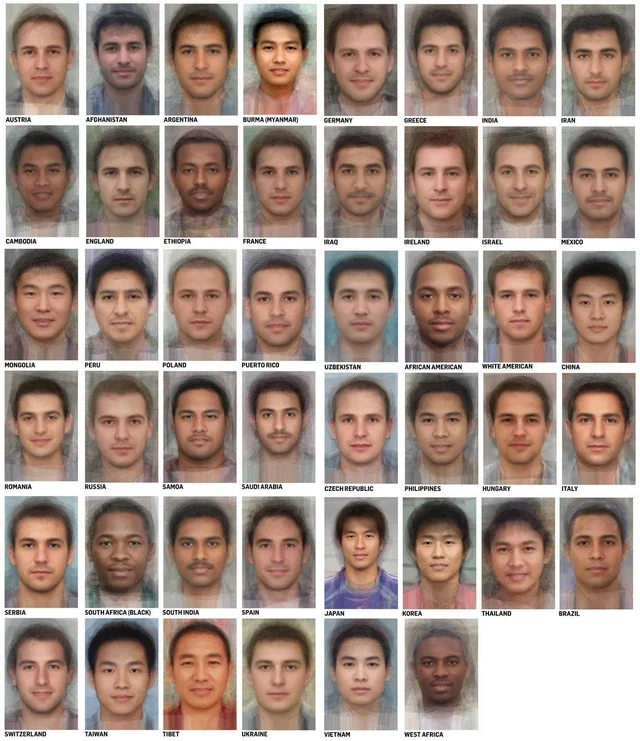
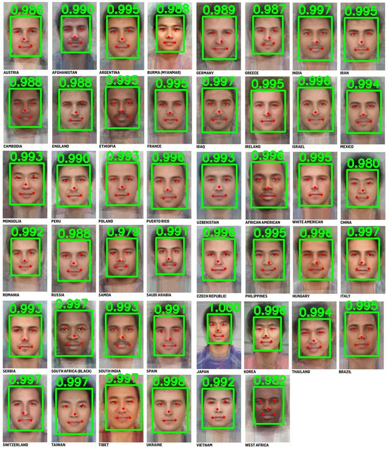

# RetinaFace Face Detection

## Metadata
| Field | Value |
| --- | --- |
| Category | face-detection |
| Difficulty | Beginner |
| Tags | retinaface, face-detection |
| Status | experimental |
| Binary Name | retinaface-face-detection |
| Model | retinaface_mobilenet25 [https://docs.sima.ai/pkg_downloads/SDK2.0.0/models/modalix/retinaface_mobilenet25_mod_0_mpk.tar.gz] |

## Concept
This example demonstrates single-image face detection with **RetinaFace**, a one-stage dense detector designed for robust face localization across pose, scale, and occlusion conditions.

RetinaFace predicts:
- Face bounding boxes
- Face confidence scores
- Five facial landmarks (left eye, right eye, nose tip, left mouth corner, right mouth corner)

Compared with generic object detectors, RetinaFace is specialized for facial geometry and alignment-sensitive tasks. Landmark outputs make it useful not only for drawing detection overlays, but also for downstream steps such as face alignment, tracking initialization, quality filtering, and recognition pre-processing.

In this app, the compiled `retinaface_mobilenet25` package is run on an input image, raw outputs are decoded into candidate detections, low-confidence candidates are filtered, overlapping boxes are merged with Non-Maximum Suppression (NMS), and the final boxes/landmarks are rendered to an output image.

## Preview
<p align="center">
  
  
</p>

## Prerequisites
- Installed NEAT SDK + built apps artifacts.
- Model package available on disk. By default this example uses:
  - `apps/assets/models/retinaface_mobilenet25_mod_0_mpk.tar.gz`
- To fetch it directly into `assets/models/`, run:
  - `./scripts/download_models.sh retinaface_mobilenet25`

## Run
### C++
```bash
./build/examples/face-detection/retinaface-face-detection_cpp/retinaface-face-detection \
  apps/assets/test_images/image.png \
  --model apps/assets/models/retinaface_mobilenet25_mod_0_mpk.tar.gz \
  --output /tmp/retinaface_out.png \
  --conf 0.4 --nms 0.9
```

### Python
```bash
python apps/examples/face-detection/retinaface-face-detection/python/main.py \
  apps/assets/test_images/image.png \
  --model apps/assets/models/retinaface_mobilenet25_mod_0_mpk.tar.gz \
  --output /tmp/retinaface_out.png \
  --conf 0.4 --nms 0.9
```

## Source Files
- C++ source: `cpp/main.cpp`
- Python source: `python/main.py`
