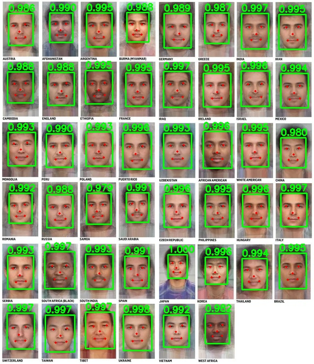

# RetinaFace Face Detection

## Metadata
| Field | Value |
| --- | --- |
| Category | face-detection |
| Difficulty | Beginner |
| Tags | retinaface, face-detection |
| Languages | C++, Python |
| Status | experimental |
| Binary Name | retinaface-face-detection |
| Model | retinaface_mobilenet25 [https://docs.sima.ai/pkg_downloads/SDK2.0.0/models/modalix/retinaface_mobilenet25_mod_0_mpk.tar.gz] |

## Concept
This example demonstrates single-image face detection with **RetinaFace**, a one-stage dense detector designed for robust face localization across pose, scale, and occlusion conditions.

RetinaFace predicts:
- Face bounding boxes
- Face confidence scores
- Five facial landmarks (left eye, right eye, nose tip, left mouth corner, right mouth corner)

Compared with generic object detectors, RetinaFace is specialized for facial geometry and alignment-sensitive tasks. Landmark outputs make it useful not only for drawing detection overlays, but also for downstream steps such as face alignment, tracking initialization, quality filtering, and recognition pre-processing.

In this app, the compiled `retinaface_mobilenet25` package is run on an input image, raw outputs are decoded into candidate detections, low-confidence candidates are filtered, overlapping boxes are merged with Non-Maximum Suppression (NMS), and the final boxes/landmarks are rendered to an output image.

## Preview
Snippet from a pipeline run:



## Supported Models
Validated with: `retinaface_mobilenet25`

Download into `assets/models/`:
- `./scripts/download_models.sh retinaface_mobilenet25`

## Prerequisites
- Installed NEAT SDK.
- Model artifacts are user-managed and should be downloaded into `assets/models/`.
- Preferred download command: `./scripts/download_models.sh retinaface_mobilenet25`
- Direct URL fallback:
  `mkdir -p assets/models && cd assets/models && sima-cli download https://docs.sima.ai/pkg_downloads/SDK2.0.0/models/modalix/retinaface_mobilenet25_mod_0_mpk.tar.gz && cd ../..`

## Important Behavior
- Input and output paths are user-provided.
- Detection confidence (`--conf`) and NMS IoU (`--nms`) control final detection count.
- By default, detections include 5-point facial landmarks unless `--no-landmarks` is set.

## Command-Line Options
### C++
- Invocation:
  `./build/examples/face-detection/retinaface-face-detection/retinaface-face-detection <input_image_path> [--model <model_path>] [--output <output_image_path>] [--conf <threshold>] [--nms <iou>] [--top-k <count>] [--keep-top-k <count>] [--max-draw <count>] [--profile] [--num-runs <count>] [--no-landmarks]`
- Required arguments:
  `<input_image_path>`
- Optional arguments:
  `--model`, `--output`, `--conf`, `--nms`, `--top-k`, `--keep-top-k`, `--max-draw`, `--profile`, `--num-runs`, `--no-landmarks`

### Python
- Invocation:
  `python3 examples/face-detection/retinaface-face-detection/python/main.py <input_image_path> [--model <model_path>] [--output <output_image_path>] [--conf <threshold>] [--nms <iou>] [--top-k <count>] [--keep-top-k <count>] [--profile] [--num-runs <count>] [--no-landmarks] [--verbose]`
- Required arguments:
  `<input_image_path>`
- Optional arguments:
  `--model`, `--output`, `--conf`, `--nms`, `--top-k`, `--keep-top-k`, `--profile`, `--num-runs`, `--no-landmarks`, `--verbose`

## Build
### Build From The Apps Repo
```bash
cd <apps-repo-root>
./build.sh
```

Binary output:
```bash
./build/examples/face-detection/retinaface-face-detection/retinaface-face-detection
```

### Build This Example Directly With CMake
```bash
cd <apps-repo-root>/examples/face-detection/retinaface-face-detection
cmake -S cpp -B build
cmake --build build -j
```

Binary output:
```bash
./build/retinaface-face-detection
```

## Run
### C++
```bash
./build/examples/face-detection/retinaface-face-detection/retinaface-face-detection \
  <input_image_path> \
  --model assets/models/retinaface_mobilenet25_mod_0_mpk.tar.gz \
  --output <output_image_path> \
  --conf 0.4 --nms 0.9
```

### Python
```bash
source ~/pyneat/bin/activate
pip install -r examples/face-detection/retinaface-face-detection/python/requirements.txt
python3 examples/face-detection/retinaface-face-detection/python/main.py \
  <input_image_path> \
  --model assets/models/retinaface_mobilenet25_mod_0_mpk.tar.gz \
  --output <output_image_path> \
  --conf 0.4 --nms 0.9
```

## Testing
Run from the apps repository root:

```bash
cd <apps-repo-root>
```

### C++
Unit test:
```bash
ctest --test-dir build/examples/face-detection/retinaface-face-detection \
  -R 'retinaface-face-detection.unit' --output-on-failure -V
```

E2E test:
```bash
SIMANEAT_APPS_TEST_MODELS_DIR="$PWD/assets/models" \
SIMANEAT_APPS_TEST_INPUT_DIR="$PWD/assets/test_images" \
SIMANEAT_APPS_TEST_OUTPUT_DIR=/tmp \
SIMANEAT_APPS_TEST_TIMEOUT_MS=60000 \
ctest --test-dir build/examples/face-detection/retinaface-face-detection \
  -R 'retinaface-face-detection.e2e' --output-on-failure -V
```

### Python
Unit test:
```bash
source ~/pyneat/bin/activate
pip install -r examples/face-detection/retinaface-face-detection/python/requirements.txt
pip install pytest
export PYTHONPATH="$PWD"
pytest -c tests/pytest.ini --rootdir="$PWD" -m unit \
  examples/face-detection/retinaface-face-detection/python/tests/test_unit.py -v
```

E2E test:
```bash
source ~/pyneat/bin/activate
pip install -r examples/face-detection/retinaface-face-detection/python/requirements.txt
pip install pytest
export PYTHONPATH="$PWD"
SIMANEAT_APPS_TEST_MODELS_DIR="$PWD/assets/models" \
SIMANEAT_APPS_TEST_INPUT_DIR="$PWD/assets/test_images" \
SIMANEAT_APPS_TEST_OUTPUT_DIR=/tmp/retinaface-python-e2e \
SIMANEAT_APPS_TEST_TIMEOUT_MS=60000 \
SIMANEAT_APPS_TEST_REQUIRE_E2E=1 \
pytest -c tests/pytest.ini --rootdir="$PWD" -m e2e \
  examples/face-detection/retinaface-face-detection/python/tests/test_e2e.py -v
```

Notes:
- Use an absolute path for `SIMANEAT_APPS_TEST_MODELS_DIR` in Python e2e. The test runs `main.py` with `cwd` set to the example directory.
- `SIMANEAT_APPS_TEST_INPUT_DIR` is supported by both C++ and Python e2e tests.
- If `SIMANEAT_APPS_TEST_INPUT_DIR` is not set, both e2e tests fall back to `assets/test_images`.
- RetinaFace e2e prefers an image filename containing `face` when present, then falls back to the first available image in the input directory.

## Debugging Notes
- If the model fails to load, verify `assets/models/retinaface_mobilenet25_mod_0_mpk.tar.gz` exists and is readable.
- If no detections appear, lower `--conf` (for example `0.25`) and confirm the input actually contains faces.
- If too many duplicate boxes appear, reduce `--nms` and/or lower `--top-k`.
- If output writing fails, ensure the parent directory of `<output_image_path>` exists and is writable.

## Source Files
- C++ source: `cpp/main.cpp`
- C++ tests: `cpp/tests/unit_test.cpp`, `cpp/tests/e2e_test.cpp`
- Python source: `python/main.py`
- Python tests: `python/tests/test_unit.py`, `python/tests/test_e2e.py`
