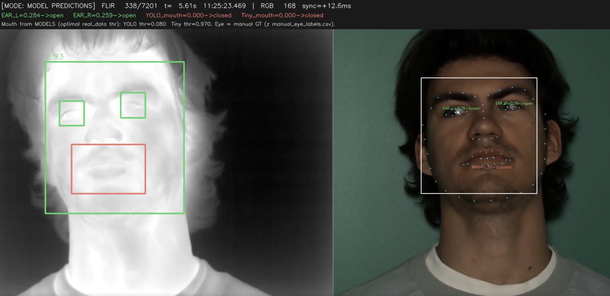

# Single-Stream Thermal Face Detector

## Metadata
| Field | Value |
| --- | --- |
| Category | face-detection |
| Difficulty | Intermediate |
| Tags | face-detection, keypoints, yolov5s-face, thermal, rtsp, insight |
| Languages | C++, Python |
| Status | stable |
| Binary Name | single-stream-thermal-face-detector |
| Model | yolov5s_face_raw_split |

## Concept
Detects faces and five facial landmarks in a live thermal RTSP stream with YOLOv5s-Face, then sends the overlay to Insight.

The pipeline keeps the video and landmarks on the same frame:

```
RTSP decode (NV12) --> branch --> video_sender (H264 RTP/UDP -> Insight)
                            \--> model (raw split heads) --> detections
```

Each frame sends one `pose-estimation` message with the left eye, right eye, nose tip, and both mouth corners. Insight draws them as labeled dots. The application sends one metadata type because Insight shows only one type per channel at a time.

YOLOv5s-Face returns raw box and landmark outputs. The C++ and Python applications decode those outputs with the same math before sending the five points to Insight.

## Preview


The reference visualization pairs a thermal stream with its visible-light
source and shows face, eye, and mouth regions. The application publishes
the five facial landmarks to Insight as labeled dots; it does not publish the
reference visualization's boxes.

## Prerequisites

- `sima-cli` ([documentation](https://developer.sima.ai/software/tools/sima-cli/))
  on a supported Modalix or DevKit target.
- A running [Neat Insight](https://developer.sima.ai/software/tools/insight/)
  instance reachable from the target, with an RTSP source containing faces.
- The model expects an 800x800 compiled canvas; its on-device preprocess accepts
  NV12, BGR, RGB, I420, or grayscale input up to 4096x4096.

## Install Apps

Install the latest Neat Apps runtime and enter the installed bundle:

```bash
sima-cli neat install apps
cd prebuilt-apps
APP_DIR=examples/face-detection/single-stream-thermal-face-detector
```

Run the remaining commands from `prebuilt-apps/`.

## Prepare the Model

Primary model: `yolov5s_face_raw_split`

Model packages come from the Model Zoo release below, which can differ from the
installed platform version.

```bash
export MODELZOO_VERSION="2.1.3"
mkdir -p models
cd models
sima-cli download \
  "https://docs.sima.ai/pkg_downloads/SDK${MODELZOO_VERSION}/models/modalix/yolov5s_face_raw_split_mpk.tar.gz"
cd ..
```

The command stores the package under `models/`; set `model.path` to the
downloaded `yolov5s_face_raw_split_mpk.tar.gz` file.

## Prepare Insight
[Neat Insight](https://developer.sima.ai/software/tools/insight/) can host an RTSP source, receive video from `VideoSender`, receive landmark metadata from `MetadataSender`, and show rendered overlays plus runtime metrics in the browser.

In the Neat Development Environment, install the sample video assets:

```bash
sima-cli install assets/multi-video-sources
```

This provides 720p and 480p videos that Insight can stream as RTSP sources. This
example expects faces in frame, so upload a thermal or visible-light face clip of
your own when the sample videos do not contain any.

To create a reproducible RTSP input:
1. Run `neat` in the Neat Development Environment and open the reported `Insight Web UI`.
2. In Insight, open `RTSP Source`.
3. Use a sample video or upload your own video.
4. Start the stream and copy the RTSP URL.
5. Put that RTSP URL into `source.rtsp_url`.

Use the same `neat` output to set `output.insight.host`, `video_port`, and `metadata_port` from the reported `videoUDP` and `metadataUDP` ranges.

**Ports when the app runs on a board.** Insight runs inside the SDK container and
builds its URLs from the container's own view, so the RTSP link copied from the UI
carries the container-internal port (`8554`). An app running on a DevKit is
outside that container and must use the SDK host IP plus the **published** host
port instead. Read the mapping from `exposedPorts` in `neat --json` and never
assume the defaults:

| Endpoint | Container port (shown in the UI) | Host port (use this from a board) |
| --- | --- | --- |
| RTSP | 8554 | `rtsp.tcp` → `hostPortStart` |
| Video UDP | 9000 | `videoUDP` → `hostPortStart` |
| Metadata UDP | 9100 | `metadataUDP` → `hostPortStart` |

Keep video and metadata on the same channel (0).

## Configure

Open `${APP_DIR}/src/common/config.yaml`. Set `model.path`, `source.rtsp_url`, and `output.insight.host`. If Insight uses nondefault ports, also set the video and metadata ports reported by `neat --json`.

Keep video and metadata on the same Insight channel. The checked-in thresholds and runtime settings are ready to use for a first run.

## Run
### C++
```bash
./${APP_DIR}/src/cpp/pre-built/single-stream-thermal-face-detector \
  --config ${APP_DIR}/src/common/config.yaml
```

### Python
```bash
source ~/pyneat/bin/activate
pip install -r ${APP_DIR}/src/python/requirements.txt
python3 ${APP_DIR}/src/python/main.py \
  --config ${APP_DIR}/src/common/config.yaml
```

Open the Insight video viewer for the channel (e.g. `/api/viewer-url?src=0`) to
watch the annotated stream.

## Debugging Notes
- If the viewer shows video but no overlays, confirm `output.insight.host` and the
  metadata port are reachable and match the viewer's channel. Use Insight's
  `/api/ingest/stats` to check `metadata.messages_received`.
- If the streamed video looks blocky, raise `encoder.bitrate_kbps` in
  `build_pipeline` (the Neat default is 4000). Check the delivered rate with
  `/api/ingest/stats` -> `rtp.bitrate_bps`; the source stream itself is only
  re-encoded here, so a sharp source plus a blocky viewer means the encoder is
  starved.
- If the viewer shows no video, verify the video UDP port and that RTP is arriving
  (`/api/ingest/stats` -> `rtp.packets_received`, `media.seen_sps`).
- If keypoints look mis-anchored, the model may have been retrained with different
  anchors -- update `_STRIDES`/`_anchors()` in `src/python/main.py` and
  `kStrides`/`kAnchors` in `src/cpp/main.cpp` to match.
- Set `runtime.profile: true` to print rolling pull/decode/metadata timing and
  output FPS.
- Use `inference.min_score` and `inference.nms_iou` to tune detection sensitivity.

## Source Files
- C++ source: `src/cpp/main.cpp`
- C++ tests: `tests/cpp/test_unit.cpp`, `tests/cpp/test_e2e.cpp`
- Python source: `src/python/main.py`
- Python tests: `tests/python/test_unit.py`, `tests/python/test_e2e.py`
- Shared assets: `src/common/face_label.txt`

The packaged C++ source is an implementation reference. Run the executable
under `src/cpp/pre-built/`; the installed bundle does not include CMake files.

## Development From Source

To modify, compile, or test this example, use the
[Apps contributor workflow](https://github.com/sima-neat/apps/blob/main/CONTRIBUTING.md).
