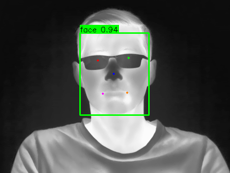

# yolov5s-face Detection + Keypoints Pipeline

## Metadata
| Field | Value |
| --- | --- |
| Category | face-detection |
| Difficulty | Intermediate |
| Tags | face-detection, keypoints, yolov5-face, folder-inference |
| Languages | C++, Python |
| Status | experimental |
| Binary Name | yolov5-face |
| Model | yolov5s_face_raw_split [https://docs.sima.ai/pkg_downloads/SDK2.0.0/models/modalix/yolov5s_face_raw_split_mpk.tar.gz] |

## Concept
Minimal image-folder face detection pipeline using yolov5s-face. Each image is inferred, annotated with a green bounding box per face plus 5 colored landmark dots (left eye, right eye, nose, left mouth corner, right mouth corner), and written to an output folder. The pipeline demonstrates the NEAT API for model loading, inference, and result decoding.

Unlike the BBOX-emitting detectors in this repo (yolo26m, yolov8n), yolov5s-face has a split-head topology with paired box (18-channel) and landmark (30-channel) outputs at three pyramid levels. NEAT's BBOX wire format carries no landmark slots, so the decode is implemented in user-space rather than via `SimaBoxDecode`: the C++ implementation mirrors the math from `python/compilation.py`, and the Python implementation uses a vectorized NumPy filter-first path for clarity.

## Preview
Snippet from a pipeline run:



## Supported Models
Validated with: `yolov5s_face_raw_split`

Download into `assets/models/`:
- `mkdir -p assets/models && cd assets/models && sima-cli download https://docs.sima.ai/pkg_downloads/SDK2.0.0/models/modalix/yolov5s_face_raw_split_mpk.tar.gz && cd ../..`

## Prerequisites
- Installed NEAT SDK.
- Model artifacts are user-managed and should be downloaded into `assets/models/`.
- yolov5s-face is not yet published in the SiMa modelzoo. Use the direct download URL below until a modelzoo entry is available.
- Direct URL download:
  `mkdir -p assets/models && cd assets/models && sima-cli download https://docs.sima.ai/pkg_downloads/SDK2.0.0/models/modalix/yolov5s_face_raw_split_mpk.tar.gz && cd ../..`
- Labels file: `examples/face-detection/yolov5-face/common/face_label.txt`

## Important Behavior
- Both C++ and Python use named flags (`--model`, `--labels`, `--input-dir`, `--output-dir`).
- Labels file is required.
- The compiled model expects an 800×800 canvas and supports input frames up to 1280×720; larger frames are skipped with a warning.
- Output images are written as `.png` files with green face boxes, score text, and 5 colored landmark dots per face (red, green, blue, magenta, orange).
- Use `--profile` to print per-image and aggregate timing plus FPS.
- Use `--num-runs N` to repeat the image set N times for benchmarking.
- Use `--no-overlay` to skip drawing bounding boxes and writing output images (useful for benchmarking pure inference).

## Command-Line Options
### C++
- Invocation:
  `./build/examples/face-detection/yolov5-face/yolov5-face --model <model.tar.gz> --labels <labels.txt> --input-dir <dir> --output-dir <dir> [--min-score 0.25] [--nms-iou 0.45] [--profile] [--no-overlay] [--num-runs 1]`
- Required arguments:
  `--model <model.tar.gz>`, `--labels <labels.txt>`, `--input-dir <dir>`, `--output-dir <dir>`
- Optional arguments:
  `--min-score <float>` (default: `0.25`), `--nms-iou <float>` (default: `0.45`), `--profile`, `--no-overlay`, `--num-runs <int>` (default: `1`)

### Python
- Invocation:
  `python examples/face-detection/yolov5-face/python/main.py --model <model.tar.gz> --labels <labels.txt> --input-dir <dir> --output-dir <dir> [--min-score 0.25] [--nms-iou 0.45] [--profile] [--no-overlay] [--num-runs 1]`
- Required arguments:
  `--model <model.tar.gz>`, `--labels <labels.txt>`, `--input-dir <dir>`, `--output-dir <dir>`
- Optional arguments:
  `--min-score <float>` (default: `0.25`), `--nms-iou <float>` (default: `0.45`), `--profile`, `--no-overlay`, `--num-runs <int>` (default: `1`)

## Build
### Build From The Apps Repo
```bash
cd <apps-repo-root>
./build.sh
```

Binary output:
```bash
./build/examples/face-detection/yolov5-face/yolov5-face
```

### Build This Example Directly With CMake
```bash
cd <apps-repo-root>/examples/face-detection/yolov5-face
cmake -S cpp -B build
cmake --build build -j
```

Binary output:
```bash
./build/yolov5-face
```

## Run
### C++
```bash
./build/examples/face-detection/yolov5-face/yolov5-face \
  --model assets/models/yolov5s_face_raw_split_mpk.tar.gz \
  --labels examples/face-detection/yolov5-face/common/face_label.txt \
  --input-dir assets/images/thermal_test --output-dir tmp_output_folder
```

### Python
```bash
source ~/pyneat/bin/activate
pip install -r examples/face-detection/yolov5-face/python/requirements.txt
python examples/face-detection/yolov5-face/python/main.py \
  --model assets/models/yolov5s_face_raw_split_mpk.tar.gz \
  --labels examples/face-detection/yolov5-face/common/face_label.txt \
  --input-dir assets/images/thermal_test --output-dir tmp_output_folder
```

## Testing
Run from the apps repository root:

```bash
cd <apps-repo-root>
```

### C++
Unit test:
```bash
./build/examples/face-detection/yolov5-face/yolov5-face_unit_test \
  ./build/examples/face-detection/yolov5-face/yolov5-face
```

E2E test:
```bash
SIMANEAT_APPS_TEST_MODELS_DIR="$PWD/assets/models" \
SIMANEAT_APPS_TEST_INPUT_DIR="$PWD/assets/images/thermal_test" \
SIMANEAT_APPS_TEST_TIMEOUT_MS=60000 \
./build/examples/face-detection/yolov5-face/yolov5-face_e2e_test \
  ./build/examples/face-detection/yolov5-face/yolov5-face
```

### Python
Unit test:
```bash
source ~/pyneat/bin/activate
pip install -r examples/face-detection/yolov5-face/python/requirements.txt
pytest examples/face-detection/yolov5-face/python/tests/test_unit.py -v
```

E2E test:
```bash
source ~/pyneat/bin/activate
pip install -r examples/face-detection/yolov5-face/python/requirements.txt
SIMANEAT_APPS_TEST_MODELS_DIR="$PWD/assets/models" \
SIMANEAT_APPS_TEST_INPUT_DIR="$PWD/assets/images/thermal_test" \
SIMANEAT_APPS_TEST_TIMEOUT_MS=60000 \
SIMANEAT_APPS_TEST_REQUIRE_E2E=1 \
pytest examples/face-detection/yolov5-face/python/tests/test_e2e.py -v
```

## Debugging Notes
- If detections are missing, validate `--min-score` and verify the model package exists at `assets/models/yolov5s_face_raw_split_mpk.tar.gz`.
- If model load fails, confirm `assets/models/yolov5s_face_raw_split_mpk.tar.gz` exists and is readable.
- Ensure input folder contains supported image extensions (`.jpg`, `.jpeg`, `.png`, `.bmp`).
- If keypoints look mis-anchored, the model may have been retrained with different anchors — update `_ANCHORS`/`kAnchors` in `python/main.py` and `cpp/main.cpp` to match.
- Use `--profile` to identify bottlenecks in the pipeline.
- Use `--min-score` and `--nms-iou` to tune detection sensitivity.

## Source Files
- C++ source: `cpp/main.cpp`
- C++ tests: `cpp/tests/unit_test.cpp`, `cpp/tests/e2e_test.cpp`
- Python source: `python/main.py`
- Python tests: `python/tests/test_unit.py`, `python/tests/test_e2e.py`
- Compilation script (offline): `python/compilation.py`
- Shared assets: `common/face_label.txt`
