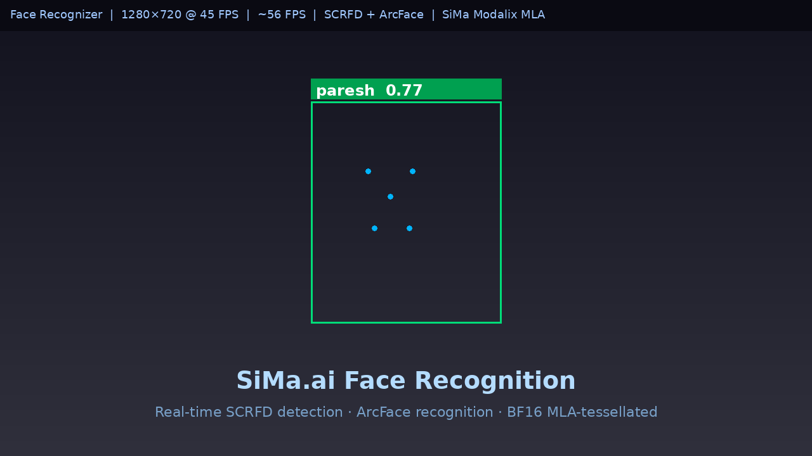

# Face Recognizer

## Metadata

| Field | Value |
| --- | --- |
| Category | face-recognition |
| Difficulty | Advanced |
| Tags | face-detection, face-recognition, scrfd, arcface, rtsp, enrollment, bf16, mla-tessellation |
| Languages | C++, Python |
| Status | stable |
| Binary Name | face-recognizer |
| Model | scrfd_2.5g_bnkps.mla, w600k_r50.surgery |

## Concept

Real-time face detection and recognition on SiMa.ai Modalix hardware using SCRFD face detection and ArcFace embeddings, both running BF16 MLA-tessellated on the MLA at over 40 FPS.

## Preview



## Prerequisites

- `sima-cli` ([documentation](https://developer.sima.ai/software/tools/sima-cli/)) on a supported Modalix or DevKit target.
- An H.264 RTSP source for the input stream.
- An [Insight](https://developer.sima.ai/software/tools/insight/) host reachable from the target for viewing the annotated output stream (optional).

## Install Apps

Install the latest Neat Apps runtime and enter the installed bundle:

```bash
sima-cli neat install apps
cd prebuilt-apps
APP_DIR=examples/face-recognition/face-recognizer
```

Run the remaining commands from `prebuilt-apps/`.

## Prepare the Model

Download the pre-compiled model packages from the Model Zoo:

```bash
export MODELZOO_VERSION="2.1.3"
mkdir -p ${APP_DIR}/models
sima-cli download "https://docs.sima.ai/pkg_downloads/SDK${MODELZOO_VERSION}/models/modalix/scrfd_2.5g_bnkps.mla_mpk.tar.gz" -o ${APP_DIR}/models/
sima-cli download "https://docs.sima.ai/pkg_downloads/SDK${MODELZOO_VERSION}/models/modalix/w600k_r50.surgery_mpk.tar.gz" -o ${APP_DIR}/models/
```

## Enroll Faces

Build a gallery before running recognition. Each invocation is additive — run once per person. When re-enrolling an existing identity, sample counts from the previous enrollment are preserved so centroids stay correctly weighted.

```bash
# From a video clip:
${APP_DIR}/src/cpp/pre-built/face-recognizer --enroll \
    --config ${APP_DIR}/src/common/config.yaml \
    --video  /path/to/alice.mp4 --name "Alice" \
    --gallery ${APP_DIR}/gallery.bin

# From an image folder (one subdirectory per identity):
#   gallery_images/Alice/photo1.jpg, photo2.jpg …
${APP_DIR}/src/cpp/pre-built/face-recognizer --enroll \
    --config ${APP_DIR}/src/common/config.yaml \
    --images gallery_images/ \
    --gallery ${APP_DIR}/gallery.bin
```

## Configure

Open `${APP_DIR}/src/common/config.yaml`. Key settings:

```yaml
gallery:
  path: gallery.bin           # Enrollment data; build with --enroll first

input:
  uri: rtsp://<HOST>:<PORT>/<STREAM>   # RTSP source

output:
  insight:
    host: ""                  # Set to Insight host IP to stream annotated output
    video_port: 9000          # UDP port Insight listens on for H.264 video input
    metadata_port: 9100       # UDP port Insight listens on for metadata input

match:
  threshold: 0.55             # Cosine similarity cutoff; below → Unknown
  margin:    0.12             # Min gap between best and 2nd-best score

runtime:
  recog_interval: 8           # Re-embed every N frames
```

## Run

```bash
./${APP_DIR}/src/cpp/pre-built/face-recognizer \
    --config ${APP_DIR}/src/common/config.yaml
```

The RTSP input URI, gallery path, model paths, and output options are all read from `config.yaml`.

> **Insight visualization note:** Bounding boxes and identity labels are burned directly into the H.264 video frame before encoding. The Insight metadata channel is kept alive with an empty payload each frame so Insight does not draw its own overlay on top. This avoids double-drawing that would otherwise produce two boxes per face.

**Optional overrides:**

| Flag | Description |
|---|---|
| `--input <uri>` | Override `input.uri` in config |
| `--gallery <path>` | Override `gallery.path` in config |
| `--scrfd-model <path>` | Override `scrfd.model` in config |
| `--arcface-model <path>` | Override `arcface.model` in config |
| `--rtsp-fps <n>` | Force decoder FPS; omit to auto-detect from stream (recommended) |
| `--max-frames <n>` | Stop after N frames (0 = unlimited) |
| `--test` | Print per-frame results and FPS report; headless |
| `--cpu-preproc` | Force CPU NEON preproc instead of EV74 CVU (slower; useful for A/B accuracy comparison) |

**Enrollment flags (with `--enroll`):**

| Flag | Description |
|---|---|
| `--video <path>` | Enrollment video; requires `--name` |
| `--name <name>` | Identity label for `--video` mode |
| `--images <dir>` | Enrollment image folder (one subdirectory per identity) |
| `--gallery <path>` | Gallery file to write or append to |
| `--sample-every <n>` | Sample 1 frame every N from video (default: 5) |
| `--min-score <f>` | Minimum SCRFD confidence for enrollment (default: 0.75) |
| `--max-per-person <n>` | Cap images per identity when using `--images` (default: unlimited) |

## Python

A Python implementation is included at `src/python/main.py`. It uses the same config.yaml and gallery.bin as the C++ binary, and produces identical Insight metadata output.

**Prerequisites:** `pyneat`, `numpy`, `opencv-python` installed in the Python environment on-device.

**Enroll from video (Python):**

```bash
python3 ${APP_DIR}/src/python/main.py --enroll \
    --config ${APP_DIR}/src/common/config.yaml \
    --video  /path/to/alice.mp4 --name "Alice" \
    --gallery ${APP_DIR}/gallery.bin
```

**Run recognition (Python):**

```bash
python3 ${APP_DIR}/src/python/main.py \
    --config ${APP_DIR}/src/common/config.yaml
```

All optional overrides accepted by the C++ binary (`--input`, `--gallery`, `--scrfd-model`, `--arcface-model`, `--max-frames`, `--test`) are also supported by the Python implementation.

## Tuning

| Parameter | Default | Notes |
|---|---|---|
| `match.threshold` | `0.55` | Raise to 0.60–0.65 in controlled lighting for fewer false positives |
| `match.margin` | `0.12` | Raise to 0.15–0.20 when multiple people are enrolled to reduce cross-ID errors |
| `scrfd.conf_threshold` | `0.65` | Lower to detect smaller or partially-occluded faces |
| `runtime.recog_interval` | `8` | Frames between re-embeddings (lower = more responsive identity updates) |

## Testing

Tests require a source build — see [Development From Source](#development-from-source) below for build commands. Unit tests need no hardware; the E2E test requires models and a live input source.

## Source Files

- C++ recognition source: `src/cpp/main.cpp`
- Python recognition source: `src/python/main.py`
- Enrollment source (C++): `tools/enroll.cpp`
- Shared runtime files: `src/common/`

The packaged C++ source is an implementation reference. Run the executable under `src/cpp/pre-built/`; the installed bundle does not include CMake files.

## Development From Source

To modify, compile, or test this example, use the [Apps contributor workflow](https://github.com/sima-neat/apps/blob/main/CONTRIBUTING.md).

<details>
<summary>Build commands</summary>

Inside the SDK container:

```bash
source /opt/bin/simaai-init-build-env modalix
cd /path/to/apps
cmake -S . -B build -DCMAKE_BUILD_TYPE=Release -DSIMANEAT_APPS_BUILD_CPP=ON
cmake --build build --target face-recognizer -j4
```

Binary: `build/examples/face-recognition/face-recognizer_cpp/face-recognizer`

### Run Tests

```bash
# Unit tests — no hardware required
ctest --test-dir build -L unit -R 'face-recognizer' --output-on-failure -V

# E2E test — requires models and an input source
export SIMANEAT_APPS_TEST_MODELS_DIR=${APP_DIR}/models

# Option A (recommended): face-containing video — enables detection + recognition assertions.
# Download the reference test video and gallery (requires gdown: pip install gdown):
#   gdown 18uSg5S4CEUBWuCNM2rjs_8CF0B5taJ9v -O /tmp/face_test.mp4
#   gdown 1BTOMCMQzUG2dkIhrr1q1SdDoRe2g1v5f -O /tmp/test_gallery.bin
export SIMANEAT_APPS_TEST_INPUT_VIDEO=/tmp/face_test.mp4
export SIMANEAT_APPS_TEST_GALLERY_BIN=/tmp/test_gallery.bin   # optional: enables recognition check

# Option B: RTSP stream — detection assertion is skipped; process exit verified only
export SIMANEAT_TEST_RTSP_H264_URL=rtsp://<HOST>:<PORT>/<STREAM>

ctest --test-dir build -L e2e -R 'face-recognizer' --output-on-failure -V
```

> **Note:** When only `SIMANEAT_TEST_RTSP_H264_URL` is set, the E2E test verifies
> that the pipeline starts cleanly and exits 0, but skips the face-detection assertion
> (a shared RTSP stream may not contain detectable faces in any 60-frame window).
> Set `SIMANEAT_APPS_TEST_INPUT_VIDEO` to a face-containing clip to enable the full check.
> When `SIMANEAT_APPS_TEST_INPUT_VIDEO` is set, enrollment mode is also tested automatically.

</details>
