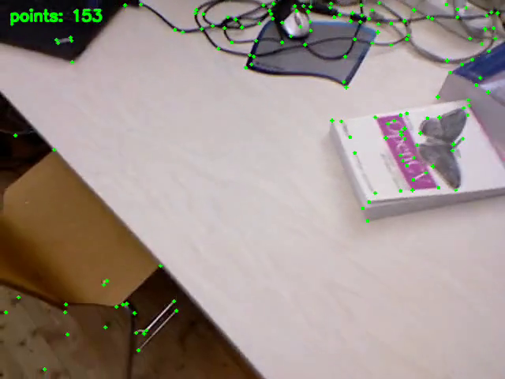

# SuperPoint Feature Extractor

## Metadata

| Field | Value |
| --- | --- |
| Category | feature-extraction |
| Difficulty | Intermediate |
| Tags | superpoint, feature-extraction, video, boxdecode |
| Languages | C++, Python |
| Status | experimental |
| Binary Name | superpoint-feature-extractor |
| Model | superpoint / modalix_int8_tessellation_mla |

## Concept

`superpoint-feature-extractor` runs SuperPoint on a video and streams the feature-point overlay
to Insight. Like the YOLO examples, it feeds BGR image tensors into Core preprocessing. Preproc
owns resize, BGR-to-grayscale conversion, normalization, and the original/model geometry metadata
consumed by A65 SuperPoint BoxDecode. BoxDecode applies the inverse Preproc affine to feature
coordinates, so the app does not duplicate W/H, resize-mode, or coordinate-remap logic.

The application selects the A65V1 numerical profile explicitly. Tensor roles, output dtypes, and
storage layouts come from the MPK contract rather than being inferred from tensor order or values.

## Preview

Frame from the included TUM RGB-D `freiburg1_desk` sequence:



## Prerequisites

- `sima-cli` ([documentation](https://developer.sima.ai/software/tools/sima-cli/)) on a supported
  Modalix or DevKit target.
- Neat Library with SuperPoint BoxDecode support.
- Insight or another RTP receiver for the annotated output stream.
- A qualified SuperPoint MPK as described below.

## Install Apps

Install the latest Neat Apps runtime and enter the installed bundle:

```bash
sima-cli neat install apps
cd prebuilt-apps
```

Run the remaining commands from `prebuilt-apps/`.

## Prepare the Model

The [Neat Model Registry](https://github.com/sima-neat/models/issues/24) publishes SuperPoint
through the Vulcan artifact registry. Install the production package and select the INT8 variant
that keeps tessellation inside the MLA:

```bash
mkdir -p models/superpoint
sima-cli neat install models/superpoint@main:latest --install-dir models/superpoint

model="$(find models/superpoint/modalix_int8_tessellation_mla -type f -name '*_mpk.tar.gz' -print -quit)"
test -n "$model"
cp "$model" models/superpoint_mpk.tar.gz
```

Use `--stg models/superpoint@develop:latest` instead while validating a staging publication. Do not
download the model from an ad hoc attachment or copy; the registry package supplies the immutable
artifact and verifies its published checksum.

The default CI pipeline test uses `modalix_int8_tessellation_mla`, while the accuracy matrix covers
all four INT8/BF16 and MLA/EV74 tessellation combinations. The INT8 MLA archive was calibrated with
128 deterministic images (80 COCO val2017, 32 HPatches, and 16 TUM RGB-D), contains one MLA
program, and has this SHA-256 checksum:

```text
768f8f2838b335ffa92fd4d2464730b61a4bcdf4190484aac125b7395e271d53
```

Verify the selected package when reproducing the reference qualification:

```bash
sha256sum models/superpoint_mpk.tar.gz
```

The model accepts a normalized 640x480 grayscale input and publishes a 65-channel detector head
and a 256-channel descriptor head. The registry also provides BF16 and EV74-tessellation variants.

Configure `model.path` after the model is published under a different filename.

## Configure

Edit `examples/feature-extraction/superpoint-feature-extractor/src/common/config.yaml`:

```yaml
model:
  path: models/superpoint_mpk.tar.gz

io:
  input: assets/datasets/tum-rgbd/freiburg1-desk.mp4

output:
  insight:
    host: <insight-host-ip>
    video_port: 9000
    channel: 0
    bitrate_kbps: 1000

runtime:
  frames: 0
  timeout_ms: 20000
```

`runtime.frames: 0` processes the complete video. Any stable input resolution supported by the
hardware may be used. Core Preproc stretches each frame to the model's 640x480 input and publishes
the resize geometry; BoxDecode returns source-space feature coordinates for the Insight overlay. A
mid-stream resolution change is rejected because the model and video-sender graphs are built once
from the first frame.

Set `output.insight.host` to the host running Insight. The application sends the annotated stream
as H.264 over RTP/UDP using the configured base port and channel.

The included sequence comes from the TUM RGB-D visual-SLAM benchmark. Its camera motion and office
scene are representative of the repeatable local features SuperPoint is designed to extract. The
source, attribution, transformation, and CC BY 4.0 license are documented in
`assets/datasets/tum-rgbd/LICENSE.md`.

## Run

### C++

```bash
./examples/feature-extraction/superpoint-feature-extractor/src/cpp/pre-built/superpoint-feature-extractor \
  --config examples/feature-extraction/superpoint-feature-extractor/src/common/config.yaml
```

### Python

```bash
source ~/pyneat/bin/activate
pip install -r examples/feature-extraction/superpoint-feature-extractor/src/python/requirements.txt
python3 examples/feature-extraction/superpoint-feature-extractor/src/python/main.py \
  --config examples/feature-extraction/superpoint-feature-extractor/src/common/config.yaml
```

Both implementations stream the overlay to Insight and print the number of processed frames,
average feature count, descriptor dimension, and selected video endpoint.

## Troubleshooting

- Confirm `model.path` points to the qualified SuperPoint package.
- A missing or incompatible typed SuperPoint contract fails during model construction.
- Confirm the input is a stable-resolution BGR video supported by the target hardware.
- Confirm Insight is reachable at the configured host and UDP video port.
- Set `runtime.frames: 30` for a short smoke run.

## Source Files

- C++ reference source: `src/cpp/main.cpp`
- Python source: `src/python/main.py`
- Shared config: `src/common/config.yaml`
- C++ tests: `tests/cpp/`
- Python tests: `tests/python/`

The packaged C++ source is an implementation reference. Run the executable under
`src/cpp/pre-built/`; the installed bundle does not include CMake files.

## Development From Source

To modify, compile, or test this example, use the
[Apps contributor workflow](https://github.com/sima-neat/apps/blob/main/CONTRIBUTING.md).
