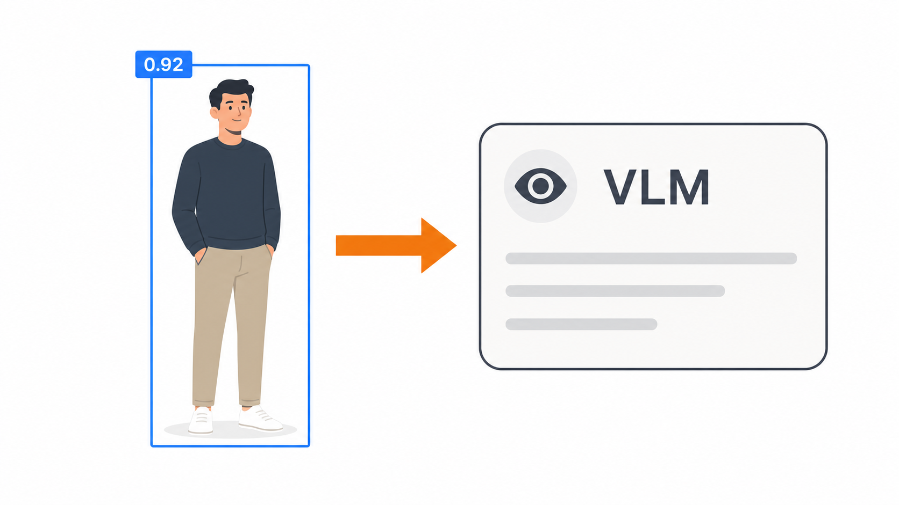

# Detection-to-VLM Assistant

## Metadata

| Field | Value |
| --- | --- |
| Category | genai |
| Difficulty | Advanced |
| Tags | object-detection, genai, yolo26, rtsp, insight, vlm |
| Languages | Python |
| Status | experimental |
| Binary Name | detection-to-vlm-assistant |
| Model | yolo26m-det-bf16-mla_tess-b1 |

## Concept

Detects people in a live RTSP stream with YOLO26 and sends video to Insight. It can also crop the highest-confidence person and ask a configured vision-language model about them.

The decoded frame branches inside a single graph to the detector, to the H.264 sender, and back to the application for the GenAI crop. Video and metadata therefore carry timestamps from the same frame, which is what lets Insight draw each detection on the frame it came from.

## Preview



## Prerequisites

- `sima-cli` ([documentation](https://developer.sima.ai/software/tools/sima-cli/)) on a supported Modalix or DevKit target.
- An RTSP source and an [Insight](https://developer.sima.ai/software/tools/insight/) URL reachable from the target.
- The [LLiMa model manager](https://developer.sima.ai/software/genai-llima/runtime) available on the target when GenAI is enabled.

## Install Apps

Install the latest Neat Apps runtime and enter the installed bundle:

```bash
sima-cli neat install apps
cd prebuilt-apps
APP_DIR=examples/genai/detection-to-vlm-assistant
```

Run the remaining commands from `prebuilt-apps/`.

## Prepare the Model

Supported detector packages:

| Model file | Role |
| --- | --- |
| `yolo26m-det-bf16-mla_tess-b1.tar.gz` | Default |
| `yolo26n-det-bf16-mla_tess-b1.tar.gz` | Supported |
| `yolo26s-det-bf16-mla_tess-b1.tar.gz` | Supported |
| `yolo26l-det-bf16-mla_tess-b1.tar.gz` | Supported |
| `yolo26x-det-bf16-mla_tess-b1.tar.gz` | Supported |
| `yolo26m-det-bf16-b1.tar.gz` | Supported |
| `yolo26m-det-int8-b1.tar.gz` | Supported |

Model packages come from the Model Zoo release below, which can differ from the installed platform version. Replace `<model-file>` with a file from the table.

```bash
export MODELZOO_VERSION="2.1.2"
mkdir -p models
cd models
sima-cli download "https://docs.sima.ai/pkg_downloads/SDK${MODELZOO_VERSION}/models/modalix/yolo26-detection/<model-file>"
cd ..
```

Set `model.path` to the downloaded detector package.

The default VLM is `Qwen3-VL-4B-Instruct-GPTQ-a16w4`.

Search the supported models:

```bash
llima search
```

Install the default model:

```bash
llima pull Qwen3-VL-4B-Instruct-GPTQ-a16w4
```

LLiMa stores models under `/media/nvme/llima/models/` by default. Set `LLIMA_MODELS_PATH` before `llima pull` to use another model directory, then update `genai_server.model.path` accordingly.

## Prepare Insight

[Insight](https://developer.sima.ai/software/tools/insight/) can host the input stream and render the video and detection metadata. Install videos directly from the Insight catalog or through Insight's YouTube support.

In the Insight Web UI, start the required stream and copy its RTSP URL. Use the host and UDP port ranges reported by `neat` for the output settings.

## Configure

Open `${APP_DIR}/src/common/config.yaml`. Set the RTSP URL, detector model path, and Insight host and ports.

To enable the VLM, set `genai.enabled` to `true`, then check the server model name and path and update the prompts. Leave it `false` to run only detection and Insight output.

## Run

Install the Python dependencies:

```bash
source ~/pyneat/bin/activate
pip install -r ${APP_DIR}/src/python/requirements.txt
```

When GenAI is enabled, start the server in one terminal:

```bash
source ~/pyneat/bin/activate
python3 ${APP_DIR}/src/python/genai_server.py \
  --config ${APP_DIR}/src/common/config.yaml
```

Start the detection pipeline in another terminal:

```bash
source ~/pyneat/bin/activate
python3 ${APP_DIR}/src/python/detector_app.py \
  --config ${APP_DIR}/src/common/config.yaml
```

The GenAI path checks `/v1/models`, waits at least `genai.interval_seconds` between requests, and bounds queued and in-flight work with `genai.max_pending_requests`.

## Troubleshooting

- Verify the RTSP URL and Insight ports before investigating inference.
- Verify `model.path` points to the detector package.
- Verify the VLM server lists `genai_server.model.name` under `/v1/models`.
- Disable GenAI to isolate the detector and Insight path.

## Source Files

- Detector application: `src/python/detector_app.py`
- GenAI server: `src/python/genai_server.py`
- Shared runtime files: `src/common/`

## Development From Source

To modify or test this example, use the [Apps contributor workflow](https://github.com/sima-neat/apps/blob/main/CONTRIBUTING.md).
