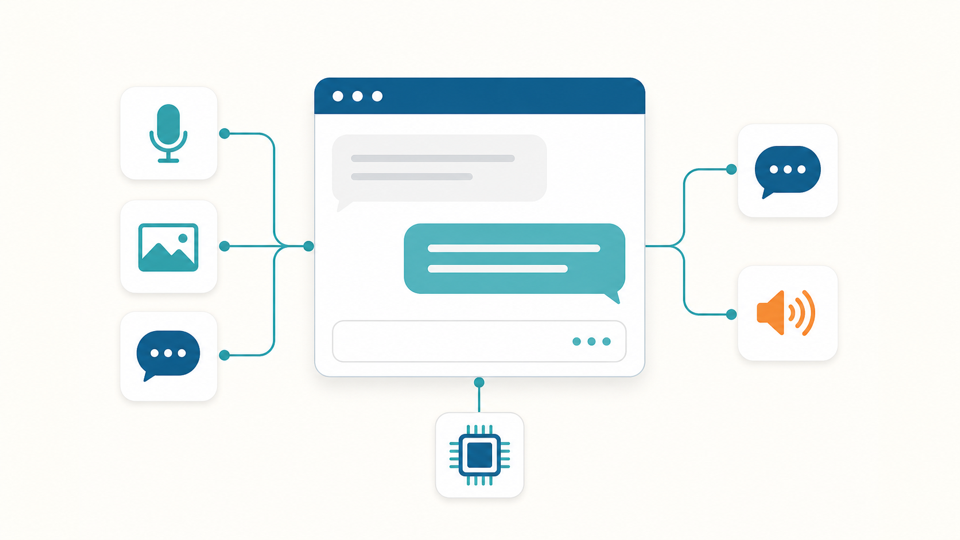

# Multimodal Assistant

## Metadata
| Field | Value |
| --- | --- |
| Category | genai |
| Difficulty | Advanced |
| Tags | genai, vlm, asr, tts, openai-compatible |
| Languages | Python |
| Status | experimental |
| Binary Name | multimodal-assistant |
| Model | Qwen3-VL-4B-Instruct-GPTQ-a16w4 + whisper-small-a16w8 |

## Concept
This example hosts SiMa-supported GenAI models through Neat's OpenAI-compatible server and uses the imported Flask demo UI as the interactive assistant surface.

The example supports one or more configured chat models, one configured ASR model, image/text chat, audio transcription, Piper TTS, system prompt control, chat history, voice selection, and abort.

The demo runs as two processes. `src/python/server/main.py` reads the `server` section of the selected config and starts the Neat OpenAI-compatible server. `src/python/ui/main.py` reads the `app` section of the selected config and starts the existing Flask UI. `src/common/config.yaml` is the tracked template; `./setup.sh` writes the runnable local config to `config.local.yaml`.

Runtime ownership is split deliberately:

- Neat hosts the OpenAI-compatible `/v1/chat/completions` endpoint for text and image chat.
- Neat hosts the OpenAI-compatible `/v1/audio/transcriptions` endpoint for ASR.
- The Flask app owns UI state, system prompt handling, chat history, abort requests, uploaded images, microphone recordings, and Piper TTS playback.
- Piper TTS is app-side. The default requirements install Piper; TTS produces audio when the configured voice assets are present under `src/python/ui/assets/`.
- RAG is app-side and optional. It uses the Flask UI, local VectorDB service, and the same chat model hosted by the Neat OpenAI-compatible server.

## Preview
Multimodal assistant UI:



## Prerequisites

- `sima-cli` on a supported Modalix or DevKit target.
- The model server uses the Python environment where `pyneat` is available. The default scripts assume:

```text
~/pyneat/bin/python
```

Set `PYNEAT_PYTHON=/path/to/python-with-pyneat` if your Neat Library environment is somewhere else.

## Install Apps

1. Choose a version from the [Neat Apps releases](https://github.com/sima-neat/apps/releases).
2. Install that version and enter the installed bundle:

```bash
sima-cli neat install apps@<release-version>
cd prebuilt-apps
```

Run the remaining commands from `prebuilt-apps/`.

## Prepare the Model

The setup script installs these model directories:

| Model | Role | Source |
| --- | --- | --- |
| `Qwen3-VL-4B-Instruct-GPTQ-a16w4` | Default chat/VLM | Hugging Face |
| `whisper-small-a16w8` | Required ASR | Hugging Face |
| `gte-small` | Default RAG embedding | Hugging Face |

Install the UI virtual environment, default chat/VLM model, Whisper ASR model, GTE-small embedding model, Piper TTS voices, default RAG database, and generated local config:

```bash
cd examples/genai/multimodal-assistant

./setup.sh
```

By default, `setup.sh` downloads:

- `simaai/Qwen3-VL-4B-Instruct-GPTQ-a16w4`
- `simaai/whisper-small-a16w8`
- `thenlper/gte-small`

Use the [LLiMa CLI](https://developer.sima.ai/software/genai-llima/runtime) to manage precompiled server models.

Search the supported models:

```bash
llima search
```

Install the VLMs you want to serve and the required ASR model:

```bash
llima pull Qwen3-VL-4B-Instruct-GPTQ-a16w4
llima pull gemma-4-E2B-it-GPTQ-a16w4
llima pull whisper-small-a16w8
```

Models installed with `llima pull` use `/media/nvme/llima/models/<model-name>` by default. The setup script configures one default VLM; add every additional VLM's name and path under `server.models.chat` in `config.local.yaml` to serve multiple models at the same time. Set `LLIMA_MODELS_PATH` before `llima pull` to use another model directory. The setup script remains the complete example installer because it also prepares the UI environment, RAG embedding model, TTS voices, local configuration, and RAG database.

`whisper-small-a16w8` is the supported ASR model and is always downloaded. To use another compatible SiMa.ai chat/VLM repository, override the default download:

```bash
CHAT_MODEL_REPO=simaai/<chat-model-repo> ./setup.sh
```

Downloaded models use this layout by default:

```text
/media/nvme/llima/models/
├── Qwen3-VL-4B-Instruct-GPTQ-a16w4/
├── whisper-small-a16w8/
└── gte-small/
```

On a SoM board, mount NVMe before running setup. If NVMe is mounted but the model directory is not writable, create it with ownership for the current user:

```bash
sudo install -d \
  -o "$(id -u)" \
  -g "$(id -g)" \
  /media/nvme/llima/models
```

On a system without NVMe, set `LLIMA_MODELS_PATH` to another writable location. To use the user-managed Apps model directory:

```bash
APPS_ROOT="$(cd ../../.. && pwd)"
LLIMA_MODELS_PATH="${APPS_ROOT}/models/genai" ./setup.sh
```

The same three model directories are created under the selected path. For a standalone example, set `LLIMA_MODELS_PATH` to any writable absolute path.

The UI virtual environment is stored under `./.venv` unless `APP_VENV` is set. The generated config is stored at `./config.local.yaml` unless `CONFIG_PATH` is set. RAG is enabled by default and uses `src/python/ui/milvus.db`, created from `src/common/rag/neat.md`.

### Configure Chat/VLM Models
After install, edit `config.local.yaml` to change or add hosted chat/VLM models:

```yaml
server:
  models:
    chat:
      - name: Qwen3-VL-4B-Instruct-GPTQ-a16w4
        path: /media/nvme/llima/models/Qwen3-VL-4B-Instruct-GPTQ-a16w4
      - name: gemma-4-E2B-it-GPTQ-a16w4
        path: /media/nvme/llima/models/gemma-4-E2B-it-GPTQ-a16w4
    asr:
      name: whisper-small-a16w8
      path: /path/to/llima/models/whisper-small-a16w8
```

The first chat/VLM entry is selected by default. Additional entries appear in the UI model selector. Model directories must contain `devkit/` and `elf_files/`.

## Run
Start both the Neat OpenAI-compatible server and the Flask UI:

```bash
./run.sh
```

Open the Flask UI:

```text
https://<target-ip>:5000
```

The Neat OpenAI-compatible server listens on:

```text
http://127.0.0.1:9998
```

Check that the configured models are hosted:

```bash
curl -s http://127.0.0.1:9998/v1/models | python3 -m json.tool
```

Wait until this command lists the configured chat and ASR models before testing the browser UI.

### Manual Process Start
Use this only when you want two explicit terminals.

```bash
export EXAMPLE_DIR="${PWD}"
```

Terminal 1, model server:

```bash
source ~/pyneat/bin/activate

python "${EXAMPLE_DIR}/src/python/server/main.py" \
  --config "${EXAMPLE_DIR}/config.local.yaml"
```

Terminal 2, Flask UI:

```bash
source .venv/bin/activate

python "${EXAMPLE_DIR}/src/python/ui/main.py" \
  --config "${EXAMPLE_DIR}/config.local.yaml"
```

The supported entrypoints are `src/python/server/main.py` for model hosting and `src/python/ui/main.py` for the UI.

## RAG
RAG is enabled by default after `./setup.sh`.

The installer downloads `thenlper/gte-small`, stores it under the configured models directory, and creates:

```text
src/python/ui/milvus.db
src/python/ui/milvus.meta.json
```

To point RAG at a different local embedding model or disable it, edit `config.local.yaml`:

```yaml
app:
  rag:
    enabled: true
    embedding_model_dir: /path/to/llima/models/gte-small
```

To rebuild the RAG database from another Markdown file:

```bash
export EXAMPLE_DIR="${PWD}"
source .venv/bin/activate

python src/python/rag/create_db.py \
  --input /path/to/document.md \
  --output src/python/ui/milvus.db \
  --embedding-model "${LLIMA_MODELS_PATH:-/media/nvme/llima/models}/gte-small"
```

Do not commit generated files:

```text
${EXAMPLE_DIR}/src/python/ui/milvus.db
${EXAMPLE_DIR}/src/python/ui/milvus.meta.json
${EXAMPLE_DIR}/config.local.yaml
```

Check VectorDB directly:

```bash
curl -sG http://127.0.0.1:9100/search \
  --data-urlencode "query=What is the canonical RAG validation phrase?" \
  --data "k=3" \
  --data "min_score=-1" | python3 -m json.tool
```

In the UI, enable `Search RAG Database` and ask:

```text
What is the canonical RAG validation phrase?
```

The RAG status area should report whether RAG was used and how many hits were retrieved.

## Verify
Use these checks after the model server and Flask UI are running.

Check hosted model names:

```bash
curl -s http://127.0.0.1:9998/v1/models | python3 -m json.tool
```

Check text chat:

```bash
CHAT_MODEL="<chat-model-name>"

curl -s http://127.0.0.1:9998/v1/chat/completions \
  -H 'Content-Type: application/json' \
  -d "{\"model\":\"${CHAT_MODEL}\",\"messages\":[{\"role\":\"user\",\"content\":[{\"type\":\"text\",\"text\":\"Say hello.\"}]}],\"max_tokens\":32}"
```

Check ASR with any short WAV file:

```bash
ASR_MODEL="<asr-model-name>"
AUDIO_FILE="/path/to/audio.wav"

curl -s http://127.0.0.1:9998/v1/audio/transcriptions \
  -F "model=${ASR_MODEL}" \
  -F "file=@${AUDIO_FILE}"
```

Check Piper TTS through the Flask app:

```bash
curl -k -s https://127.0.0.1:5000/v1/audio/speech \
  -H 'Content-Type: application/json' \
  -d '{"model":"piper-tts","input":"Hello from the Multimodal Assistant."}' \
  --output /tmp/multimodal-assistant-tts.wav
```

If RAG is enabled, check VectorDB:

```bash
curl -sG http://127.0.0.1:9100/search \
  --data-urlencode "query=What is Neat?" \
  --data "k=3" \
  --data "min_score=-1" | python3 -m json.tool
```

Then test the browser UI:

- send a text prompt
- select another hosted chat model
- enable `Include image in the prompt` and send an image prompt
- record audio and confirm transcription appears
- select a Piper voice and confirm playback
- change the system prompt and send a new prompt
- press abort during generation
- enable `Search RAG Database` and ask a question from `src/common/rag/neat.md`

## Source Files
- Run wrapper: `run.sh`
- Python source: `src/python/server/main.py`, `src/python/ui/main.py`, `src/python/ui/flask_app.py`, `src/python/shared/config.py`, `src/python/ui/pipertts.py`
- Python dependencies: `src/python/requirements.txt`, `src/python/requirements-rag.txt`
- RAG helper: `src/python/rag/create_db.py`, `src/python/rag/vectordb.py`, `src/python/rag/vectordb_worker.py`
- RAG sample document: `src/common/rag/neat.md`
- UI assets: `src/python/ui/templates/`, `src/python/ui/static/`, `src/python/ui/assets/`, `src/python/ui/certs/`
- Manual API scripts: `src/python/ui/apitest/`
- Shared config: `src/common/config.yaml`

## Development From Source

To modify or test this example, use the [Apps contributor workflow](https://github.com/sima-neat/apps/blob/main/CONTRIBUTING.md).
