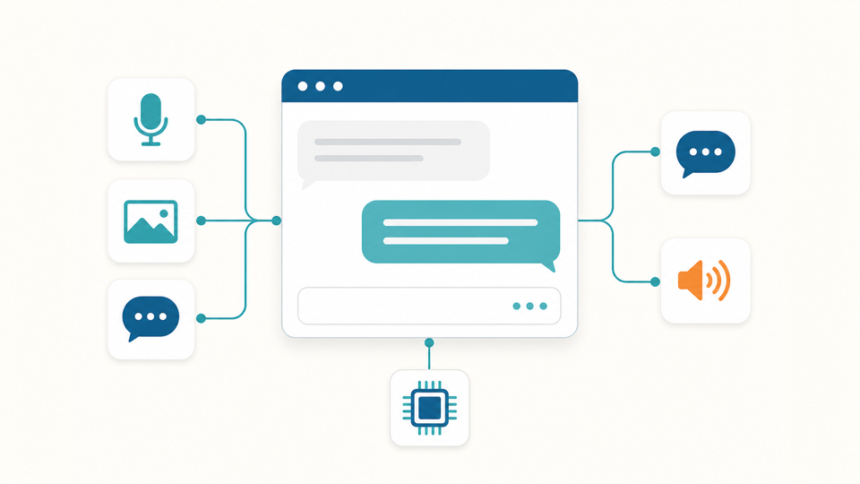

# Neat GenAI Studio

## Metadata
| Field | Value |
| --- | --- |
| Category | genai |
| Difficulty | Advanced |
| Tags | genai, vlm, asr, tts, japanese, multilingual, rag, model-switching, huggingface, markdown, openai-compatible |
| Languages | Python |
| Status | stable |
| Binary Name | neat-genai-studio |
| Model | Loaded on demand (e.g. Qwen3-VL-4B-Instruct-GPTQ-a16w4) + whisper-small-a16w8-layered-encoder |

## Concept
Runs supported language and vision-language models on a Modalix device through a web interface for chat, image analysis, model setup, and diagnostics.

The Studio starts without a chat model loaded. From the web interface you can:

- find compatible models already on the device
- download models from the supported Hugging Face accounts when the device is online
- load one language or vision-language model at a time without restarting the Studio
- chat with text, uploaded images, a browser camera, or a camera attached to the board
- transcribe speech with Whisper, speak replies with the installed voices, and search local documents with RAG

The interface and its fonts and JavaScript libraries run locally. Internet access is needed only when you search for or download a model from Hugging Face.

## Preview


## Prerequisites
- A Modalix DevKit with `sima-cli` ([documentation](https://developer.sima.ai/software/tools/sima-cli/)), the Neat Development Environment, and the Neat Library installed.
- The Neat Library's Python environment at `~/pyneat/bin/python`. If it is somewhere else, set `PYNEAT_PYTHON=/path/to/python-with-pyneat` before running the commands below.
- Internet access on the board for the first `setup.sh` run and for Hugging Face downloads.

Run every command below in a shell on the board.

## Install Apps
Install the Apps bundle, enter it, and name the Studio's directory:

```bash
sima-cli neat install apps
cd prebuilt-apps
APP_DIR=examples/genai/neat-genai-studio
```

Run the remaining commands from `prebuilt-apps/`. In a new shell, run the `cd`
and `APP_DIR=` lines again first.

## Prepare the Model
Install the Studio's environments, models, and voices:

```bash
${APP_DIR}/setup.sh
```

`setup.sh` downloads the default speech-to-text model
(`florianvoss/whisper-small-a16w8-layered-encoder`) and the RAG embedding model
(`thenlper/gte-small`) into `/media/nvme/llima/models`, installs the
text-to-speech voices and the Supertonic engine, builds the default RAG
database, and writes `config.local.yaml`. When asked, pick the voice languages
to install and whether to add a `neat-ai` shell alias. It finishes with
`Install complete.`

No chat or vision-language model is installed by default; you load one from the
web interface after startup. To download one during setup instead:

```bash
CATALOG_MODEL_REPOS="simaai/Qwen3-VL-4B-Instruct-GPTQ-a16w4" ${APP_DIR}/setup.sh
```

On a board without NVMe storage, choose another directory for the models:

```bash
LLIMA_MODELS_PATH=/path/to/models \
SUPERTONIC_MODELS_ROOT=/path/to/models/supertonic-tts/models \
${APP_DIR}/setup.sh
```

## Configure
Most users change nothing. `setup.sh` writes `config.local.yaml` from the
packaged defaults in `src/common/config.yaml`, and any compatible model under
the model directory can be loaded from the web interface without a restart.
Edit `config.local.yaml` only to change:

- `server.models.catalog_dir`: the directory scanned for models (default `/media/nvme/llima/models`).
- `server.models.chat`: chat or vision-language models to load at startup (none by default).
- `server.models.asr`: the speech-to-text model active at startup. Models from Hugging Face accounts other than `simaai` are named `<org>@<name>`, for example `florianvoss@whisper-small-a16w8-layered-encoder`.
- `server.hub.allow_download`: whether the interface may download models from Hugging Face.
- `app.rag.enabled`: retrieval-augmented search.
- `app.web`: the web interface's host, port, and HTTPS setting.

Set `chat: []` and remove `asr:` to start with no model loaded; the interface
then asks you to load or download one.

Restart the Studio after editing the file.

## Run
Start the Studio:

```bash
${APP_DIR}/run.sh
```

`run.sh` starts the model server (`${APP_DIR}/src/python/server/main.py`) and
the web interface (`${APP_DIR}/src/python/ui/main.py`). When startup finishes,
it prints the address to open, `https://<board-ip>:5000`. Open it on a computer
that can reach the board. The browser warns about the Studio's self-signed certificate
the first time; choose Advanced, then proceed.

Load a model from **Settings (⚙) → Models**, or download one from
**Settings → Add Model**, then send a chat message.

To stop the Studio, press `Ctrl+C` in the terminal running `run.sh`, use
**⏻ Shutdown** in the sidebar, or run `${APP_DIR}/run.sh stop` from another shell.
`${APP_DIR}/run.sh status` reports whether it is running.

## Expected Result
- The web interface loads at `https://<board-ip>:5000`.
- After you load a model, a chat message returns a streamed reply.
- Recording from the microphone shows the transcription, and spoken replies play when a voice is installed for the language.

To confirm the model server from a second shell on the board:

```bash
curl -s http://127.0.0.1:9998/v1/models | python3 -m json.tool
```

The output lists the speech-to-text model and any chat model you loaded.

## Troubleshooting
- **The model server does not start:** confirm `pyneat` imports in the environment at `PYNEAT_PYTHON` (default `~/pyneat/bin/python`).
- **`setup.sh` says the runtime refuses the speech-to-text model:** your Neat runtime needs a speech model with a different encoder layout. Install the older build instead with `ASR_MODEL_REPO=simaai/whisper-small-a16w8 ${APP_DIR}/setup.sh`.
- **A model download fails with an access error:** set `HF_TOKEN` for gated Hugging Face repositories.
- **A model fails to load with an accelerator error:** restart the Studio (`${APP_DIR}/run.sh stop`, then `${APP_DIR}/run.sh`) to free the accelerator, then load the model again.
- **Start over:** `${APP_DIR}/run.sh --clean`, then `${APP_DIR}/setup.sh`. Downloaded models are kept.

## Optional Features

Everything below is optional — the workflow above is all most users need. The
features are grouped here so you can jump to what you want:

- **Models:** [Switch models on the fly](#switch-models-on-the-fly) · [Switch the speech-to-text model](#switch-the-speech-to-text-model) · [Download models from Hugging Face](#download-models-from-hugging-face)
- **Audio:** [Audio API (OpenAI-compatible)](#audio-api-openai-compatible) · [Text-to-speech (voices & languages)](#text-to-speech-voices--languages)
- **Front ends & access:** [Terminal chat (CLI)](#terminal-chat-cli) · [Backend-only mode](#backend-only-mode-for-insight-and-other-front-ends) · [Manual Process Start](#manual-process-start) · [API checks](#api-checks)
- **More features:** [RAG](#rag) · [Benchmark (TTFT / TPS)](#benchmark-ttft--tps) · [SiMaSentry Solutions](#simasentry-solutions-med--safe--sec-demo-harnesses) · [Markdown & fonts](#markdown--fonts)
- **Setup & operations:** [Setup options](#setup-options) · [Reset the accelerator](#reset-the-accelerator) · [Update](#update) · [Clean up](#clean-up)

### Setup options
Seed the catalog with one or more chat/VLM models at install time instead of
downloading them from the UI (space-separated Hugging Face repos):

```bash
CATALOG_MODEL_REPOS="simaai/<a-chat-or-vlm-repo> simaai/<another-repo>" ${APP_DIR}/setup.sh
```

Other useful environment variables:

- `CHAT_MODEL_REPO`: optionally download **and preload** one chat/VLM model at
  startup (empty by default, i.e. none).
- `ASR_MODEL_REPO`: the speech-to-text model installed and made active at
  startup (default `florianvoss/whisper-small-a16w8-layered-encoder`; set to
  `""` to install none). Current LLiMa splits the Whisper encoder into one ELF
  per layer and refuses the older monolithic builds; on a runtime that needs a
  monolithic encoder pass `ASR_MODEL_REPO=simaai/whisper-small-a16w8`. Setup
  checks the model loads and leaves it out of the startup configuration if the
  runtime refuses it, rather than configuring a model that cannot be used.
- `ASR_CATALOG_MODEL_REPOS`: space-separated extra ASR repos to seed the
  catalog, e.g. `florianvoss/whisper-medium-a16w8-layered-encoder`, so you can
  switch between them
  at runtime from **Settings → Models**.
- `MAX_RESIDENT_CHAT_MODELS`: kept for advanced use; by default only one
  chat/VLM model is resident and loading a new one clears the others.
- `ALLOW_HUB_DOWNLOAD`: `true`/`false` to enable/disable in-UI Hugging Face
  downloads (default `true`).
- `HUB_ORGS`: space-separated Hugging Face accounts the in-UI browser searches
  (default `simaai TDoSiMa florianvoss`). Only listed accounts can be downloaded
  from.
- `TTS_LANGUAGES`: comma- or space-separated catalogued server-TTS languages to
  install. Interactive setup prompts when this is unset; non-interactive setup
  defaults to `en,de,es,fr,it,ja,pt,vi,zh`.
- `INSTALL_SUPERTONIC`, `SUPERTONIC_MODELS_ROOT`, `SUPERTONIC_VENV`: install the
  MLA-accelerated Supertonic 3 engine (default on), where its model files are
  stored (default `/media/nvme/supertonic-tts/models`) and where its runtime venv
  is built (default `./.venv-supertonic`); see
  [Text-to-speech](#text-to-speech-voices--languages). The models root is
  written to `config.local.yaml` under `app.tts.supertonic`, so `run.sh` finds a
  non-default location without re-exporting it.
- `TTS_OPTIONAL_VOICES`: optional voice ids to install, for example
  `mera,en_US-ljspeech-medium,zh_CN-chaowen-medium`.

The UI virtual environment is stored under `./.venv` unless `APP_VENV` is set.
The generated config is stored at `./config.local.yaml` unless `CONFIG_PATH` is
set. RAG is enabled by default and uses `src/python/ui/milvus.db`.

At the end, `setup.sh` offers to create a **`neat-ai`** shell alias for `${APP_DIR}/run.sh`
so you can start the studio from any directory. On the eLxr board (interactive
SSH sessions are login shells) it is written to `~/.bash_profile`; for zsh it goes
to `~/.zshrc`. Answer the prompt, or set `CREATE_ALIAS=1`/`0` to skip it
non-interactively; after it's added, `source ~/.bash_profile` (or open a new
shell), then run `neat-ai`, `neat-ai --cli`, `neat-ai stop`, etc.

On a board with a desktop (display, keyboard and mouse attached), `setup.sh`
also offers a **desktop icon** (`CREATE_DESKTOP_ICON=1`/`0` non-interactively);
it goes on the desktop and in the applications menu. Double-clicking it opens a
terminal that runs `${APP_DIR}/run.sh --open-browser`: the Studio starts, or is found
already running, and the default browser opens on it as soon as the UI
answers. The first visit shows the browser's warning for the Studio's
self-signed certificate; choose Advanced → proceed. Closing the terminal window
(or Ctrl+C in it) stops the Studio; if startup fails, the window stays open with
the error. The first double-click may ask to trust the launcher (XFCE:
**Mark Executable**) unless `setup.sh` ran inside the logged-in desktop session.
`${APP_DIR}/run.sh --clean` removes the icon along with the other generated files.

Re-running `setup.sh` (for example to add a model or voice) regenerates
`config.local.yaml` but keeps your `app.web` settings (host, port, https,
`headless`, `cors_origins`) and the Supertonic paths; the previous file is saved
as `config.local.yaml.bak` so any other hand edits can be copied back.

### Terminal chat (CLI)
Prefer the terminal? `--cli` starts the model server (clearing stale processes
first, as usual) and drops you into an interactive chat instead of the web UI:

```bash
${APP_DIR}/run.sh --cli    # or `neat-ai --cli`
```

On an interactive start it first asks what you want to do: **Chat with a model**,
**Benchmark model(s)**, **Download a model** (when online), or **go straight to the
prompt**. Skip the menu by jumping straight to a mode:

```bash
${APP_DIR}/run.sh --chat [MODEL]        # chat now (load MODEL first if given)
${APP_DIR}/run.sh --download [REPO]      # download REPO (or prompt), then chat
${APP_DIR}/run.sh --benchmark [MODEL]    # benchmark MODEL (or prompt), then chat (alias --bench)
```

It then talks straight to the model server (the control API to list/load models
and the OpenAI endpoint to stream replies). Type a message to chat; commands:

```text
/models          list catalog models (● loaded, ○ not)
/load [name]     load a model: no name pops an arrow-key picker (↑/↓, Enter)
/download        browse Hugging Face: pick one, several, or all models to
                 download (Space to multi-select, 'a' for all), then load one
/unload [name]   unload a model: no name unloads the loaded LLM/VLM
/delete [name]   delete a model's weights from disk: no name pops a picker;
                 asks to confirm (irreversible; /rm, /remove)
/image [path]    attach an image to the next message (VLM only; no path prompts)
/camera [device] arm the board camera: every message then auto-sends a fresh
                 frame to the VLM (/camera off to stop; /dev/video16: /cam, /webcam)
/benchmark …     TTFT/TPS benchmark: see the Benchmark section below
/system <text>   set a system prompt (empty clears it)
/new             clear the conversation
/export [file]   save this chat to a .log file (default neat-chat-<time>.log)
/tokens <n>      set max response tokens
/think [on|off]  let reasoning models think before answering (default on):
                 the reasoning streams dimmed, is counted separately, and stays
                 out of the history and /export; off sends /no_think like the
                 web UI's Thinking toggle (start with --no-think for the same)
/rag [filter]    inspect the RAG database: list chunks (/docs; filter narrows)
/rag on|off      toggle RAG-augmented chat (top passages prepended to prompts)
/rag search <q>  semantic search: show top matches without asking the model
/rag db [path]   show, or switch to, which milvus.db is served ('default' reverts)
/rag status      show the RAG toggle, active database and service state
/rag reset|clear rebuild from the default document, or clear all RAG documents
/help  /quit     help / exit (aliases: /exit, /bye, /q, Ctrl+D)
```

Replies render live as Markdown, and LaTeX math is converted to Unicode for the
terminal (`$E = mc^2$` → `E = mc²`, `\frac`, `\sqrt`, Greek letters, `\sum`, …).

Ctrl+C stops the current reply; it prints per-response timing (tokens, TTFT,
tok/s). Exiting shuts the model server down. If the model server crashes,
`run.sh` relaunches it (load a model again with `/load`), up to
`MLA_MAX_RESTART_RETRIES` times in a row (default 4); a relaunch that stays up
for `RELAUNCH_STABLE_SECONDS` (default 60) resets the count. Use **↑/↓** at the
prompt to recall previous prompts (history persists across sessions in
`~/.neat_ai_history`).

`/camera <index>` **arms** a camera attached **to the board** (the CLI runs on
the board, unlike the web UI, which uses the browser's camera). Once armed, every
message auto-grabs a fresh frame and sends it to the VLM: `/camera off` disarms,
and a `📷` in the prompt shows it's live. It uses any available capture tool,
including `ffmpeg`, `fswebcam`, or `libcamera`/`rpicam`. Install one if
the board has none, or set `NEAT_CAMERA_DEVICE` to the right `/dev/video*` node.
An explicit `/image` still takes precedence for that one message.

### Switch models on the fly
The **Settings → Models** tab shows models downloaded to the board in a searchable list. Loaded models are marked
`● loaded`, on-disk ones `○ downloaded`; press **Load** on a not-yet-loaded model
to load it at runtime and unload all other chat/VLM models (speech-to-text has
its own slot and is untouched), so the MLA holds just the active model. A **Load status** panel pins to the
top of the tab and shows the live progress bar while it loads. The studio cancels
the outgoing model's in-flight generation and waits for its memory to be released
before loading the new one, then warms it so your first message is instant.

If a switch hits an accelerator error, the Studio rolls back the failed model
registration and reports the error. It does not restart or reset board services;
restart the Studio to free the accelerator, then load the model again.

### Switch the speech-to-text model
The same tab lists your speech-to-text (ASR) models in their own
**Speech-to-text** group, because they never compete with chat models for the
same slot. Exactly one is active — marked `● active` — and pressing **Use** on
another evicts it and makes the new one active, without restarting and without
clearing the conversation. The chat model stays loaded throughout.

`setup.sh` installs `florianvoss/whisper-small-a16w8-layered-encoder` by
default — a layered-encoder build, which is what current LLiMa requires. To
install a different or additional model:

```bash
# Replace the default:
ASR_MODEL_REPO="florianvoss/whisper-medium-a16w8-layered-encoder" ${APP_DIR}/setup.sh

# Or keep whisper-small and seed extra models to switch between at runtime:
ASR_CATALOG_MODEL_REPOS="florianvoss/whisper-medium-a16w8-layered-encoder" ${APP_DIR}/setup.sh
```

You can also download any Whisper build from **Settings → Add Model** while the
studio is running; it appears in the Speech-to-text group ready to use. Larger
models transcribe more accurately at the cost of load time and memory.

Switching is **not persistent**: `server.models.asr` in `config.local.yaml` is
what a restart re-selects, and the model it names carries a `startup default`
badge. Edit it to make a different choice permanent. Set `STUDIO_ASR_WARMUP=0`
to skip the warm-up a switch performs (the first transcription then pays the
load cost instead).

### Download models from Hugging Face
When the board is online, the **Settings → Add Model** tab appears (it's hidden
offline). It lists compatible models *available to download* from the Hugging Face
accounts in `server.hub.orgs` — `simaai` (official precompiled) plus the
`TDoSiMa` and `florianvoss` community accounts — each with a **download size**
badge (⬇ so you know how much space it needs) and a **`💾 NVMe storage: … free`**
readout so you can tell whether it will fit. Filter by account, type
(LLM / VLM / ASR), parameter count or family, search, click **Download**, watch
the progress bar, and the model moves to the **Models** tab ready to load — a
speech model into the **Speech-to-text** group. The account filter lists only
accounts that returned results, and hides itself when just one is configured.

Downloads land under `catalog_dir`. A repo from an account other than `simaai` is
stored as `<org>@<name>`, so two accounts publishing the same model name cannot
collide. Set `HF_TOKEN` for gated repos, and `HUB_ORGS` at install time (or
`server.hub.orgs` afterwards) to change which accounts are searched; a repo from
an account that is not listed is refused.

### Audio API (OpenAI-compatible)
The web UI port (`https://<board>:5000`, self-signed certificate) serves the
OpenAI audio API shape, so any OpenAI-style client can speak and transcribe
without the chat UI. Both routes are same-origin proxies/engines inside the
Studio, so browser pages can call them too (the model server on `:9998` is plain
HTTP and cannot be reached from an HTTPS page).

```text
POST /v1/audio/speech            JSON
  input            required, up to 4096 characters
  model            default | supertonic | piper-plus | piper-tts   (a named engine is used or refused, never swapped;
                   OpenAI's tts-1 / tts-1-hd / gpt-4o-mini-tts mean default; any other name answers 400)
  voice            Supertonic speaker F1-F5 / M1-M5, per request. The Piper engines speak with the voice
                   loaded for the language (chosen in the Studio's voice settings): omit voice or name
                   that one; any other Piper voice answers 400 rather than a different voice
  speed            0.25-4.0 (default 1.0); clamped to the engine's range, effective value in X-Speed
  response_format  wav (the only format produced; anything else answers 400)
  language         extension: ISO code the text is in (default en; auto means en)
  -> 200 audio/wav with X-Engine, X-Voice, X-Language, X-Speed, X-RTF, X-Audio-Duration, X-Elapsed-Time
     400 {error, param} | 503 {error, reason, engine} when the engine cannot serve the language

POST /v1/audio/transcriptions    multipart/form-data
  file             required (WAV, WebM/Opus, MP4/AAC, ... the server decodes with libavformat; up to 25 MiB)
  model            optional speech-to-text model; default: the active one
  language         optional ISO code or auto (default)
  response_format  json (default) -> {"text"} | verbose_json -> text plus language, language_detected,
                   tts_language, no_speech_prob, avg_logprob, ignored, reason, model | text -> text/plain
  -> headers X-ASR-Model, X-Elapsed-Time; 400 missing file | 413 too large | 503 no ASR active / server unreachable

POST /v1/audio/translations      multipart/form-data, same fields and limits as transcriptions
  -> the speech translated into English (Whisper's translate task); verbose_json adds
     task: "translate", language = the detected source language, tts_language: "en";
     headers X-ASR-Model, X-Task, X-Elapsed-Time

GET  /v1/audio/voices            extension: discovery
  -> {default_engine, languages, engines: [{key, label, loaded, languages, voices: [{id, label, ...}]}]}
```

`utterance_speed` / `utteranceSpeed` are still accepted on the speech route as
deprecated aliases of `speed`. The scripts under `src/python/ui/apitest/`
(`speech.sh`, `transcriptions.sh`, `translations.sh`, `chat.sh`) wrap these calls.

#### Audio API playground
The waveform button in the header opens the **Audio API playground**
(`https://<board>:5000/playground/`, also usable standalone), a page built from
the Studio's own design tokens, fonts, controls and spacing, with four modes:

- **Speech** fills its engine, voice and language pickers from
  `GET /v1/audio/voices`, calls `POST /v1/audio/speech`, draws and plays the
  result (Web Audio, with a scrubbable player and a download link) and shows the
  `X-*` headers, the request body and a copyable `curl` equivalent.
- **Transcription** has a *Clip* mode (record from the microphone with a level
  meter or drop a file, preview it, call `POST /v1/audio/transcriptions` in any
  of the three formats, see the transcript, its metadata and a `curl` line) and
  a *Live* mode: hands-free listening where an energy-based voice-activity
  detector in the browser cuts each utterance at a pause you set (sensitivity
  and end-of-utterance sliders), uploads it as 16 kHz WAV and appends the
  transcript to a running log with per-utterance latency, real-time factor and
  the Studio's accepted/ignored verdict.
- **Echo** is a voice loop: speak, and what you said is transcribed and spoken
  straight back with the engine, voice, language (by default the language that
  was heard) and speed you pick. The microphone is muted while the reply plays
  and listening resumes afterwards; each turn shows the words heard, the reply
  spoken and the ASR, TTS and total timings.
- **Translate** turns speech or typed text in one language into another. Pick
  the source (or let Whisper detect it) and any target; the target list marks
  languages the chosen voice engine cannot speak. Into English, speech goes
  through Whisper's translate task (`POST /v1/audio/translations`, with the
  original transcribed alongside so each turn shows both);
  into any other language, Whisper transcribes what was said and the loaded
  chat model translates it through `POST /v1/chat/completions`, streaming the
  result into the turn. A **Tone** setting (neutral, formal, casual, friendly,
  business, simple) sets the register: formal and casual pick the language's
  formal or informal address (vous/tu, Sie/du, usted/tú); any tone other than
  neutral uses the chat model, into English too, and with the source and target
  the same it rewrites the text in that tone. The translation can be spoken back with the chosen
  engine, voice and speed. Hands-free like Echo (the microphone is muted while
  a translation plays), with a text box for typed input, a swap button, and
  ASR, LLM and TTS timings per turn.

Speech, Transcription and Echo need no chat model; Translate needs one only for
targets other than English (or for typed text), and says so when none is
loaded. Everything stays on this origin with no external requests; the
microphone needs the HTTPS page the Studio serves by default.
**Back to Studio** (top left, or Esc) returns to the chat; standalone it links
to the Studio root. Source: `src/python/ui/playground/`.

### Backend-only mode (for Insight and other front ends)
`${APP_DIR}/run.sh --backend-only` starts the model server and the Studio's API
endpoints without the web UI, so another front end (for example Insight) can
use the chat, speech, transcription and translation services directly. The
text-to-speech engines still run in the Studio's web process, so the speech
routes work exactly as in the full Studio. `app.web.headless: true` in
`config.local.yaml` makes it the default; `${APP_DIR}/run.sh status` reports the mode.

Served on the Studio port (HTTPS by default; set `app.web.https: false` for
plain HTTP behind another service):

```text
GET  /health                       readiness: model server, active ASR model, loaded chat models, TTS engines
POST /v1/chat/completions          OpenAI chat (streaming), proxied to the loaded chat/VLM model
POST /v1/audio/speech              text to speech (see the audio API above)
GET  /v1/audio/voices              engines, voices and languages
POST /v1/audio/transcriptions      speech to text in the spoken language
POST /v1/audio/translations        speech to English text
GET  /models/status, /models/catalog; POST /models/load, /models/unload, /models/asr, ...
GET/POST /tts/engine; GET /supertonic/voices, /piperplus/voices, /voices; POST /supertonic/select, /piperplus/select, /voices/select   voice settings
POST /shutdown                     stop everything (not reachable cross-origin)
```

Everything else (the UI pages, `/playground/`, static files, the Studio's own
chat, RAG and camera routes) answers 404 in this mode. Browser pages on other
origins are refused by default; list the origins that may call the API, or `*`:

```bash
BACKEND_CORS_ORIGINS="https://insight.local:8443,http://10.0.0.5:3000" ${APP_DIR}/run.sh --backend-only
```

To keep the allowlist across launches, set `app.web.cors_origins` in
`config.local.yaml` (a comma-separated string or a YAML list); the environment
variable overrides it for one run, and setting it empty
(`BACKEND_CORS_ORIGINS= ${APP_DIR}/run.sh --backend-only`) turns CORS off for that run.

Allowed origins get CORS headers (the `X-*` timing and engine headers are
exposed) and preflight answers on the API paths; `/shutdown` never is. Quick
checks from the board:

```bash
B=https://127.0.0.1:5000
curl -sk $B/health
curl -sk $B/v1/audio/voices | head -c 300
curl -sk -X POST $B/v1/audio/speech -H 'Content-Type: application/json' \
  -d '{"input":"Hello from the backend","model":"supertonic"}' -o hello.wav -D -
curl -sk -X POST $B/v1/audio/translations -F file=@hello.wav -F response_format=verbose_json
curl -sk -X OPTIONS $B/v1/audio/speech -H 'Origin: http://10.0.0.5:3000' \
  -H 'Access-Control-Request-Method: POST' -D - -o /dev/null
```

`src/python/ui/apitest/backend_runtime_test.sh` exercises the model server and
the speech routes against a backend started this way, and
`src/python/ui/apitest/audio_e2e.sh [host:port | base URL]` checks the audio
workflow end to end against any running instance: synthesized speech is
transcribed back to its words, German speech translates to English, and the
chat model answers; it exits non-zero on any failure. The `apitest` scripts
take a full base URL (`http://…` when `app.web.https` is false) or `STUDIO_URL`.

### Text-to-speech (voices & languages)
Spoken replies use a **multi-engine router** that picks the best offline TTS
engine per language. The spoken language follows the **Transcription language**
selector in Settings.

| Engine | Licence | Runtime | Languages |
| --- | --- | --- | --- |
| **Supertonic 3** | OpenRAIL model terms (see notices) | PyNeat on the **MLA** (vector field + vocoder), onnxruntime (CPU text front end) | 30+ incl. English, German, Spanish, French, Italian, Portuguese, Japanese, **Korean**, Vietnamese (not Chinese) |
| **piper-plus** | MIT runtime; model-specific terms | onnxruntime (CPU) | Japanese, English, Chinese, Spanish, French, Portuguese |
| **piper-tts** | GPL-3.0 runtime; model-specific terms | onnxruntime (CPU) | English, Chinese, Spanish, French, Portuguese, German, Italian, Norwegian, Vietnamese |
| **Browser** (Web Speech API) | None | client-side (your browser / OS) | any language your device has a voice for |

- The speech API (`POST /v1/audio/speech`) honours an explicit `model`:
  `supertonic`, `piper-plus` or `piper-tts` is dispatched to exactly that
  engine and answers 503 when it cannot speak the requested `language`; any
  other value (`default`, `tts-1`, …) goes through the router below.
- **Supertonic 3** is the MLA-accelerated engine (runtime vendored under
  `src/python/ui/tts/supertonic_sima/`, models from Hugging Face). It
  is preferred for every language it speaks whenever its runtime is installed
  (see below), synthesizes at a real-time factor of about 0.07 on a Modalix
  DevKit, and offers ten speakers (F1-F5, M1-M5) under **Settings → Supertonic
  voice**. `SUPERTONIC_VOICE` picks the startup speaker; `SUPERTONIC_STEPS`
  (5-12, default 8) trades quality for latency. Replies are split into segments
  that fit the compiled 192-character contract and streamed one WAV per segment.
- **Japanese** defaults to Piper Plus CSS10. CSS10 is declared public domain;
  the multilingual base model is CC BY 4.0 and its attribution is preserved in
  [the TTS notices](https://github.com/sima-neat/apps/blob/main/examples/genai/neat-genai-studio/THIRD_PARTY_TTS_MODELS.md).
- **MERA** is an optional Piper Plus model published under Apache 2.0, with the
  CC BY 4.0 base-model attribution preserved. Selecting it downloads and
  verifies it automatically.
- **Chinese** defaults to the dedicated Huayan Piper voice. Chaowen is an
  optional second Chinese voice; Piper Plus CSS10 remains available as the
  multilingual alternative.
- **Korean** is spoken by Supertonic 3 when it is installed. Without it there is
  no server-side Korean model: use Browser TTS when the client has a Korean
  voice; otherwise replies remain text-only.
- **Voice engine**: a **Settings → Voice engine** dropdown chooses which engine
  is preferred for languages more than one can speak (supertonic, piper-plus or
  piper-tts). Languages only one engine supports are unaffected.
- **Browser**: selecting the **Browser** engine speaks replies on the client with
  the Web Speech API instead of synthesizing on the board (no server compute). The
  server still cleans each sentence (Markdown/LaTeX stripped), so the browser
  utters clean text; pick a device voice under **Settings → Browser voice**. It
  works for any language your browser has a voice for.
- `setup.sh` asks which catalogued languages to install. In non-interactive use,
  set `TTS_LANGUAGES`, and use `TTS_OPTIONAL_VOICES=mera` to add MERA. The UI
  lists catalogued voices per language and downloads a missing voice when it is
  activated.
- CSS10 is the default Piper Plus model. It applies across all six Piper Plus
  languages; MERA is the only optional multilingual model.
- **piper-tts runs in its own venv** (`.venv-pipertts`). piper-tts and piper-plus
  both ship a top-level `piper` package and can't share one environment, so
  `setup.sh` installs piper-tts separately and the UI reaches it through a
  subprocess worker (`pipertts_worker.py`); `run.sh` exports `PIPERTTS_PYTHON`
  for this. If the venv is missing, dedicated voices are skipped and Piper Plus
  keeps working.
- Every dedicated piper-tts voice is split into encoder and decoder ONNX files
  during setup. The decoder emits roughly half-second audio slices, so the
  browser starts playback while the remainder of the sentence is synthesized.
  Split inference is required: setup fails if an installed dedicated voice cannot
  be split, and the UI keeps the current voice if a newly selected voice cannot
  be prepared. The original model remains on disk only to rebuild the split
  files; the worker loads only the encoder and decoder sessions into memory.
  Piper Plus is a separate multilingual engine and does not use this split path.
- The default router preference is `supertonic` when its runtime loaded and
  `piper-tts` otherwise. Selecting `piper-plus` under **Settings → Voice engine**
  switches supported languages to the active multilingual voice.
- **CPU engines load on demand.** When Supertonic is available, piper-plus and
  the dedicated piper-tts voices stay out of RAM at startup; only languages
  Supertonic cannot speak (Chinese, Norwegian) get their Piper voice loaded.
  The **Voice engine** picker still lists installed CPU engines, marked
  "loads on select"; choosing piper-tts loads the voice for the current
  language (a few seconds) and other languages load on their first spoken
  reply. Without Supertonic every installed engine loads at startup as before.
- **Supertonic runs in its own venv and worker too.** Its runtime needs `pyneat`,
  `onnxruntime` and `numpy 1.26`, which the UI venv does not carry, so `setup.sh`
  builds `./.venv-supertonic` (requirements in
  `src/python/requirements-supertonic.txt`, plus the PyNeat wheel fetched with
  `sima-cli neat install core -t pyneat`) and downloads the model files with
  the venv's `hf`: the upstream CPU models and voice styles from
  [Supertone/supertonic-3](https://huggingface.co/Supertone/supertonic-3) and
  the precompiled MLA packages from
  [florianvoss/supertonic-3-sima](https://huggingface.co/florianvoss/supertonic-3-sima),
  both at commit revisions pinned in `setup.sh` and verified by SHA-256. No
  on-device compilation is needed, and nothing is cloned from an external
  repository: the runtime package itself is vendored in
  `src/python/ui/tts/supertonic_sima/` (see its README for provenance and how to
  refresh it). Every `setup.sh` run (including `--dependencies-only`) checks all
  19 model files against the SHA-256 of the pinned revisions and re-fetches any
  that are missing or different, so an interrupted, corrupted or outdated
  download is repaired; a venv whose build fails part-way is removed rather than
  left half-installed. The models root and the venv path are persisted under
  `app.tts.supertonic.models_root` / `.venv` in `config.local.yaml`; `setup.sh`,
  `run.sh` and the UI read them from there (so a custom `SUPERTONIC_VENV` or
  `SUPERTONIC_MODELS_ROOT` keeps working on every later launch and re-run), with `SUPERTONIC_MODELS_ROOT`
  / `SUPERTONIC_VENV` / `SUPERTONIC_PYTHON` in the environment as overrides, and
  `run.sh` exports `SUPERTONIC_PYTHON` for the worker. Set `INSTALL_SUPERTONIC=0` to skip
  it; when the runtime is missing the engine is simply not offered and the CPU
  engines behave as before. `${APP_DIR}/run.sh --clean` removes the venv under the
  example directory and keeps the model files; a venv configured elsewhere and
  the model files are removed only with `CLEAN_SUPERTONIC=1`. `${APP_DIR}/run.sh update`
  warns when a release changes the Supertonic requirements or model revisions
  without `UPDATE_DEPS=1`. Installs made before the runtime was vendored keep working:
  their `app_root` config key maps to `<app_root>/models`, and the old venv and
  checkout can simply be deleted. The worker holds the two Supertonic models on
  the MLA next to the chat and speech-to-text models.

The authoritative reviewed catalog is `src/python/ui/tts/voice_catalog.json`. Each
entry has a compact licence label, pinned upstream repository revision, and
SHA-256 checksums. Models under `CC-BY-NC-SA-4.0` are excluded. Runtime
discovery ignores models outside the catalog. See
[Third-party TTS models](https://github.com/sima-neat/apps/blob/main/examples/genai/neat-genai-studio/THIRD_PARTY_TTS_MODELS.md) for attribution notices.

### RAG
RAG is enabled by default after `${APP_DIR}/setup.sh`.

The installer downloads `thenlper/gte-small`, stores it under the configured
models directory, and creates:

```text
src/python/ui/milvus.db
src/python/ui/milvus.meta.json
```

#### Inspect the RAG database
See exactly what has been ingested: the source, chunk count, embedding model,
and every chunk (header breadcrumb + text):

- **Web UI**: **Settings → Knowledge (RAG) → Inspect RAG DB** opens a browser with
  a filter box.
- **CLI**: `/rag` lists the chunks, `/rag <filter>` narrows by a substring
  (alias `/docs`).

The UI reads through the running VectorDB service, which owns the DB file. The
CLI uses that service when it is available. Otherwise, it reads `milvus.db`
directly. This prevents the database from being opened twice for writing.

#### RAG-augmented chat (CLI)
The web UI has a **Search RAG Database** toggle; the CLI has the same, plus a way
to switch which database it searches:

- `/rag on` / `/rag off`: when on, each prompt is first used to retrieve the top
  passages from the database, which are prepended to that turn as context (your
  chat history keeps the clean prompt, so context isn't re-fed every turn).
- `/rag search <query>`: a one-off semantic search that prints the top matches
  without asking the model.
- `/rag db <path>`: point the CLI at a different `milvus.db` (`/rag db default`
  reverts). Inspection, search and augmentation then all use that file.
- `/rag status`: show the toggle, the active database and the service state.

RAG needs the VectorDB service (semantic search). In CLI mode the studio's web
service usually isn't running, so the CLI **starts its own** worker on first use
(loading the embedding model takes a moment) and stops it on exit. If the Studio
is running, the CLI shares its service instead of starting a second one, and
`/rag status` shows which database that shared service actually serves (a pending
`/rag db` override only takes effect once the running service stops).

Retrieved context is size-capped before it's added to a prompt so it can't
overflow the on-board model's small context window. Because the single-writer
`milvus.db` is guarded by port reachability, avoid **cold-starting the CLI's RAG
and the web UI at the same instant** against the same database.

#### Reset or clear the RAG database
- **Reset to Default** rebuilds RAG from the bundled `src/common/rag/neat.md`.
- **Clear** removes all ingested documents.

In the **Web UI**: **Settings → Knowledge (RAG)** → *Reset to Default* / *Clear RAG
DB* (both confirm first). In the **CLI**: `/rag reset` and `/rag clear`. The CLI
operations run only when the RAG service isn't holding the database file open
(otherwise it points you to the UI buttons).

To point RAG at a different local embedding model or disable it, edit
`config.local.yaml`:

```yaml
app:
  rag:
    enabled: true
    embedding_model_dir: /path/to/llima/models/gte-small
```

To rebuild the RAG database from another Markdown file:

```bash
source "${APP_DIR}/.venv/bin/activate"

python "${APP_DIR}/src/python/rag/create_db.py" \
  --input /path/to/document.md \
  --output "${APP_DIR}/src/python/ui/milvus.db" \
  --embedding-model "${LLIMA_MODELS_PATH:-/media/nvme/llima/models}/gte-small"
```

### Benchmark (TTFT / TPS)
The performance half of SiMa's **MoLE** (Modalix Language-model Evaluator) measures
**Time-To-First-Token (TTFT)** and **Tokens-Per-Second (TPS)** by streaming from
the on-device model. Open it with the speedometer icon in the header.

- **Pick one, several, or all models.** The *Models to benchmark* control is a
  multi-select (with **Select all downloaded**). Each selected model is loaded and
  benchmarked in turn.
- **Comparison + export.** With 2+ models you get a side-by-side bar chart and
  table (TPS mean/p90, TTFT, tokens, σ) with the best TPS/TTFT highlighted, plus
  **⤓ CSV / ⤓ JSON** export of the results.
- Configure **Runs** and **Output tokens**; each run streams live and the summary
  reports min/max/avg/median/σ/p90.

In the CLI, use `/benchmark`:

```text
/benchmark                 benchmark the active model (5 runs · 128 tokens)
/benchmark all             benchmark every downloaded LLM/VLM, then a comparison table
/benchmark m1,m2 5 128     specific models · 5 runs · 128 tokens each
```

After a CLI run it offers to export the results to a `.csv` or `.json` path.
Ctrl+C stops the current run. (Accuracy tasks like hellaswag/piqa still need the
host `llima-benchmark` CLI.)

### SiMaSentry Solutions (Med / Safe / Sec demo harnesses)
The Studio includes three AI harnesses. **SiMaSentry-Med** provides clinical VLM chat and diagnostic imaging tools. **SiMaSentry-Safe** handles PPE and hazard inspection with live camera zones. **SiMaSentry-Sec** supports SOC threat analysis and change detection. Open them from the shield icon in the header.

- Picking a card launches the harness full-screen, **auto-wired to the currently
  loaded model** through a same-origin `/v1/chat/completions` proxy (the Studio
  page is HTTPS while the model server is HTTP, so the proxy avoids
  mixed-content/CORS blocks).
- Load a VLM to use the image features. A
  badge and confirmation warn when the loaded model has no vision support.
- The harness's ⌂ Home action returns to the launcher grid; ✕ (or Esc) closes it.
- The suite also works standalone at `https://<board>:5000/solutions/` (the
  SiMaSentry Mission Control portal), handy for kiosk setups.
- Safe's PPE Inspector uses the browser camera and all three support voice
  in/out: grant camera/microphone permission when prompted (HTTPS required,
  which the Studio already serves).

### Markdown & fonts
Assistant replies render Markdown live. Hover a reply to **copy the whole
response** (top-right button), and hover any code block to **copy the code**.
Under **Appearance**, pick a font family and size or type any locally installed
family; the choice is saved in the browser. The dark/light theme toggle is in the
Settings header.

### Update
To update, install the newer Apps release with `sima-cli neat install apps` and
run `${APP_DIR}/setup.sh` again. (`${APP_DIR}/run.sh update` refreshes a source checkout or a
single-example download instead; see Development From Source.)

### Clean up
Remove everything the app generated (both venvs, `config.local.yaml`, the RAG
database, downloaded TTS voices, `__pycache__`, the pid file, and any `*.log`)
to reclaim space or start fresh:

```bash
${APP_DIR}/run.sh --clean        # lists what will be removed, then asks to confirm
${APP_DIR}/run.sh --clean -y     # skip the prompt (or CLEAN_YES=1)
CLEAN_SUPERTONIC=1 ${APP_DIR}/run.sh --clean   # also remove the downloaded Supertonic model files
```

It stops a running instance first and lists each target with the total size
before deleting. Downloaded chat/VLM/ASR models under `catalog_dir` are **kept**
(they're large and shared); re-run `${APP_DIR}/setup.sh` afterwards to reinstall the venvs.

Shutdown is graceful: both processes handle `SIGTERM`, so the model server
releases its models from the MLA and the UI stops the RAG worker before exiting
(a force-kill only happens if they don't stop within `SHUTDOWN_GRACE_SECONDS`,
default 10). `run.sh` records its PID in `.neat-genai-studio.pid` (used by
`stop`/`status`) and refuses to start a second instance while one is running.

On launch, `run.sh` stops stale model-server/UI processes from an interrupted
Studio run and waits for the model-server port to become available. It does not
reset or recover the board runtime, and model/runtime failures are reported
rather than silently recovered from.

### Manual Process Start
Use this only when you want two explicit terminals. `${APP_DIR}/run.sh` also
sets up the text-to-speech workers, which this manual start does not.

Terminal 1, model server + control API (from `prebuilt-apps/`). The server runs
in the Neat environment, which may not have PyYAML, so give it a JSON copy of the
config made with the app's own venv, as `run.sh` does:

```bash
APP_DIR=examples/genai/neat-genai-studio
"${APP_DIR}/.venv/bin/python" -c 'import json, sys, yaml; json.dump(yaml.safe_load(open(sys.argv[1])) or {}, open(sys.argv[2], "w"))' \
  "${APP_DIR}/config.local.yaml" "${APP_DIR}/.neat-genai-server-config.json"
~/pyneat/bin/python "${APP_DIR}/src/python/server/main.py" \
  --config "${APP_DIR}/.neat-genai-server-config.json"
```

Terminal 2, web interface (from `prebuilt-apps/`):

```bash
APP_DIR=examples/genai/neat-genai-studio
"${APP_DIR}/.venv/bin/python" "${APP_DIR}/src/python/ui/main.py" \
  --config "${APP_DIR}/config.local.yaml"
```

### API checks
Use these checks after the model server and Flask UI are running.

Check hosted model names:

```bash
curl -s http://127.0.0.1:9998/v1/models | python3 -m json.tool
```

Check the model-management control API:

```bash
# Catalog + loaded state + memory budget + Hugging Face availability
curl -s http://127.0.0.1:9997/control/status | python3 -m json.tool

# Load a catalog model at runtime (no restart), then confirm it via /v1/models
curl -s http://127.0.0.1:9997/control/load \
  -H 'Content-Type: application/json' \
  -d '{"name":"<catalog-model-name>"}' | python3 -m json.tool

# Unload it again
curl -s http://127.0.0.1:9997/control/unload \
  -H 'Content-Type: application/json' \
  -d '{"name":"<catalog-model-name>"}' | python3 -m json.tool

# Make another speech-to-text model active (evicts the previous one). The
# status above reports the active one as "asrModel" and the one a restart
# re-selects as "configuredAsrModel".
curl -s http://127.0.0.1:9997/control/asr \
  -H 'Content-Type: application/json' \
  -d '{"name":"florianvoss@whisper-medium-a16w8-layered-encoder"}' | python3 -m json.tool
```

Check text chat:

```bash
CHAT_MODEL="<chat-model-name>"

curl -s http://127.0.0.1:9998/v1/chat/completions \
  -H 'Content-Type: application/json' \
  -d "{\"model\":\"${CHAT_MODEL}\",\"messages\":[{\"role\":\"user\",\"content\":[{\"type\":\"text\",\"text\":\"Say hello in Markdown.\"}]}],\"max_tokens\":32}"
```

Check ASR with any short audio file, through the Studio (the active model is
used when `model` is omitted):

```bash
AUDIO_FILE="/path/to/audio.wav"

curl -k -s https://127.0.0.1:5000/v1/audio/transcriptions \
  -F "file=@${AUDIO_FILE}" -F "response_format=verbose_json" | python3 -m json.tool
```

or directly against the model server:

```bash
ASR_MODEL="<asr-model-name>"

curl -s http://127.0.0.1:9998/v1/audio/transcriptions \
  -F "model=${ASR_MODEL}" \
  -F "language=auto" \
  -F "file=@${AUDIO_FILE}"
```

The Studio uses a strict silence/noise filter: a recording is ignored when
either `no_speech_prob > 0.6` or `avg_logprob <= -1.0`. The latter catches
Gaussian/background noise that Whisper may assign a low no-speech probability
but very low-confidence tokens. Automatic language detection also routes the
answer to the matching installed TTS voice. Override either threshold when
tuning for a microphone or environment:

```bash
ASR_NO_SPEECH_THRESHOLD=0.6 ASR_LOGPROB_THRESHOLD=-1.0 ${APP_DIR}/run.sh
```

If the deployed Whisper artifact does not provide `avg_logprob`, the Studio
uses `no_speech_prob` alone.

Check TTS through the Flask app. `model` names an engine (used or refused,
never swapped); `default` lets the router pick (Supertonic when installed):

```bash
# what is available
curl -k -s https://127.0.0.1:5000/v1/audio/voices | python3 -m json.tool

# Supertonic, German, speaker F2, a little faster; -D - shows the X-* headers
curl -k -s -D - https://127.0.0.1:5000/v1/audio/speech \
  -H 'Content-Type: application/json' \
  -d '{"model":"supertonic","voice":"F2","input":"Guten Morgen aus dem Studio.","language":"de","speed":1.2}' \
  --output /tmp/neat-genai-studio-tts-de.wav

# dedicated Piper voice, English
curl -k -s https://127.0.0.1:5000/v1/audio/speech \
  -H 'Content-Type: application/json' \
  -d '{"model":"piper-tts","input":"Hello from Neat GenAI Studio.","language":"en"}' \
  --output /tmp/neat-genai-studio-tts-en.wav
```

Then test the browser UI:

- send a text prompt and confirm the reply renders Markdown (try asking for a
  table or a code block, then use the code copy button)
- in **Settings → Models**, press **Load** on a different downloaded model and
  confirm it loads (watch the pinned Load-status bar) and answers without restarting
- if online, open **Settings → Add Model**, download a compatible model, and load it
- open the **Benchmark** (header speedometer), select two or more models, run it,
  and export the comparison as CSV/JSON
- under Appearance, change the font family/size and reload to confirm it persists
- enable `Include image in the prompt` and send an image prompt
- record audio and confirm transcription appears
- pick a **Transcription language** (e.g. Japanese) and confirm spoken replies
  play in that language; select a piper-tts voice and confirm playback
- change the system prompt, press abort during generation
- enable `Search RAG Database` and ask a question from `src/common/rag/neat.md`

## Source Files
- Launcher and setup: `run.sh`, `setup.sh`
- Model server and control API: `src/python/server/`
- Web interface, speech, and voices: `src/python/ui/`
- Terminal chat: `src/python/cli/`
- Shared configuration and helpers: `src/common/`, `src/python/shared/`
- RAG tools and default document: `src/python/rag/`, `src/common/rag/`
- Manual API scripts: `src/python/ui/apitest/`

## Development From Source
See the Apps repository [contributor guide](https://github.com/sima-neat/apps/blob/main/CONTRIBUTING.md)
for contribution requirements. The repository (not the installed bundle) also
carries the host-runnable unit suites under `tests/python/`, collected by
`tests/python/test_unit.py`; `./tests/test.sh --unit` runs them and they need
only pytest and PyYAML.

Outside the installed bundle, the Studio can also be fetched on its own with
`curl -fsSL https://raw.githubusercontent.com/sima-neat/apps/main/scripts/get-example.sh | bash -s -- neat-genai-studio`.
`${APP_DIR}/run.sh update` refreshes such a download, or runs `git pull` in a checkout;
`NEAT_APPS_BRANCH=<branch>` picks the branch and `UPDATE_DEPS=1` also refreshes
the Python environments.

Do not commit the generated `config.local.yaml`, `src/python/ui/milvus.db`, or
`src/python/ui/milvus.meta.json`.
