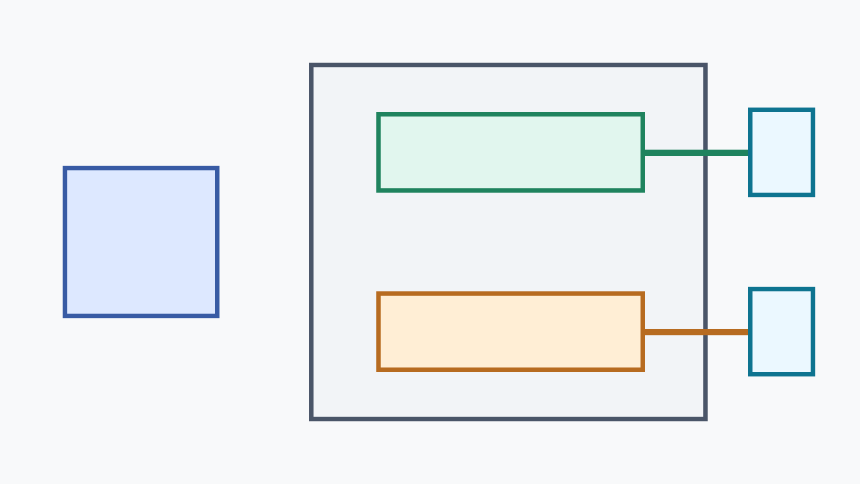

# Two-VLM OpenAI Server

## Metadata
| Field | Value |
| --- | --- |
| Category | genai |
| Difficulty | Beginner |
| Tags | genai, vlm, openai, multi-model |
| Languages | Python |
| Status | experimental |
| Binary Name | two-vlm-openai-server |
| Model | two LLiMa VLM model directories |

## Concept
This example starts one Neat OpenAI-compatible server and registers two VLM
model directories under different served names. A separate client sends one
local image plus a prompt to either served model.

The example intentionally avoids RTSP, detection, Insight, and app-side graph
composition so the deployment boundary stays visible: one `pyneat.OpenAIServer`,
two loaded VLMs, and ordinary `/v1/chat/completions` requests.

## Preview
Two served VLMs behind one OpenAI-compatible endpoint:



## Prerequisites
- Installed Neat SDK with GenAI support.
- LLiMa VLM model directories available under `assets/models/genai/`, or
  equivalent paths configured in `common/config.yaml`.
- Python packages from `python/requirements.txt`.
- A local image file to send in the prompt.

The default `common/config.yaml` expects:

```text
assets/models/genai/gemma3-siglip448-a16w4
assets/models/genai/gemma4-E2B-it
```

## Run
From the `apps` repository root, start the server:

```bash
python3 examples/genai/two-vlm-openai-server/python/serve.py \
  --config examples/genai/two-vlm-openai-server/common/config.yaml
```

In another shell, ask either served model about the same image:

```bash
python3 examples/genai/two-vlm-openai-server/python/ask_image.py \
  --config examples/genai/two-vlm-openai-server/common/config.yaml \
  --model vlm-1 \
  --image path/to/image.jpg \
  --prompt "Describe this image briefly."
```

```bash
python3 examples/genai/two-vlm-openai-server/python/ask_image.py \
  --config examples/genai/two-vlm-openai-server/common/config.yaml \
  --model vlm-2 \
  --image path/to/image.jpg \
  --prompt "Describe this image briefly."
```

`serve.py` prints the registered model names after both models are added. The
server warms registered models before listening, so startup failure means at
least one configured VLM could not be loaded.

## Source Files
- Python source: `python/serve.py`, `python/ask_image.py`, `python/utils/config.py`
- Python tests: `python/tests/test_unit.py`
- Shared assets: `common/`
