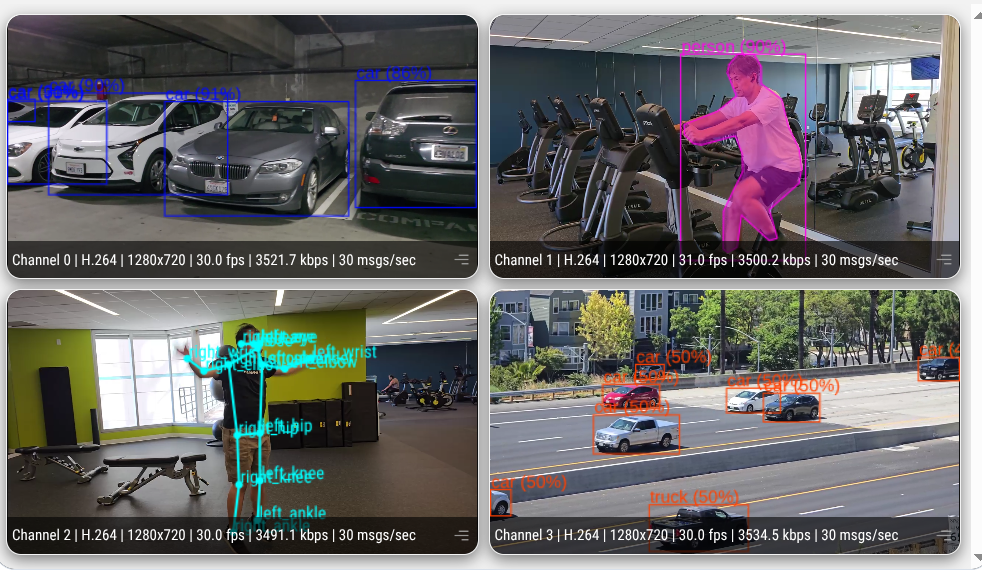

# Multi Stream Multi Model

## Metadata

| Field | Value |
| --- | --- |
| Category | multi-model |
| Difficulty | Advanced |
| Tags | multi-model, multi-stream, detection, segmentation, pose, yolo11, yolo26, rtsp, insight |
| Languages | C++, Python |
| Status | stable |
| Binary Name | multi-stream-multi-model |
| Model | yolo_11s |

## Concept

Runs a different model on each of four RTSP cameras in one process, and sends every camera's video and its own detection, segmentation, or pose metadata to Insight.

Each stream owns its own model archive, its own on-device decode, and its own Insight channel. Stream identity holds end to end: the frame pulled from camera *i* is inferred by model *i*, decoded for task *i*, and published on channel *i*. The four models share one MLA, so this is also the honest way to see what four concurrent networks cost.

The four decoders live in **one** graph and `Run`, because Neat requests a decoder-admission lease
only when a single graph holds more than one decoder. Each model lives in a `Run` of **its own**:
four model graphs in a single `Run` couple to each other, and one stream then stalls permanently
while its neighbours keep running at the source rate. Separate `Run`s are why the host pulls each
decoded frame and pushes it into its model — a data path cannot cross a `Run` boundary. Video stays
in-graph as an encoded passthrough, so only the NV12 frame makes that round trip.

A frame pushed into a `Run` arrives with no presentation timestamp, so the model's results come
back stamped `-1`. Insight matches an overlay to the frame it describes by timestamp, and metadata
without one is drawn over whatever frame is on screen — boxes visibly trail the objects they
describe. Each stream therefore carries its source frame's timestamp across the `Run` boundary in
a queue: push and pull are FIFO-paired, so the oldest queued stamp belongs to the result just
pulled.

Insight draws an overlay only on frames it has metadata for, so a frame the application skips
renders bare and the overlay visibly blinks. The feeder therefore waits briefly for an in-flight
slot instead of discarding the frame it just pulled, and the decoded-frame endpoint keeps a few
buffers rather than only the newest. Both still drop under genuine overload, which is what a live
camera wants.

## Preview



## Prerequisites

- `sima-cli` ([documentation](https://developer.sima.ai/software/tools/sima-cli/)) on a supported Modalix or DevKit target.
- Up to four RTSP H.264 or H.265 sources, and an [Insight](https://developer.sima.ai/software/tools/insight/) host reachable from the target. Pointing several streams at the same camera is fine; each one still builds its own decode and its own model.

## Install Apps

Install the latest Neat Apps runtime and enter the installed bundle:

```bash
sima-cli neat install apps
cd prebuilt-apps
APP_DIR=examples/multi-model/multi-stream-multi-model
```

Run the remaining commands from `prebuilt-apps/`.

## Prepare the Model

This example loads one model per stream. The defaults below cover all three tasks:

| Model file | Slot | Task | `decode` | Role |
| --- | --- | --- | --- | --- |
| `yolo_11s_mpk.tar.gz` | 0 | detection | `yolov8` | Default |
| `yolo_11s_seg_mpk.tar.gz` | 1 | segmentation | `yolov8` | Default |
| `yolo26m-pose-int8-b1.tar.gz` | 2 | pose | `yolo26` | Default |
| `yolo26m-det-int8-b1.tar.gz` | 3 | detection | `yolo26` | Default |
| `yolo_v8s_mpk.tar.gz` | any | detection | `yolov8` | Supported |
| `yolo_v8s_seg_mpk.tar.gz` | any | segmentation | `yolov8` | Supported |
| `yolo_26s_seg_mpk.tar.gz` | any | segmentation | `yolo26` | Supported |

The YOLO26 slots use the direct `-int8-b1` artifacts rather than the Model Zoo `yolo_26*` packages.
The zoo YOLO26 packages load and run, but decode into far more instances than the scene contains
(around 26 poses for a single person, around 37 objects where the direct artifact finds 6), and no
score threshold filters them. Serializing those phantom instances is expensive enough to cap
throughput, so use the artifacts listed above.

`decode` names the shape of the package's detection head, which is what selects the on-device
BoxDecode family — not the model's version number. YOLO26 packages carry raw l/t/r/b distance
heads, while the Model Zoo YOLO11 and YOLOv8 packages carry the YOLOv8 head layout, so a YOLO11
package is configured as `yolov8`. Setting this wrong produces a running pipeline with nonsense
boxes, so keep it aligned with the package you download.

Model packages come from the Model Zoo release below, which can differ from the installed platform version.

```bash
export MODELZOO_VERSION="2.1.3"
mkdir -p models
cd models
sima-cli download "https://docs.sima.ai/pkg_downloads/SDK${MODELZOO_VERSION}/model_zoo/gen2/object_detection/yolo_11s/yolo_11s_mpk.tar.gz"
sima-cli download "https://docs.sima.ai/pkg_downloads/SDK${MODELZOO_VERSION}/model_zoo/gen2/instance_segmentation/yolo_11s_seg/yolo_11s_seg_mpk.tar.gz"
sima-cli download "https://docs.sima.ai/pkg_downloads/SDK${MODELZOO_VERSION}/models/modalix/yolo26-pose/yolo26m-pose-int8-b1.tar.gz"
sima-cli download "https://docs.sima.ai/pkg_downloads/SDK${MODELZOO_VERSION}/models/modalix/yolo26-detection/yolo26m-det-int8-b1.tar.gz"
cd ..
```

Set each `streams[].model` in the example config to the matching downloaded package.

## Configure

Open `${APP_DIR}/src/common/config.yaml` and set:

- `streams[].url` — the RTSP URL for each camera.
- `streams[].task` — `detection`, `segmentation`, or `pose`.
- `streams[].decode` — `yolov8` or `yolo26`, matching the package's head layout.
- `streams[].model` — the downloaded package for that stream.
- `output.insight.host` — the host running Insight.

Drop stream entries to run fewer than four models; the example accepts one to four. Stream *i*
publishes video on `output.insight.video_port_base + i` and metadata on
`output.insight.metadata_port_base + i`.

## Run

### C++

```bash
./${APP_DIR}/src/cpp/pre-built/multi-stream-multi-model \
  --config ${APP_DIR}/src/common/config.yaml
```

### Python

```bash
source ~/pyneat/bin/activate
pip install -r ${APP_DIR}/src/python/requirements.txt
python3 ${APP_DIR}/src/python/main.py \
  --config ${APP_DIR}/src/common/config.yaml
```

Both implementations read the same config and accept `--validate-config-only` to check it without
touching the cameras.

## Expected Result

Each stream prints its resolved task, model, and Insight ports at startup:

```text
[stream 0] task=detection decode=yolov8 model=yolo_11s_mpk.tar.gz rtsp=... video=9000 metadata=9100
[stream 1] task=segmentation decode=yolov8 model=yolo_11s_seg_mpk.tar.gz rtsp=... video=9001 metadata=9101
[stream 2] task=pose decode=yolo26 model=yolo26m-pose-int8-b1.tar.gz rtsp=... video=9002 metadata=9102
[stream 3] task=detection decode=yolo26 model=yolo26m-det-int8-b1.tar.gz rtsp=... video=9003 metadata=9103
```

Open the Insight Video Viewer and select the four channels. Open a viewer tab for **every**
channel you want to see: Insight only forwards frames to channels with a viewer attached, and a
channel with no tab open renders nothing and correlates no metadata. Each one shows its own camera with the
overlay its task publishes: boxes on the detection channels, masks on the segmentation channel, and
skeletons on the pose channel. Insight draws these from the metadata, so the video itself is the
untouched camera stream.

Setting `output.debug_dir` and `output.save_every` also writes annotated JPEGs named
`stream_<i>_frame_<n>.jpg`, which is the quickest way to confirm a stream's model without a browser.

With `runtime.profile: true` each stream reports its own throughput:

```text
[profile stream=1 task=segmentation] frames=100 output_fps=... avg_result_pull_ms=... avg_instances=...
```

Measured on a Modalix DevKit against four 1280x720@60 RTSP sources, over ten-minute runs:

| Implementation | detection | segmentation | pose | detection | aggregate |
| --- | --- | --- | --- | --- | --- |
| C++ | 57.4 fps | 57.3 fps | 57.5 fps | 57.5 fps | ~230 fps |
| Python | 57.1 fps | 50.8 fps | 57.0 fps | 57.4 fps | ~222 fps |

Steady-state rates; the ceiling is 240 fps. Both implementations hold this flat for the full ten
minutes with no stream falling behind. Python matches C++ on three streams; only segmentation
trails, because tracing mask contours per frame is host work and the GIL serialises it.

Against the same four cameras at 30 fps the two implementations are indistinguishable, both
tracking the source rate at ~28 fps per stream and ~111 fps aggregate. Halving the frame rate
doubles the host budget per frame, which is enough for Python's segmentation overlay work to keep
up: the gap above is a host-throughput limit, not a difference in what the two produce.

## Troubleshooting

- Boxes lag or lead the objects they describe: the metadata carries no timestamp, so Insight
  cannot correlate it to a frame. Check `matched_video_first` in
  `curl -k https://<insight-host>:9900/api/ingest/stats` — it should track `messages_received`
  one-for-one. It also reads zero when two copies of the application publish to the same channel,
  so confirm only one is running.
- Boxes appear in roughly the right places but at the wrong sizes: `streams[].decode` does not match
  the package's head layout. Check it against the table above.
- One stream is silent while the others work: confirm its `model` path is readable and that its
  Insight metadata port is not taken by another application.
- Segmentation reports `dropped_segments` at exit: a frame's polygons did not fit one metadata
  message. Lower `inference.max_detections` or raise `inference.min_score`.
- Throughput is roughly halved and one stream is far behind: check that each model was given its
  own `Run`. Sharing one `Run` across the four model graphs is what makes a single stream stall.
- One stream falls far behind the others while the rest hold the source rate: the MLA is
  oversubscribed. Four 1280x720@60 streams fit the small INT8 defaults; heavier packages do not,
  and the shortfall concentrates on a single stream instead of spreading. Drop stream entries or
  return to the default packages.

## Source Files

- C++ reference source: `src/cpp/main.cpp`
- Python source: `src/python/main.py`
- Shared runtime files: `src/common/`

The packaged C++ source is an implementation reference. Run the executable under `src/cpp/pre-built/`; the installed bundle does not include CMake files.

## Development From Source

To modify, compile, or test this example, use the [Apps contributor workflow](https://github.com/sima-neat/apps/blob/main/CONTRIBUTING.md).
