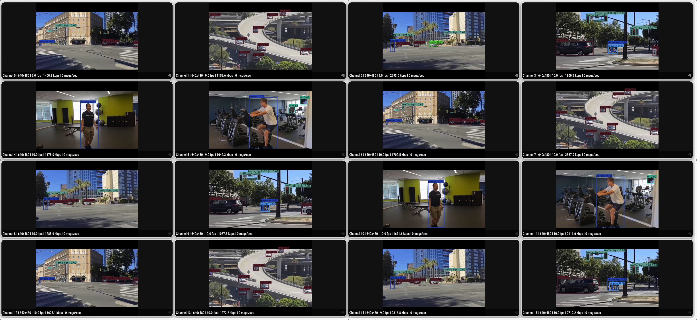

# 16-Stream Object Detector

## Metadata
| Field | Value |
| --- | --- |
| Category | object-detection |
| Difficulty | Advanced |
| Tags | object-detection, rtsp, multistream, insight, yolo26 |
| Languages | C++, Python |
| Status | experimental |
| Binary Name | 16-stream-object-detector |
| Model | yolo26m-det-int8-b1 |

## Concept
This example runs many RTSP video streams while bounding YOLO26 detector load with a smaller detector worker pool. Each stream owns RTSP decode and clean Insight video output. Detector workers receive latest decoded `Sample` objects from the stream graphs, run YOLO26, and publish `object-detection` metadata to the matching Insight channel.

## Preview
Snippet from a pipeline run:



Architecture:
- one source/video graph per RTSP stream
- one smaller YOLO26 detector worker pool shared by streams
- fixed modulo stream assignment across detector workers
- latest-frame source output to avoid stale detector backlog
- clean Insight video stays independent from detection scheduling

Per-stream source graph:
- `RtspDecodedInput -> Branch(detector_frame, video)`
- `video -> VideoSender(H.264 RTP/UDP)`
- `detector_frame -> Output(detector_frame, Latest)`

Detector worker graph:
- `Input(frame) -> model.graph() -> Output(detections)`

## Prerequisites
- Installed Neat SDK.
- Reachable RTSP camera URLs encoded at the intended detector candidate FPS.
- A YOLO26 INT8 batch-1 model pack downloaded into `assets/models/`.
- Edit `src/common/config.yaml` before running with real streams.
- On Modalix DevKit, run `bash /usr/bin/fix_devkit_runtime.sh` before starting the example if the runtime has been used by earlier ML/video apps.

## Command-line options
- `--config <path>`: path to the YAML configuration file
- `--validate-config-only`: validate the config and exit without opening RTSP streams
- `--help`: print the CLI help text

## Download Models
The default model is `yolo26m-det-int8-b1.tar.gz`.

```bash
mkdir -p assets/models
cd assets/models
sima-cli download https://docs.sima.ai/pkg_downloads/SDK2.0.0/models/modalix/yolo26-detection/yolo26m-det-int8-b1.tar.gz
cd ../..
```

## Build
### Build From The Apps Repo
```bash
cd <apps-repo-root>
./build.sh
```

### Build This Example Directly With CMake
```bash
cd <apps-repo-root>
cmake -S examples/object-detection/16-stream-object-detector/src/cpp -B build/16-stream-object-detector
cmake --build build/16-stream-object-detector -j
```

## Run
### Validate Config Only
This is useful for a quick smoke test without opening RTSP streams.

```bash
./build/examples/object-detection/16-stream-object-detector/16-stream-object-detector \
  --config examples/object-detection/16-stream-object-detector/src/common/config.yaml \
  --validate-config-only
```

### C++
```bash
SIMA_GST_RUN_INPUT_TIMEOUT_MS=120000 ./build/examples/object-detection/16-stream-object-detector/16-stream-object-detector \
  --config examples/object-detection/16-stream-object-detector/src/common/config.yaml
```

### Python
```bash
source ~/pyneat/bin/activate
pip install -r examples/object-detection/16-stream-object-detector/src/python/requirements.txt
SIMA_GST_RUN_INPUT_TIMEOUT_MS=120000 python3 examples/object-detection/16-stream-object-detector/src/python/main.py \
  --config examples/object-detection/16-stream-object-detector/src/common/config.yaml
```

## Debugging notes
- The checked-in `src/common/config.yaml` includes placeholder stream URLs and Insight host values. Replace them before running.
- Set the intended detector candidate FPS at the RTSP source. This example does not downsample in the scheduler and does not use `VideoRate`.
- `inference.workers` must be between 1 and the stream count. For 16 streams, the default 4 workers assign streams as `0,4,8,12`, `1,5,9,13`, `2,6,10,14`, and `3,7,11,15`.
- `output.debug_dir` and `output.save_every` let you save periodic debug frames locally. Debug saving maps frame pixels on the CPU and is outside the normal live path.
- Profiling prints source pull, detector, parse, metadata, dropped-frame, timeout, and detection-count summaries.

## Notes
- Point `model.path` at a YOLO26 detection pack. This example does not use a `model.family` config key.
- Both C++ and Python use the same public graph shape: `RtspDecodedInput`, `graphs::Branch`, `VideoSender`, `Input -> model.graph() -> Output`, and `MetadataSender`.
- The live video path is graph-owned and independent from detector worker scheduling.
- Detector workers receive `Sample` objects, not `cv::Mat` or NumPy frames.
- Metadata uses the selected source frame timestamp and frame id so Insight overlays detections on the intended video frame.
- `output.video_enabled: false` disables per-stream H.264 video output. Metadata still runs.

## Source Files
- C++: `src/cpp/main.cpp`
- C++ tests: `tests/cpp/test_unit.cpp`, `tests/cpp/test_e2e.cpp`
- Python: `src/python/main.py`
- Python tests: `tests/python/test_unit.py`, `tests/python/test_e2e.py`
- Shared assets: `src/common/`
