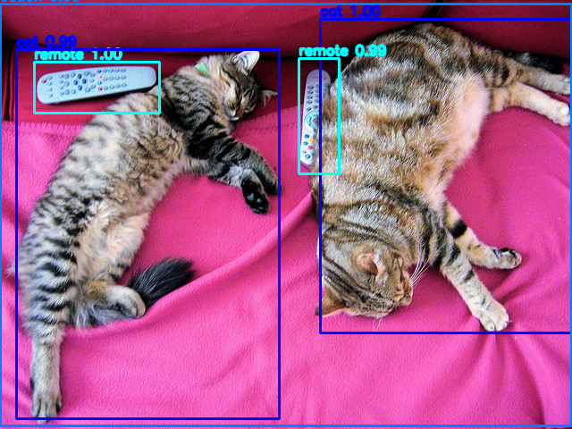

# DETR Object Detection

## Metadata
| Field | Value |
| --- | --- |
| Category | object-detection |
| Difficulty | Intermediate |
| Tags | detr, object-detection, single-image, coco |
| Languages | C++, Python |
| Status | experimental |
| Binary Name | detr-object-detection |
| Model | detr_resnet50_modified_class_embed_bbox_embed [https://docs.sima.ai/pkg_downloads/SDK2.0.0/models/modalix/detr_resnet50_modified_class_embed_bbox_embed_mpk.tar.gz] |

## Concept
This example demonstrates single-image object detection with a compiled **DETR** model. The input image is resized with aspect-ratio preservation into the model frame, normalized with ImageNet mean and standard deviation, run through the NEAT pipeline, and then decoded into object boxes and class scores.

The model emits two raw tensors: classification logits and normalized bounding boxes for a fixed set of object queries. The example applies `softmax` over the class logits, `sigmoid` over the box outputs, filters by confidence, optionally keeps only the COCO `person` class, maps detections back onto the original image, and writes an annotated output image.

## Preview
Snippet from a pipeline run:



## Supported Models
Validated with: `detr_resnet50_modified_class_embed_bbox_embed`

Download into `assets/models/`:
- `./scripts/download_models.sh detr_resnet50_modified_class_embed_bbox_embed`

## Prerequisites
- Installed Neat SDK.
- Model artifacts are user-managed and should be placed under `assets/models/`.
- Preferred download command: `./scripts/download_models.sh detr_resnet50_modified_class_embed_bbox_embed`
- Direct URL fallback:
  `mkdir -p assets/models && cd assets/models && sima-cli download https://docs.sima.ai/pkg_downloads/SDK2.0.0/models/modalix/detr_resnet50_modified_class_embed_bbox_embed_mpk.tar.gz && cd ../..`
- Default model path:
  `assets/models/detr_resnet50_modified_class_embed_bbox_embed_mpk.tar.gz`

## Important Behavior
- The example expects one input image.
- Input preprocessing preserves aspect ratio and center-pads into an `1333x800` model frame.
- Output boxes are mapped back to the original image resolution before drawing.
- By default all DETR foreground classes are considered; `--person-only` keeps only the DETR `person` class.
- Overlay text uses built-in DETR COCO labels and class-colored boxes.
- `--profile` runs repeated inference and reports session, postprocessing, and overall timing statistics.

## Command-Line Options
### C++
- Invocation:
  `./build/examples/object-detection/detr-object-detection/detr-object-detection <input_image_path> [--model <model_path>] [--output <output_image_path>] [--conf <threshold>] [--max-draw <count>] [--person-only] [--profile] [--num-runs <count>]`
- Required arguments:
  `<input_image_path>`
- Optional arguments:
  `--model`, `--output`, `--conf`, `--max-draw`, `--person-only`, `--profile`, `--num-runs`

### Python
- Invocation:
  `python3 examples/object-detection/detr-object-detection/python/main.py <input_image_path> [--model <model_path>] [--output <output_image_path>] [--conf <threshold>] [--max-draw <count>] [--person-only] [--profile] [--num-runs <count>] [--verbose]`
- Required arguments:
  `<input_image_path>`
- Optional arguments:
  `--model`, `--output`, `--conf`, `--max-draw`, `--person-only`, `--profile`, `--num-runs`, `--verbose`

## Build
### Build From The Apps Repo
```bash
cd <apps-repo-root>
./build.sh
```

Binary output:
```bash
./build/examples/object-detection/detr-object-detection/detr-object-detection
```

### Build This Example Directly With CMake
```bash
cd <apps-repo-root>/examples/object-detection/detr-object-detection
cmake -S cpp -B build
cmake --build build -j
```

Binary output:
```bash
./build/detr-object-detection
```

## Run
### C++
```bash
./build/examples/object-detection/detr-object-detection/detr-object-detection \
  <input_image_path> \
  --model assets/models/detr_resnet50_modified_class_embed_bbox_embed_mpk.tar.gz \
  --output <output_image_path> \
  --conf 0.5
```

### Python
```bash
source ~/pyneat/bin/activate
pip install -r examples/object-detection/detr-object-detection/python/requirements.txt
python3 examples/object-detection/detr-object-detection/python/main.py \
  <input_image_path> \
  --model assets/models/detr_resnet50_modified_class_embed_bbox_embed_mpk.tar.gz \
  --output <output_image_path> \
  --conf 0.5
```

## Testing
Run from the apps repository root:

```bash
cd <apps-repo-root>
```

### C++
Unit test:
```bash
ctest --test-dir build/examples/object-detection/detr-object-detection \
  -R 'detr-object-detection.unit' --output-on-failure -V
```

E2E test:
```bash
SIMANEAT_APPS_TEST_MODELS_DIR="$PWD/assets/models" \
SIMANEAT_APPS_TEST_INPUT_DIR="$PWD/assets/test_images" \
SIMANEAT_APPS_TEST_OUTPUT_DIR=/tmp \
SIMANEAT_APPS_TEST_TIMEOUT_MS=180000 \
ctest --test-dir build/examples/object-detection/detr-object-detection \
  -R 'detr-object-detection.e2e' --output-on-failure -V
```

### Python
Unit test:
```bash
source ~/pyneat/bin/activate
pip install -r examples/object-detection/detr-object-detection/python/requirements.txt
pip install pytest
export PYTHONPATH="$PWD"
pytest -c tests/pytest.ini --rootdir="$PWD" -m unit \
  examples/object-detection/detr-object-detection/python/tests/test_unit.py -v
```

E2E test:
```bash
source ~/pyneat/bin/activate
pip install -r examples/object-detection/detr-object-detection/python/requirements.txt
pip install pytest
export PYTHONPATH="$PWD"
SIMANEAT_APPS_TEST_MODELS_DIR="$PWD/assets/models" \
SIMANEAT_APPS_TEST_INPUT_DIR="$PWD/assets/test_images" \
SIMANEAT_APPS_TEST_OUTPUT_DIR=/tmp/detr-python-e2e \
SIMANEAT_APPS_TEST_TIMEOUT_MS=180000 \
SIMANEAT_APPS_TEST_REQUIRE_E2E=1 \
pytest -c tests/pytest.ini --rootdir="$PWD" -m e2e \
  examples/object-detection/detr-object-detection/python/tests/test_e2e.py -v
```

## Debugging Notes
- If the model fails to load, verify `assets/models/detr_resnet50_modified_class_embed_bbox_embed_mpk.tar.gz` exists and is readable.
- First-run model initialization can exceed 60 seconds on some setups. Increase `SIMANEAT_APPS_TEST_TIMEOUT_MS` (for example `180000`) for e2e runs.
- If no detections appear, lower `--conf` and confirm the input image contains supported COCO objects.
- If detections are visibly offset, verify the model frame assumptions (`1333x800`) still match the compiled package.
- If output writing fails, ensure the parent directory of `<output_image_path>` exists and is writable.

## Source Files
- C++ source: `cpp/main.cpp`
- C++ tests: `cpp/tests/unit_test.cpp`, `cpp/tests/e2e_test.cpp`
- Python source: `python/main.py`
- Python tests: `python/tests/test_unit.py`, `python/tests/test_e2e.py`
