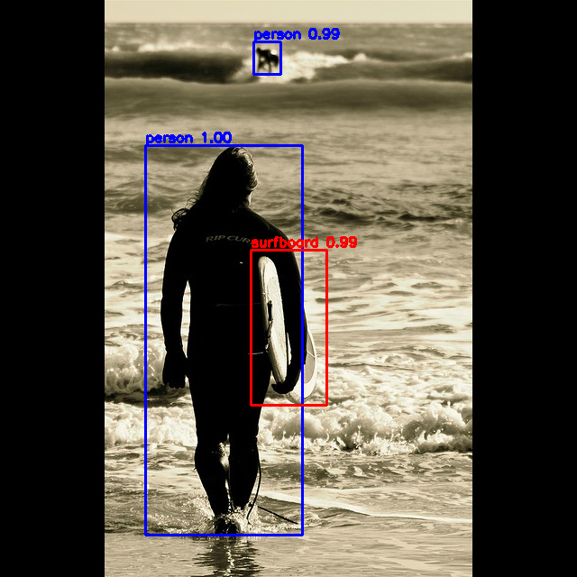

# DETR Object Detector

## Metadata
| Field | Value |
| --- | --- |
| Category | object-detection |
| Difficulty | Intermediate |
| Tags | detr, object-detection, folder-input, coco |
| Languages | C++, Python |
| Status | experimental |
| Binary Name | detr-object-detector |
| Model | detr_resnet50_modified_class_embed_bbox_embed |

## Concept
This example demonstrates folder-based object detection with a compiled **DETR** model. Each input image is resized with aspect-ratio preservation into the model frame, normalized with ImageNet mean and standard deviation, run through the Neat Library pipeline, and then decoded into object boxes and class scores.

The model emits two raw tensors: classification logits and normalized bounding boxes for a fixed set of object queries. The example applies `softmax` over the class logits, `sigmoid` over the box outputs, filters by confidence, optionally keeps only the COCO `person` class, maps detections back onto the original image, and writes annotated output images.

## Preview
Snippet from a pipeline run:



## Supported Models
Use the platform version wherever `<platform-version>` appears.

Validated with: `detr_resnet50_modified_class_embed_bbox_embed`

Download into `assets/models/`:
- `./scripts/download_models.sh detr_resnet50_modified_class_embed_bbox_embed`

## Prerequisites
- Installed Neat Development Environment.
- Model artifacts are user-managed and should be placed under `assets/models/`.
- Preferred download command: `./scripts/download_models.sh detr_resnet50_modified_class_embed_bbox_embed`
- Direct URL fallback:
  `mkdir -p assets/models && cd assets/models && sima-cli download https://docs.sima.ai/pkg_downloads/SDK<platform-version>/models/modalix/detr_resnet50_modified_class_embed_bbox_embed_mpk.tar.gz && cd ../..`
- Default model path:
  `assets/models/detr_resnet50_modified_class_embed_bbox_embed_mpk.tar.gz`

## Important Behavior
- The example expects an input folder with image files.
- Input preprocessing preserves aspect ratio and center-pads into an `1333x800` model frame.
- Output boxes are mapped back to the original image resolution before drawing.
- By default all DETR foreground classes are considered; `--person-only` keeps only the DETR `person` class.
- Overlay text uses built-in DETR COCO labels and class-colored boxes.
- `runtime.profile` runs repeated inference and reports session, postprocessing, and overall timing statistics.

## Command-Line Options
### C++
- Invocation:
  `./build/examples/object-detection/detr-object-detector/detr-object-detector [--config <path>]`
- Optional arguments:
  `--config <path>`: YAML config path. Defaults to `src/common/config.yaml`.

### Python
- Invocation:
  `python3 examples/object-detection/detr-object-detector/src/python/main.py [--config <path>]`
- Optional arguments:
  `--config <path>`: YAML config path. Defaults to `src/common/config.yaml`.

## Build
### Build From The Apps Repo
```bash
cd <apps-repo-root>
./build.sh
```

Binary output:
```bash
./build/examples/object-detection/detr-object-detector/detr-object-detector
```

### Build This Example Directly With CMake
```bash
cd <apps-repo-root>/examples/object-detection/detr-object-detector
cmake -S cpp -B build
cmake --build build -j
```

Binary output:
```bash
./build/detr-object-detector
```

## Run
### C++
```bash
./build/examples/object-detection/detr-object-detector/detr-object-detector
```

### Python
```bash
source ~/pyneat/bin/activate
pip install -r examples/object-detection/detr-object-detector/src/python/requirements.txt
python3 examples/object-detection/detr-object-detector/src/python/main.py
```

## Testing
Run from the apps repository root:

```bash
cd <apps-repo-root>
```

### C++
Unit test:
```bash
ctest --test-dir build/examples/object-detection/detr-object-detector \
  -R 'detr-object-detector.unit' --output-on-failure -V
```

E2E test:
```bash
SIMANEAT_APPS_TEST_MODELS_DIR="$PWD/assets/models" \
SIMANEAT_APPS_TEST_INPUT_DIR="$PWD/assets/test_images" \
SIMANEAT_APPS_TEST_OUTPUT_DIR=/tmp \
SIMANEAT_APPS_TEST_TIMEOUT_MS=180000 \
ctest --test-dir build/examples/object-detection/detr-object-detector \
  -R 'detr-object-detector.e2e' --output-on-failure -V
```

### Python
Unit test:
```bash
source ~/pyneat/bin/activate
pip install -r examples/object-detection/detr-object-detector/src/python/requirements.txt
pip install pytest
export PYTHONPATH="$PWD"
pytest -c tests/pytest.ini --rootdir="$PWD" -m unit \
  examples/object-detection/detr-object-detector/tests/python/test_unit.py -v
```

E2E test:
```bash
source ~/pyneat/bin/activate
pip install -r examples/object-detection/detr-object-detector/src/python/requirements.txt
pip install pytest
export PYTHONPATH="$PWD"
SIMANEAT_APPS_TEST_MODELS_DIR="$PWD/assets/models" \
SIMANEAT_APPS_TEST_INPUT_DIR="$PWD/assets/test_images" \
SIMANEAT_APPS_TEST_OUTPUT_DIR=/tmp/detr-python-e2e \
SIMANEAT_APPS_TEST_TIMEOUT_MS=180000 \
SIMANEAT_APPS_TEST_REQUIRE_E2E=1 \
pytest -c tests/pytest.ini --rootdir="$PWD" -m e2e \
  examples/object-detection/detr-object-detector/tests/python/test_e2e.py -v
```

## Debugging Notes
- If the model fails to load, verify `assets/models/detr_resnet50_modified_class_embed_bbox_embed_mpk.tar.gz` exists and is readable.
- First-run model initialization can exceed 60 seconds on some setups. Increase `SIMANEAT_APPS_TEST_TIMEOUT_MS` (for example `180000`) for e2e runs.
- If no detections appear, lower `decode.confidence_threshold` and confirm the input images contain supported COCO objects.
- If detections are visibly offset, verify the model frame assumptions (`1333x800`) still match the compiled package.
- If output writing fails, ensure `io.output_dir` exists or can be created.

## Source Files
- C++ source: `src/cpp/main.cpp`
- C++ tests: `tests/cpp/test_unit.cpp`, `tests/cpp/test_e2e.cpp`
- Python source: `src/python/main.py`
- Python tests: `tests/python/test_unit.py`, `tests/python/test_e2e.py`
