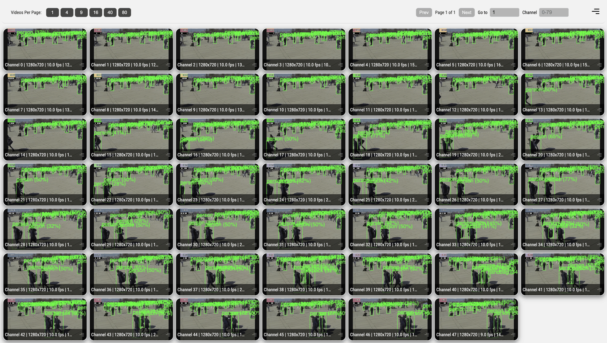

# High-Density Multi-Stream Object Detector

## Metadata

| Field | Value |
| --- | --- |
| Category | object-detection |
| Difficulty | Advanced |
| Tags | object-detection, rtsp, multistream, high-density, insight, yolo26 |
| Languages | C++, Python |
| Status | stable |
| Binary Name | high-density-multi-stream-object-detector |
| Model | yolo26n-det-int8-b1 |

## Concept

Runs one YOLO26 detector across 16, 24, or 48 RTSP streams and sends synchronized video and detection metadata to Insight.

Unlike the general multi-stream detector, this application tunes the pipeline for high stream counts.

Each RTSP source is depacketized once, then Core fuses two branches into the same source pipeline:

```text
RTSP H.264/H.265
  ├─ latest encoded edge ─> VideoSender ─> Insight video channel N
  └─ decode ─> shared YOLO26 detector ─> timestamped metadata ─> channel N
```

The application expresses this fan-out with ordinary `Graph::connect()` and starts it with ordinary `Graph::build()`. Core fuses the eligible topology internally. `VideoSender` consumes the read-only encoded access unit before the decoder, so the application does not open a second RTSP session, copy a decoded EV buffer, run an encoder, or shuttle encoded frames through appsink/appsrc. The UDP sender uses `async=false` so its sink cannot hold the shared live pipeline in `PAUSED` while waiting for preroll from every stream. The encoded edge uses `RealtimeLatestByStream`; a congested Insight channel can drop stale encoded work without blocking that stream's decoder branch.

Detection metadata includes the source `rtp_timestamp` and is sent with nonblocking UDP. A compatible Insight receiver holds complete encoded RTP frames for 400 ms and matches metadata to that source timestamp before WebRTC forwarding. Keep one active viewer while validating metadata, as described below.

The three checked-in profiles use the same application and model:

| Config | Streams | Source resolution and FPS | Expected FPS per channel |
| --- | ---: | --- | ---: |
| `config.yaml` | 16 | 1280×720 at 30 or 29.97 FPS, detected from the source | Source rate |
| `config-24x720p20fps.yaml` | 24 | 1280×720 at 20 FPS | 20 FPS |
| `config-48x720p10fps.yaml` | 48 | 1280×720 at 10 FPS | 10 FPS |

The expected rate applies to both Insight video and detection metadata after startup.

## Preview

The 48-stream profile running in Insight:



## Prerequisites

- A Modalix DevKit compatible with the selected Apps release, with the decoder service running.
- An [Insight](https://developer.sima.ai/software/tools/insight/) URL reachable from the DevKit.
- 16, 24, or 48 H.264 or H.265 RTSP sources matching `input.codec` and the selected profile.
- For H.265, the computer running the Insight viewer must support hardware HEVC decoding; Chromium does not provide a software decoder fallback for WebRTC H.265.
- H.265 playback in Chrome on macOS renders, but is not stable. Chrome's WebRTC HEVC decoder can stop producing frames mid-stream and fall back to a null decoder that discards what follows, at which point the tile stalls until the viewer reconnects it.
- Constant source frame rate, 1280×720 resolution, no B-frames in the selected codec, and a short, regular IDR interval. The validated sources use one IDR per second.
- The `yolo26n-det-int8-b1.tar.gz` model pack.

The application starts all source graphs together. Start every RTSP publisher before starting the application.

## Install Apps

Install the latest Neat Apps runtime and enter the installed bundle:

```bash
sima-cli neat install apps
cd prebuilt-apps
APP_DIR=examples/object-detection/high-density-multi-stream-object-detector
```

Run the remaining commands from `prebuilt-apps/`.

## Prepare the Model

| Model file | Role | Source |
| --- | --- | --- |
| `yolo26n-det-int8-b1.tar.gz` | Default | Direct artifact |

Model packages come from the Model Zoo release below, which can differ from the installed platform version.

```bash
export MODELZOO_VERSION="2.1.3"
mkdir -p models
cd models
sima-cli download "https://docs.sima.ai/pkg_downloads/SDK${MODELZOO_VERSION}/models/modalix/yolo26-detection/yolo26n-det-int8-b1.tar.gz"
cd ..
```

Set `model.path` in the selected config to the downloaded package.

A relative `model.path` resolves from the config file, not from `prebuilt-apps/`.
A bare `models/yolo26n-det-int8-b1.tar.gz` therefore points at
`${APP_DIR}/src/common/models/` and fails with
`ModelPack: invalid_archive: archive path does not exist`. Use an absolute path
to the file downloaded above.

Print it from `prebuilt-apps/`:

```bash
echo "$(pwd)/models/yolo26n-det-int8-b1.tar.gz"
```

Then set that value as `model.path` in the selected config. Change only that
line; `labels` and `decode_type` must keep their packaged values:

```yaml
model:
  path: <paste-the-printed-path>
  labels: examples/object-detection/high-density-multi-stream-object-detector/src/common/coco_label.txt
  decode_type: yolo26
```

`model.labels` is the exception: it resolves from the Apps root, so the packaged
value needs no change.

## Prepare Insight

[Insight](https://developer.sima.ai/software/tools/insight/) can host the input streams and render each output channel. Install videos directly from the Insight catalog or through YouTube support. In the Insight Web UI, start the required streams and copy their RTSP URLs into `streams`. Use the host and UDP port ranges reported by `neat` for the output settings. Use a host and published port that the target can reach, not `localhost` and not an address only Insight's own machine can resolve. Verify the URL from the target before running; the application prints the resolved source and its dimensions on startup.

Verify each source before starting the application. A Modalix DevKit does not
ship `ffprobe`, so run this from the machine hosting the sources or from any
workstation with FFmpeg installed:

```bash
ffprobe -v error \
  -select_streams v:0 \
  -show_entries stream=codec_name,width,height,avg_frame_rate,has_b_frames \
  -of default=noprint_wrappers=1 \
  <rtsp-url>
```

The result must report the codec selected by `input.codec`, `1280x720`, the selected profile FPS, and no B-frames. Using a different source FPS changes the output rate and is not the documented profile. The encoded Insight edge retains the latest complete access unit under congestion, so a one-second-or-shorter IDR interval bounds receiver recovery if an older access unit is replaced.

## Configure

Choose one config under `${APP_DIR}/src/common/` and edit:

- `model.path`
- every entry under `streams`
- `output.insight.host`

Set `input.codec` to `h264`/`avc` or `h265`/`hevc`. H.264 is the default in all checked-in density profiles and remains the validated high-density configuration.

`inference.max_inflight_per_stream` and `inference.max_inflight_total` bound raw decoder-backed frames admitted to the shared detector. The 16- and 48-stream profiles use a total limit of eight; the 24-stream profile uses 24 so one aggregate frame interval can be admitted without an unbounded queue. The realtime mux retains only the latest pending frame for each stream.

Do not add the removed `inference.fan_in_policy` or `runtime` benchmark settings. Ordinary `connect()` and `build()` select the eligible realtime fan-in lowering automatically. The application publishes metadata from the first valid detection result and runs continuously until interrupted; warmup, throughput measurement, and progress deadlines belong to the E2E receiver. Video/metadata synchronization is performed by Insight from each payload's source RTP timestamp; there is no application-side video-delay setting.

The default 16-stream config uses `input.fps: 0` and enables probing, so the source determines its frame rate. Keep `input.width` and `input.height` matched to the source. The 24- and 48-stream profiles keep explicit FPS values and skip probing; their configured dimensions and frame rates must match the sources.

Insight channel and port mapping is deterministic:

```text
channel index: 0 .. stream_count - 1
video port:    9000 + channel index
metadata port: 9100 + channel index
```

## Run

Set the example and selected profile from the `prebuilt-apps/` root:

```bash
APP_DIR=examples/object-detection/high-density-multi-stream-object-detector
APP=./${APP_DIR}/src/cpp/pre-built/high-density-multi-stream-object-detector
CONFIG="$APP_DIR/src/common/config.yaml"
```

Use one of the named configs for the larger profiles:

```bash
CONFIG="$APP_DIR/src/common/config-24x720p20fps.yaml"
CONFIG="$APP_DIR/src/common/config-48x720p10fps.yaml"
```

Validate the selected config without starting RTSP or Insight:

```bash
"$APP" --config "$CONFIG" --validate-config-only
```

Run the C++ application:

```bash
"$APP" --config "$CONFIG"
```

Run the Python implementation with the same config:

```bash
source ~/pyneat/bin/activate
python3 -m pip install -r "$APP_DIR/src/python/requirements.txt"
python3 "$APP_DIR/src/python/main.py" --config "$CONFIG"
```

Stop the application with `Ctrl-C`.

Use one active Insight viewer while validating metadata. Insight currently has a single-viewer metadata rendering limitation; multiple simultaneous viewers can make box delivery appear intermittent even when the application is advancing normally.

## Expected Result

- Every configured Insight channel receives live video.
- Detection boxes appear on the matching channel.
- Video and metadata follow the source cadence for 16 streams, 20 FPS for 24 streams, or 10 FPS for 48 streams.
- Nonblocking metadata-send failures are reported as rate-limited warnings without stalling inference.
- `Ctrl-C` closes the graph and exits cleanly.

If channels do not start, confirm that every publisher was already reachable and that the configured source caps match the selected profile. Restart the application after restarting the publishers.

## Troubleshooting

Check the configuration before involving hardware. This validates and exits
without opening a stream or touching Insight:

```bash
"$APP" --config "$CONFIG" --validate-config-only
```

- `ModelPack: invalid_archive: archive path does not exist` at run time means
  `model.path` resolved from the config file rather than from `prebuilt-apps/`.
  Use the absolute path printed in Prepare the Model. Validation does not open
  the archive, so this appears only once the run starts.
- `output.insight.max_visible_streams cannot exceed stream count` means the
  profile's visible-stream count is higher than the number of entries under
  `streams`. Reduce it, or add the missing stream URLs.
- `failed to probe RTSP frame rate` from the C++ binary does not tell you which
  problem you have. The shipped profiles set `input.width` and `input.height` but
  leave `input.fps` at `0`, so the configured dimensions are used as-is and only
  the frame rate is probed. An unreachable source and a reachable source that
  advertises no frame rate both end at this same message. Confirm the URL is
  reachable from the board before assuming the latter, and set `input.fps` only
  once you have.
- The Python entrypoint does distinguish the two: an unreachable source raises
  `failed to open RTSP source for probing: <url>` before any dimension or rate
  check.
- Either way, verify the URL from the board itself rather than from the machine
  running Insight; the URL Insight displays is not always reachable from the
  target.
## Source Files

- C++ reference source: `src/cpp/main.cpp`
- Python implementation: `src/python/main.py`
- Default 16-stream profile: `src/common/config.yaml`
- 24-stream profile: `src/common/config-24x720p20fps.yaml`
- 48-stream profile: `src/common/config-48x720p10fps.yaml`
- COCO labels: `src/common/coco_label.txt`

The packaged C++ source is an implementation reference. Run the executable under `src/cpp/pre-built/`; the installed bundle does not include CMake files.

## Development From Source

To modify, compile, or test this example, use the [Apps contributor workflow](https://github.com/sima-neat/apps/blob/main/CONTRIBUTING.md). The 16-, 24-, and 48-stream profiles still require Modalix, live RTSP publishers, and Insight for runtime validation.
