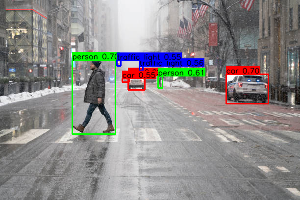

# Image Folder Object Detector

## Metadata
| Field | Value |
| --- | --- |
| Category | object-detection |
| Difficulty | Beginner |
| Tags | object-detection, yolov8, folder-inference |
| Languages | C++, Python |
| Status | experimental |
| Binary Name | image-folder-object-detector |
| Model | yolo_v8n |

## Concept
Minimal image-folder object detection pipeline. Each image is inferred, annotated with bounding boxes and labels, and written to an output folder.

## Preview
Snippet from a pipeline run:



## Supported Models
Also works with: `yolo_v8s`, `yolo_v8m`, `yolo_v8l`

Download any variant into `assets/models/`:
- `mkdir -p assets/models && cd assets/models && sima-cli modelzoo -v 2.0.0 get yolo_v8n && cd ../..`

## Prerequisites
- Installed Neat SDK.
- Model artifacts are user-managed and should be downloaded into `assets/models/`.
- Download command: `mkdir -p assets/models && cd assets/models && sima-cli modelzoo -v 2.0.0 get yolo_v8n && cd ../..`
- Labels file: `examples/object-detection/image-folder-object-detector/common/coco_label.txt`

## Important Behavior
- C++ and Python read runtime values from `common/config.yaml`.
- Labels file is configured under `model.labels`.
- Output images are written as `.png` files.

## Command-Line Options
### C++
- Invocation:
  `./build/examples/object-detection/image-folder-object-detector/image-folder-object-detector [--config <path>]`
- Optional arguments:
  `--config <path>`: YAML config path. Defaults to `common/config.yaml`.

### Python
- Invocation:
  `python examples/object-detection/image-folder-object-detector/python/main.py [--config <path>]`
- Optional arguments:
  `--config <path>`: YAML config path. Defaults to `common/config.yaml`.

## Build
### Build From The Apps Repo
```bash
cd <apps-repo-root>
./build.sh
```

Binary output:
```bash
./build/examples/object-detection/image-folder-object-detector/image-folder-object-detector
```

### Build This Example Directly With CMake
```bash
cd <apps-repo-root>/examples/object-detection/image-folder-object-detector
cmake -S cpp -B build
cmake --build build -j
```

Binary output:
```bash
./build/image-folder-object-detector
```

## Run
### C++
```bash
./build/examples/object-detection/image-folder-object-detector/image-folder-object-detector
```

### Python
```bash
source ~/pyneat/bin/activate
pip install -r examples/object-detection/image-folder-object-detector/python/requirements.txt
python examples/object-detection/image-folder-object-detector/python/main.py
```

## Debugging Notes
- If detections are missing, validate label file ordering and score thresholds.
- If model load fails, verify `assets/models/yolo_v8n_mpk.tar.gz` exists.
- Ensure input folder contains supported image extensions.

## Source Files
- C++ source: `cpp/main.cpp`
- Python source: `python/main.py`
- Shared config: `common/config.yaml`
