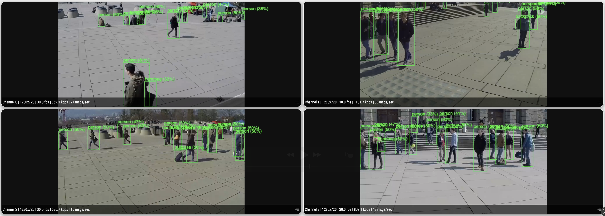

# Multi-Stream Object Detector

## Metadata

| Field | Value |
| --- | --- |
| Category | object-detection |
| Difficulty | Advanced |
| Tags | object-detection, rtsp, multistream, insight, yolo26 |
| Languages | C++, Python |
| Status | experimental |
| Binary Name | multi-stream-object-detector |
| Model | yolo26m-det-int8-b1 |

## Concept

This example runs a config-driven multi-stream RTSP detection pipeline and publishes video plus detection metadata for each stream to Insight.

## Preview



## Prerequisites

- `sima-cli` ([documentation](https://developer.sima.ai/software/tools/sima-cli/)) on a supported Modalix or DevKit target.
- RTSP sources reachable from the target.
- On a reused Modalix DevKit, run `bash /usr/bin/fix_devkit_runtime.sh` before starting the application if earlier video or ML workloads changed runtime state.

## Install Apps

1. Choose a version from the [Neat Apps releases](https://github.com/sima-neat/apps/releases).
2. Install the selected version and enter the installed bundle. We recommend using the latest release:

```bash
sima-cli neat install apps@<release-version>
cd prebuilt-apps
```

Run the remaining commands from `prebuilt-apps/`.

## Prepare the Model

| Model file | Role |
| --- | --- |
| `yolo26m-det-int8-b1.tar.gz` | Default |
| `yolo26n-det-bf16-mla_tess-b1.tar.gz` | Supported |
| `yolo26s-det-bf16-mla_tess-b1.tar.gz` | Supported |
| `yolo26m-det-bf16-mla_tess-b1.tar.gz` | Supported |
| `yolo26l-det-bf16-mla_tess-b1.tar.gz` | Supported |
| `yolo26x-det-bf16-mla_tess-b1.tar.gz` | Supported |
| `yolo26m-det-bf16-b1.tar.gz` | Supported |

The required platform version is recorded in `manifest.json`. Replace `<model-file>` with a file from the table.

```bash
mkdir -p models
cd models
sima-cli download https://docs.sima.ai/pkg_downloads/SDK<platform-version>/models/modalix/yolo26-detection/<model-file>
cd ..
```

Set `model.path` in the config to the downloaded package.

## Prepare Insight

[Insight](https://developer.sima.ai/software/tools/insight/) can host the input streams and render each output channel. Install videos directly from the Insight catalog or through Insight's YouTube support.

In the Insight Web UI, start each source and copy its RTSP URL into `streams`. Use the host and UDP port ranges reported by `neat` for the output settings.

## Configure

Edit `examples/object-detection/multi-stream-object-detector/src/common/config.yaml`.

```yaml
model:
  path: <model-path>

streams:
  - <first-rtsp-url>
  - <second-rtsp-url>

inference:
  frames: 0
  max_inflight_per_stream: 4
  max_inflight_total: 16
  min_score: 0.30

output:
  insight:
    host: <insight-host-ip>
    video_port_base: <videoUDP-start-port>
    metadata_port_base: <metadataUDP-start-port>
```

## Run

Validate the config without opening streams:

```bash
./examples/object-detection/multi-stream-object-detector/src/cpp/pre-built/multi-stream-object-detector \
  --config examples/object-detection/multi-stream-object-detector/src/common/config.yaml \
  --validate-config-only
```

### C++

```bash
./examples/object-detection/multi-stream-object-detector/src/cpp/pre-built/multi-stream-object-detector \
  --config examples/object-detection/multi-stream-object-detector/src/common/config.yaml
```

### Python

```bash
source ~/pyneat/bin/activate
pip install -r examples/object-detection/multi-stream-object-detector/src/python/requirements.txt
python3 examples/object-detection/multi-stream-object-detector/src/python/main.py \
  --config examples/object-detection/multi-stream-object-detector/src/common/config.yaml
```

## Troubleshooting

- Replace all placeholder stream URLs and the Insight host before running.
- This example supports up to four active streams.
- Set either inflight limit to `-1` to use the Core default.
- Verify host and UDP port ranges if Insight receives no output.
- Use `output.debug_dir`, `output.save_every`, and profiling output for diagnosis.

## Source Files

- C++ reference source: `src/cpp/main.cpp`
- Python source: `src/python/main.py`
- Shared runtime files: `src/common/`

The packaged C++ source is an implementation reference. Run the executable under `src/cpp/pre-built/`; the installed bundle does not include CMake files.

## Development From Source

To modify, compile, or test this example, use the [Apps contributor workflow](https://github.com/sima-neat/apps/blob/main/CONTRIBUTING.md).
