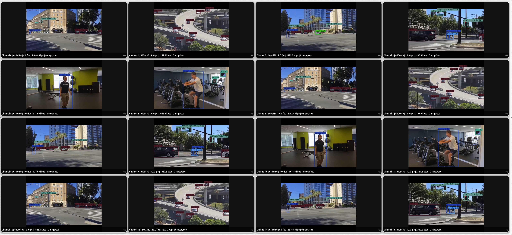

# Multistream Object Detection via OptiView

## Metadata
| Field | Value |
| --- | --- |
| Category | object-detection |
| Difficulty | Intermediate |
| Tags | object-detection, rtsp, multistream, optiview, yolov8 |
| Languages | C++, Python |
| Status | experimental |
| Binary Name | multistream-object-detection-optiview |
| Model | yolo_v8m |

## Concept
This example runs a config-driven multistream RTSP detection pipeline for YOLOv8 model packs and publishes per-stream video plus detection metadata to OptiView.

## Preview
Snippet from a pipeline run:



Architecture:
- one decoded RGB RTSP source runtime per stream
- one lazy OptiView video runtime and one OptiView JSON sender per stream
- a shared detector worker pool sized by `runtime.worker_count`
- one keep-latest mailbox per stream so the example can scale to many cameras without building large per-stream backlogs

Detector graph:
- YOLOv8: `Input(RGB) -> Preprocess -> Infer/MLA -> SimaBoxDecode`

Video graph:
- `Input(RGB) -> VideoConvert -> H264EncodeSima -> UdpH264OutputGroup`

## Prerequisites
- Installed NEAT SDK.
- One or more reachable RTSP camera URLs.
- A YOLOv8 model pack downloaded into `assets/models/`.
- Edit `common/config.yaml` before running with real streams.
- On Modalix DevKit, run `bash /usr/bin/fix_devkit_runtime.sh` before starting the example if the runtime has been used by earlier ML/video apps.

## Download Models
```bash
mkdir -p assets/models
cd assets/models

sima-cli modelzoo get yolo_v8n
sima-cli modelzoo get yolo_v8s
sima-cli modelzoo get yolo_v8m
sima-cli modelzoo get yolo_v8l
sima-cli modelzoo get yolo_v8x
```

## Build
### Build From The Apps Repo
```bash
cd <apps-repo-root>
./build.sh
```

### Build This Example Directly With CMake
```bash
cd <apps-repo-root>
cmake -S examples/object-detection/multistream-object-detection-optiview/cpp -B build/multistream-object-detection-optiview
cmake --build build/multistream-object-detection-optiview -j
```

## Run
### Validate Config Only
This is useful for a quick smoke test without opening RTSP streams.

```bash
./build/examples/object-detection/multistream-object-detection-optiview/multistream-object-detection-optiview \
  --config examples/object-detection/multistream-object-detection-optiview/common/config.yaml \
  --validate-config-only
```

### C++
```bash
SIMA_GST_RUN_INPUT_TIMEOUT_MS=120000 ./build/examples/object-detection/multistream-object-detection-optiview/multistream-object-detection-optiview \
  --config examples/object-detection/multistream-object-detection-optiview/common/config.yaml
```

### Python
```bash
source ~/pyneat/bin/activate
pip install -r examples/object-detection/multistream-object-detection-optiview/python/requirements.txt
SIMA_GST_RUN_INPUT_TIMEOUT_MS=120000 python3 examples/object-detection/multistream-object-detection-optiview/python/main.py \
  --config examples/object-detection/multistream-object-detection-optiview/common/config.yaml
```

## Notes
- Set `model.family: yolov8` and point `model.path` at a YOLOv8 pack.
- The checked-in `common/config.yaml` includes 16 placeholder stream slots. Replace the RTSP URLs and OptiView host before running.
- Both the C++ and Python paths decode each RTSP stream to RGB in system memory, run YOLOv8 on those RGB frames, and re-encode RGB frames for OptiView video output. They do not forward the original encoded H264 bitstream.
- `output.video_mode: clean` publishes unannotated RGB frames to OptiView and keeps JSON enabled. `annotated` draws detection boxes into the RGB video stream and suppresses JSON so OptiView does not overlay detections twice.
- `output.video_enabled: false` disables per-stream H264 video output. In `clean` mode the example still sends JSON detections; in `annotated` mode JSON is suppressed.
- `runtime.mailbox_depth` defaults to `1` and should usually stay small for dense multistream runs.
- The example applies the following runtime defaults for dense RTSP runs when the environment does not already override them:
  `SIMA_FORCE_MODEL_NUM_BUFFERS=3`, `SIMA_FORCE_DECODER_NUM_BUFFERS=7`, and `SIMA_FORCE_DECODER_POOL_BUFFERS=7`.
- The Python implementation now mirrors the same high-level contract as C++ while staying on public `pyneat`: `RtspDecodedInput`, explicit `nodes.preproc(...)`, `groups.mla(model)`, `nodes.sima_box_decode(...)`, and `groups.udp_h264_output_group(...)`.
- When `inference.fps` is lower than the source FPS, the example throttles after decode and keeps only the most recent frame per stream in the mailbox.
- `output.optiview.json_offset_ms` lets you shift JSON timestamps to better align OptiView boxes with the published video stream when transport latency makes boxes appear early or late. It only applies when JSON output is enabled.
- profiling now prints `source`, `preproc`, `detect`, `video`, `json`, `publish`, and `loop` timings per stream so bottlenecks are easier to isolate.
- `output.debug_dir` and `output.save_every` let you save periodic RGB debug frames locally without changing the OptiView output contract.

## Source Files
- C++: `cpp/main.cpp`
- C++ runtime helpers: `cpp/utils/config.cpp`, `cpp/utils/pipeline.cpp`, `cpp/utils/sample_utils.cpp`, `cpp/utils/workers.cpp`
- C++ tests: `cpp/tests/unit_test.cpp`, `cpp/tests/e2e_test.cpp`
- Python: `python/main.py`
- Python runtime helpers: `python/utils/config.py`, `python/utils/model_family.py`, `python/utils/pipeline.py`, `python/utils/sample_utils.py`, `python/utils/image_utils.py`, `python/utils/workers.py`
- Python tests: `python/tests/test_unit.py`, `python/tests/test_e2e.py`
- Shared assets: `common/`
