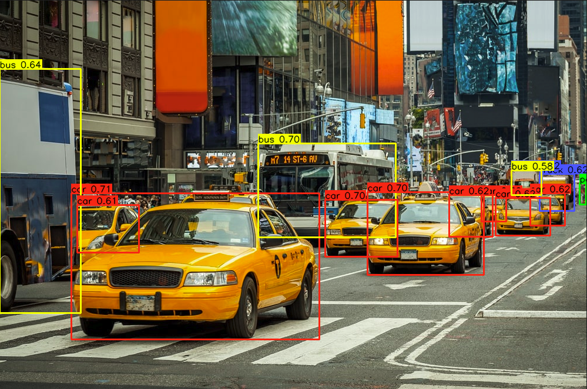

# Multistream RTSP Detection Pipeline

## Metadata
| Field | Value |
| --- | --- |
| Category | object-detection |
| Difficulty | Advanced |
| Tags | object-detection, rtsp, multistream |
| Languages | C++, Python |
| Status | experimental |
| Binary Name | multistream-rtsp-detection-pipeline |
| Model | yolo_v8m |

## Concept
Multi-camera RTSP object detection pipeline using YOLOv8. The sample demonstrates concurrent stream ingestion, batched runtime behavior, and per-stream annotated output writing.

## Preview
Snippet from a pipeline run:



## Architecture

### Pipeline

```
RTSP Source ──► Frame Queue ──► Model Inference ──► Result Queue ──► Overlay + Save
(producer)                      (infer worker)                      (overlay worker)
```

Each RTSP stream gets its own set of producer, infer, and overlay worker threads connected by bounded queues with keep-latest overflow semantics.

### Code Structure (Single-File Entrypoints)

Both implementations are intentionally kept in one file (`python/main.py`, `cpp/main.cpp`) but now follow the same high-level structure:

1. CLI/config parsing and validation
2. NEAT runtime builders (RTSP and model/infer)
3. Shared runtime state (stream state, packets, queues, profiling)
4. Worker methods (producer, infer, overlay)
5. Orchestration (thread startup, monitor loop, shutdown, summary)

## NEAT API Usage

**Python (`pyneat`)**
- RTSP session build (`build_rtsp_run` in `python/main.py`):
  - `pyneat.RtspDecodedInputOptions`
  - `pyneat.Session` + `add(pyneat.groups.rtsp_decoded_input(...))` + `add(pyneat.nodes.output(...))`
  - `session.build(run_opt)` returns `run`; producer thread uses `run.pull_tensor(...)`
- Model object creation (`PipelineApp._make_model`):
  - `pyneat.ModelOptions` + `pyneat.Model(model_path, mopt)`
- Inference runner build (`PipelineApp._infer_worker`, initialized on first frame):
  - `model.build(frame, model_session_opt, run_opt)`
  - infer thread uses `runner.push(frame)` and `runner.pull(timeout_ms=...)`
- Box decode behavior:
  - Parse `BBOX` payload if present (`extract_bbox_payload` + `parse_bbox_payload`)
  - Otherwise use manual YOLOv8 decode (`decode_yolov8_boxes_from_sample`)
  - No Python `SimaBoxDecode` node is used

**C++ (`simaai::neat`)**
- RTSP session build (`build_rtsp_runtime` / `build_rtsp_runtime_with_fallback` in `cpp/main.cpp`):
  - `simaai::neat::nodes::groups::RtspDecodedInputOptions`
  - `simaai::neat::Session` + `add(RtspDecodedInput)` + `add(Output)`
  - `session.build(run_opt)` returns `run`; producer thread uses `run.pull_tensor(...)`
- Model + infer session build (`build_infer_runtime`):
  - `simaai::neat::Model::Options` + `simaai::neat::Model`
  - Explicit graph: `Input → Preprocess → Infer → SimaBoxDecode → Output`
  - Async run built via `session.build(dummy_frame, RunMode::Async, run_opt)`
  - infer thread uses `run.push(frame)` and `run.pull(timeout_ms, sample, ...)`

### Worker Thread Lifecycle

For each stream, both languages use:

1. Producer worker: pull decoded RTSP frames and push to frame queue (keep-latest behavior)
2. Infer worker: push frames to model run, pull inference outputs, decode boxes, push to result queue
3. Overlay worker: draw boxes and save every `--save-every` frame

Shutdown is coordinated by a monitor loop plus per-stream done flags and queue emptiness checks.  
In C++, producer start is intentionally gated until infer/overlay workers are live to avoid startup backlog.

## Supported Models
Also works with: `yolo_v8n`, `yolo_v8s`, `yolo_v8l`

Download any variant into `assets/models/`:
- `mkdir -p assets/models && cd assets/models && sima-cli modelzoo get yolo_v8m && cd ../..`

## Prerequisites
- Installed NEAT SDK.
- One or more RTSP camera sources.
- Model artifacts are user-managed and should be downloaded into `assets/models/`.
- Download command: `mkdir -p assets/models && cd assets/models && sima-cli modelzoo get yolo_v8m && cd ../..`

## Important Behavior
- `--model`, `--output`, and at least one `--rtsp` are required.
- Use repeated `--rtsp` flags for multistream input.
- The C++ implementation does not accept `--width` or `--height`; it probes each RTSP stream during setup and uses that per-stream geometry for decode, infer-session input sizing, and `SimaBoxDecode` box coordinates.
- Output images are written per stream under the output directory.

## Command-Line Options
### C++
- Invocation:
  `./build/examples/object-detection/multistream-rtsp-detection-pipeline/multistream-rtsp-detection-pipeline --model <path> --output <dir> --rtsp <url0> [--rtsp <url1> ...] [options]`
- Required arguments:
  `--model`, `--output`, one or more `--rtsp`
- Optional arguments:
  `--labels-file`, `--frames`, `--fps`, `--tcp`, `--sample-every`, `--save-every`, `--run-queue-depth`, `--overflow-policy`, `--output-memory`, `--min-score`, `--nms-iou`, `--max-det`, `--model-timeout-ms`, `--frame-queue`, `--result-queue`, `--pull-timeout-ms`, `--max-idle-ms`, `--reconnect-miss`, `--debug`, `--profile`, `--profile-every`

### Python
- Invocation:
  `python examples/object-detection/multistream-rtsp-detection-pipeline/python/main.py --model <path> --output <dir> --rtsp <url0> [--rtsp <url1> ...] [options]`
- Required arguments:
  `--model`, `--output`, one or more `--rtsp`
- Optional arguments:
  `--labels-file`, `--frames`, `--fps`, `--tcp`, `--latency-ms`, `--sample-every`, `--save-every`, `--run-queue-depth`, `--overflow-policy`, `--output-memory`, `--infer-size`, `--min-score`, `--nms-iou`, `--max-det`, `--model-timeout-ms`, `--model-queue-depth`, `--frame-queue`, `--result-queue`, `--pull-timeout-ms`, `--max-idle-ms`, `--reconnect-miss`, `--debug`, `--profile`, `--profile-every`

## Build
### Build From The Apps Repo
```bash
cd <apps-repo-root>
./build.sh
```

Binary output:
```bash
./build/examples/object-detection/multistream-rtsp-detection-pipeline/multistream-rtsp-detection-pipeline
```

### Build This Example Directly With CMake
```bash
cd <apps-repo-root>/examples/object-detection/multistream-rtsp-detection-pipeline
cmake -S cpp -B build
cmake --build build -j
```

Binary output:
```bash
./build/multistream-rtsp-detection-pipeline
```

## Run

### RTSP Source
If you want quick RTSP streams for testing, [`tool-mediasources`](https://github.com/SiMa-ai/tool-mediasources) on the host is one option:

```bash
sima-cli install gh:sima-ai/tool-mediasources
./mediasrc.sh <video-dir>
open preview.html
```

If you use host-streamed sources from a board/devkit, use the host IP in the RTSP URLs instead of `127.0.0.1`. Any other RTSP source also works.

### C++
```bash
./build/examples/object-detection/multistream-rtsp-detection-pipeline/multistream-rtsp-detection-pipeline \
  --model assets/models/yolo_v8m_mpk.tar.gz \
  --output <output_dir> \
  --labels-file examples/object-detection/multistream-rtsp-detection-pipeline/common/coco_label.txt \
  --frames 100 --tcp --fps 10 --save-every 10 \
  --rtsp <rtsp-url-0> \
  --rtsp <rtsp-url-1> \
  --rtsp <rtsp-url-2> \
  --rtsp <rtsp-url-3>
```

### Python
```bash
source ~/pyneat/bin/activate
pip install -r examples/object-detection/multistream-rtsp-detection-pipeline/python/requirements.txt
python examples/object-detection/multistream-rtsp-detection-pipeline/python/main.py \
  --model assets/models/yolo_v8m_mpk.tar.gz \
  --output <output_dir> \
  --labels-file examples/object-detection/multistream-rtsp-detection-pipeline/common/coco_label.txt \
  --frames 100 --tcp --fps 10 --save-every 10 \
  --rtsp <rtsp-url-0> \
  --rtsp <rtsp-url-1> \
  --rtsp <rtsp-url-2> \
  --rtsp <rtsp-url-3>
```

## Debugging Notes
- Start with one stream first, then scale to multiple URLs.
- If boxes look shifted or stretched, confirm the stream is being probed at the expected runtime resolution in the startup log and avoid assuming `1280x720` geometry for smaller RTSP sources.
- If streams stall, check pull timeout, queue sizes, and RTSP source health.
- If no detections appear, verify model path and labels file.

## Source Files
- C++ source: `cpp/main.cpp`
- Python source: `python/main.py`
