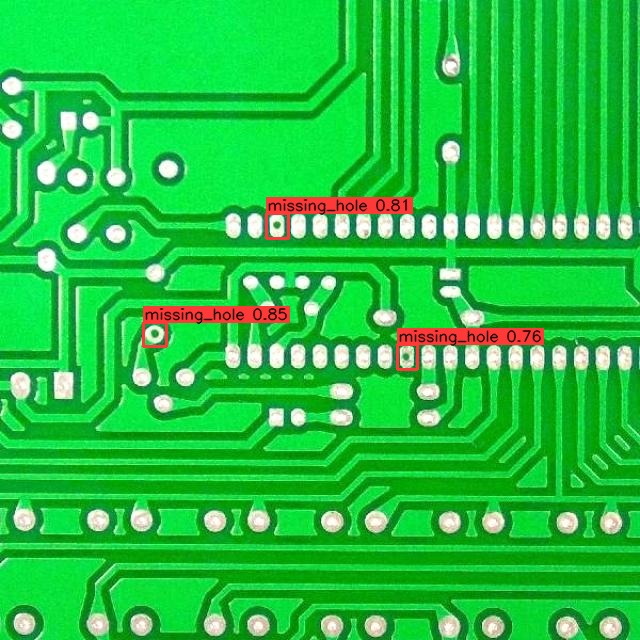

# PCB Defect Detector

## Metadata

| Field | Value |
| --- | --- |
| Category | object-detection |
| Difficulty | Beginner |
| Tags | object-detection, yolo26, pcb, defect-detection, industrial-inspection |
| Languages | C++, Python |
| Status | stable |
| Binary Name | pcb-defect-detector |
| Model | yolo26n_plc |

## Concept

Batch visual inspection of printed circuit boards with a custom-trained YOLO26n
detector. Every image in a folder is run on the MLA and written back annotated.

Images of any resolution are accepted. Each one is letterboxed to the model
input (640x640) before inference, and the detections are mapped back onto the
original frame, so boxes are drawn on the full-resolution source image.

The compiled pack owns the rest of the Neat path — color conversion,
normalization, MLA inference, and on-device YOLO26 box decode — so the
application feeds letterboxed BGR frames, parses the returned BBOX payload, and
draws the results.

Six manufacturing defect classes are detected:

```text
missing_hole, mouse_bite, open_circuit, short, spur, spurious_copper
```

This example is image-in / image-out. It does not publish a video stream and
does not require Insight or an RTSP source. The C++ and Python implementations
read the same `src/common/config.yaml` and produce the same annotated output.

## Preview



## Prerequisites

- `sima-cli` ([documentation](https://developer.sima.ai/software/tools/sima-cli/)) on a supported Modalix or DevKit target.
- Network access to `docs.sima.ai` to download the model package.

## Install Apps

Install the latest Neat Apps runtime and enter the installed bundle:

```bash
sima-cli neat install apps
cd prebuilt-apps
APP_DIR=examples/object-detection/pcb-defect-detector
```

Run the remaining commands from `prebuilt-apps/`.

## Prepare the Model

| Model | Role | Source |
| --- | --- | --- |
| `yolo26n_plc_mpk.tar.gz` | Default | Direct artifact |

Model packages come from the Model Zoo release below, which can differ from the installed platform version.

```bash
export MODELZOO_VERSION="2.1.3"
mkdir -p models
cd models
sima-cli download "https://docs.sima.ai/pkg_downloads/SDK${MODELZOO_VERSION}/models/modalix/yolo26n_plc_mpk.tar.gz"
cd ..
```

Set `model.path` in the config to the downloaded package.

The detector is trained on a custom PCB defect dataset rather than published in
Model Zoo. The pack is a BF16 build with MLA tessellation, compiled from the
trained YOLO26n ONNX export with the raw detection heads exposed and C2PSA
attention rewritten to BF16-friendly Einsum nodes. Class order is fixed by the
checkpoint and must match `src/common/pcb_label.txt`.

Dataset and source-model reference:
[PCB defects detection](https://platform.ultralytics.com/muhammadrizwanmunawar/datasets/pcb-defects-detection).

## Configure

Open `${APP_DIR}/src/common/config.yaml`.

```yaml
model:
  path: <model-path>         # Example: models/<model-pack>.tar.gz
  labels: examples/object-detection/pcb-defect-detector/src/common/pcb_label.txt
  input_size: 640

io:
  input_dir: assets/datasets/pcb
  output_dir: sandbox/pcb-defect-detector

decode:
  score_threshold: 0.25
  nms_iou: 0.45
  max_detections: 300

runtime:
  timeout_ms: 8000
  num_runs: 1
  queue_depth: 8
  profile: false

output:
  overlay: true
```

`model.input_size` must match the compiled model pack; 640 is correct for
`yolo26n_plc_mpk.tar.gz`. Images are letterboxed to that square with aspect
ratio preserved and grey (114) padding, so a folder can mix resolutions and
aspect ratios freely. Annotated output keeps the source resolution. Set
`runtime.profile: true` for per-image timing, `runtime.num_runs` above 1 to
repeat the folder for steadier timings, and `output.overlay: false` to measure
inference without drawing or writing images.

Five sample PCB images ship under `assets/datasets/pcb/`, so the example runs as
soon as the model pack is in place. Point `io.input_dir` at your own folder to
inspect other boards.

## Run

### C++

```bash
./${APP_DIR}/src/cpp/pre-built/pcb-defect-detector \
  --config ${APP_DIR}/src/common/config.yaml
```

### Python

```bash
source ~/pyneat/bin/activate
pip install -r ${APP_DIR}/src/python/requirements.txt
python3 ${APP_DIR}/src/python/main.py \
  --config ${APP_DIR}/src/common/config.yaml
```

Both implementations accept the same threshold overrides, so you can sweep
values without editing the config:

```bash
./${APP_DIR}/src/cpp/pre-built/pcb-defect-detector \
  --config ${APP_DIR}/src/common/config.yaml \
  --score 0.30 --nms 0.50
```

Both also accept `--validate-config-only`, which checks the configuration and
label file and exits without loading the model:

```bash
./${APP_DIR}/src/cpp/pre-built/pcb-defect-detector \
  --config ${APP_DIR}/src/common/config.yaml \
  --validate-config-only
```

## Expected Result

Each input image produces one annotated PNG in `io.output_dir`:

```text
assets/datasets/pcb/pcb_01_missing_hole.jpg
  -> sandbox/pcb-defect-detector/pcb_01_missing_hole.png
```

Stale images in `io.output_dir` are cleared at the start of each run, unless
`io.output_dir` and `io.input_dir` are the same folder.

Every run prints a per-image line with the defect count and class breakdown,
followed by a per-class total for the folder.

## Troubleshooting

- Run either implementation with `--validate-config-only` to check configuration values and the label file without loading the model.
- Confirm `model.path` points at a readable model package under `models/`.
- Confirm `io.input_dir` exists and contains `.jpg`, `.jpeg`, `.png`, or `.bmp` files, and that `io.output_dir` is writable.
- If no defects are reported, lower `decode.score_threshold`; if boxes overlap heavily, raise `decode.nms_iou`.
- Class names in `src/common/pcb_label.txt` are index-aligned with the trained checkpoint. Reordering them mislabels detections.
- If boxes look offset or scaled, confirm `model.input_size` matches the model package's compiled input.

## Source Files

- C++ reference source: `src/cpp/main.cpp`
- Python source: `src/python/main.py`
- Shared config: `src/common/config.yaml`
- Class labels: `src/common/pcb_label.txt`
- Sample images: `assets/datasets/pcb/`

The packaged C++ source is an implementation reference. Run the executable under `src/cpp/pre-built/`; the installed bundle does not include CMake files.

## Development From Source

To modify, compile, or test this example, use the [Apps contributor workflow](https://github.com/sima-neat/apps/blob/main/CONTRIBUTING.md).
