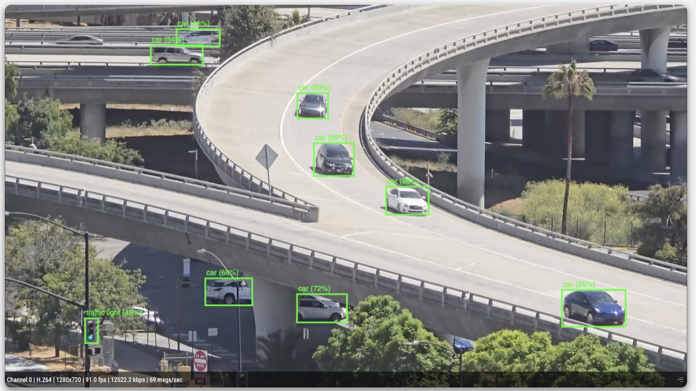

# RF-DETR Detection and Segmentation

## Metadata

| Field | Value |
| --- | --- |
| Category | object-detection |
| Difficulty | Advanced |
| Tags | object-detection, instance-segmentation, rfdetr, rtsp, insight |
| Languages | C++, Python |
| Status | stable |
| Binary Name | rfdetr-detection-segmentation |
| Model | RF-DETR Small, Medium, or Segmentation |

## Concept

Run RF-DETR detection or instance segmentation on one H.264, H.265, or MJPEG RTSP stream and view the result in Insight.

The application decodes to NV12 once. EV74 converts, resizes, and normalizes each frame for the selected backbone. A one-frame queue drops stale decoded frames if inference falls behind. Host code then selects the strongest proposals and passes the matching boxes and feature tensor to the transformer. Insight receives the source video and matching detection boxes or segmentation polygons.

## Preview



## Prerequisites

- [`sima-cli` 2.1.15 or newer](https://developer.sima.ai/software/tools/sima-cli/) on a supported Modalix or DevKit target.
- An H.264, H.265, or MJPEG RTSP source and an [Insight endpoint](https://developer.sima.ai/software/tools/insight/) reachable from the target.

## Install Apps

```bash
sima-cli neat install apps
cd prebuilt-apps
APP_DIR=examples/object-detection/rfdetr-detection-segmentation
```

Run the remaining commands from `prebuilt-apps/`.

## Prepare the Model

The packaged configuration selects RF-DETR Small detection. Download its model pair:

```bash
export MODELZOO_VERSION="2.1.3"
mkdir -p models
cd models
sima-cli download "https://docs.sima.ai/pkg_downloads/SDK${MODELZOO_VERSION}/models/modalix/rfdetr-small-backbone.tar.gz"
sima-cli download "https://docs.sima.ai/pkg_downloads/SDK${MODELZOO_VERSION}/models/modalix/rfdetr-small-transformer.tar.gz"
cd ..
```

For Medium detection, download `rfdetr-medium-backbone.tar.gz` and `rfdetr-medium-transformer.tar.gz` from the same SDK model directory. Segmentation uses `rfdetr-segmentation-backbone.tar.gz` and `rfdetr-segmentation-transformer.tar.gz`; their public download links must be added before this draft is ready to merge.

## Configure

Edit `$APP_DIR/src/common/config.yaml`:

- Set `model.task` to `detection` or `segmentation`.
- For detection, set `model.detection.variant` to `small` or `medium`.
- Set `source.rtsp_url` and select `source.codec` as `h264`, `h265`, or `mjpeg`.
- Leave `source.width`, `height`, and `fps` at `0` to probe the stream. Width and height are fallbacks; a positive FPS overrides the detected value.
- Set `output.insight.host`, `video_port`, and `metadata_port` to the values reported by Insight.
- Keep `inference.frames: 0` to run continuously, or set a finite result count.

EV74 resizes the decoded frame to the input size required by the selected model.

## Run

### C++

```bash
"$APP_DIR/src/cpp/pre-built/rfdetr-detection-segmentation" --config "$APP_DIR/src/common/config.yaml"
```

### Python

```bash
source ~/pyneat/bin/activate
pip install -r "$APP_DIR/src/python/requirements.txt"
python3 "$APP_DIR/src/python/main.py" --config "$APP_DIR/src/common/config.yaml"
```

Insight receives `object-detection` metadata for detection or `segmentation` polygon metadata for segmentation. Stop a continuous run with Ctrl-C.

## Detection Performance

Measured end-to-end throughput on Modalix:

| Input Resolution | Codec | RF-DETR Small | RF-DETR Medium |
| --- | --- | ---: | ---: |
| 720p | H.264, H.265, MJPEG | Up to 70 FPS | Up to 50 FPS |
| 1080p | H.264, H.265, MJPEG | Up to 70 FPS | Up to 50 FPS |
| 4K | H.264 | Up to 60 FPS | Up to 50 FPS |

## Source Files

- C++ implementation: `src/cpp/main.cpp`
- Python implementation: `src/python/main.py`
- Shared configuration and COCO labels: `src/common/`

The packaged C++ source is an implementation reference. Run the executable under `src/cpp/pre-built/`; the installed bundle does not include CMake files.

## Development From Source

To modify, compile, or test this example, use the [Apps contributor workflow](https://github.com/sima-neat/apps/blob/main/CONTRIBUTING.md).
