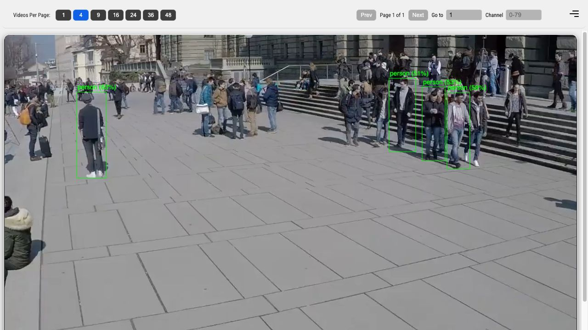

# RF-DETR Object Detector

## Metadata

| Field | Value |
| --- | --- |
| Category | object-detection |
| Difficulty | Advanced |
| Tags | object-detection, rfdetr, rtsp, insight |
| Languages | C++, Python |
| Status | stable |
| Binary Name | rfdetr-object-detector |
| Model | RF-DETR Small or Medium |

## Concept

Run RF-DETR Small or Medium on one H.264, H.265, or MJPEG RTSP stream and publish the source
video plus object-detection metadata to Insight.

The application decodes to NV12 once. EV74 converts, resizes, and normalizes
each frame for the selected backbone. A small host bridge selects the top 300
proposals, gathers their boxes, and sends those boxes together with the
matching backbone feature tensor to the transformer. The encoded source is
forwarded directly to Insight for H.264 and H.265. MJPEG is encoded to H.264
from the shared decoded frame because Insight does not accept MJPEG passthrough.

## Preview



## Prerequisites

- `sima-cli` 2.1.15 or newer
  ([documentation](https://developer.sima.ai/software/tools/sima-cli/)) on a
  supported Modalix or DevKit target.
- An H.264, H.265, or MJPEG RTSP source and an
  [Insight](https://developer.sima.ai/software/tools/insight/) endpoint
  reachable from the target.

## Install Apps

Install Neat Apps and enter the installed bundle:

```bash
sima-cli neat install apps
cd prebuilt-apps
APP_DIR=examples/object-detection/rfdetr-object-detector
```

Run the remaining commands from `prebuilt-apps/`.

## Prepare the Model

Download the Small model, which is selected by the packaged configuration:

```bash
export MODELZOO_VERSION="2.1.3"
mkdir -p models
cd models
sima-cli download \
  "https://docs.sima.ai/pkg_downloads/SDK${MODELZOO_VERSION}/models/modalix/rfdetr-small-backbone.tar.gz"
sima-cli download \
  "https://docs.sima.ai/pkg_downloads/SDK${MODELZOO_VERSION}/models/modalix/rfdetr-small-transformer.tar.gz"
cd ..
```

To use Medium, download its pair instead:

```bash
cd models
sima-cli download \
  "https://docs.sima.ai/pkg_downloads/SDK${MODELZOO_VERSION}/models/modalix/rfdetr-medium-backbone.tar.gz"
sima-cli download \
  "https://docs.sima.ai/pkg_downloads/SDK${MODELZOO_VERSION}/models/modalix/rfdetr-medium-transformer.tar.gz"
cd ..
```

## Configure

Edit `$APP_DIR/src/common/config.yaml`:

- Set `model.variant` to `small` or `medium`.
- Set `source.rtsp_url` and select `source.codec` as `h264`, `h265`, or `mjpeg`.
- Leave `source.width`, `height`, and `fps` at `0` to probe the stream. Width
  and height are fallbacks; a positive FPS overrides the detected value.
- Set `output.insight.host`, `video_port`, and `metadata_port` to the values
  reported by Insight.
- Keep `inference.frames: 0` to run continuously, or set a finite frame count.

The model paths already match the download commands above. The model input size
belongs to the selected compiled artifact; EV74 performs the resize in the
Neat preprocessing route.

## Run

### C++

```bash
"$APP_DIR/src/cpp/pre-built/rfdetr-object-detector" \
  --config "$APP_DIR/src/common/config.yaml"
```

### Python

```bash
source ~/pyneat/bin/activate
pip install -r "$APP_DIR/src/python/requirements.txt"
python3 "$APP_DIR/src/python/main.py" \
  --config "$APP_DIR/src/common/config.yaml"
```

Insight receives the original H.264 or H.265 video, or H.264 video converted
from MJPEG, on `video_port`. Matching `object-detection` metadata arrives on
`metadata_port`. Stop a continuous run with Ctrl-C.

## Source Files

- C++ implementation: `src/cpp/main.cpp`
- Python implementation: `src/python/main.py`
- Shared configuration and COCO labels: `src/common/`

The packaged C++ source is an implementation reference. Run the executable
under `src/cpp/pre-built/`; the installed bundle does not include CMake files.

## Development From Source

To modify, compile, or test this example, use the
[Apps contributor workflow](https://github.com/sima-neat/apps/blob/main/CONTRIBUTING.md).
