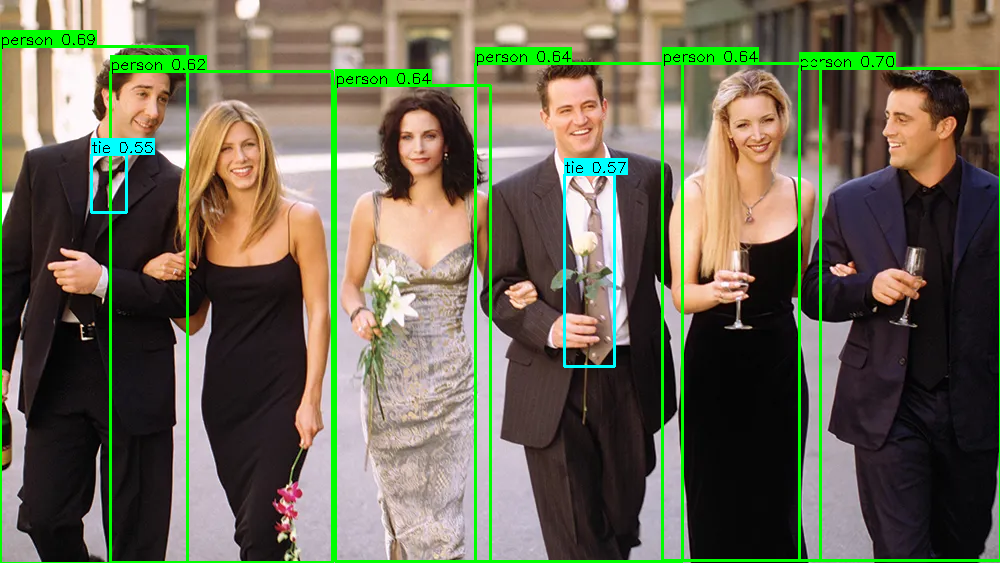

# Single-Stream Object Detector

## Metadata
| Field | Value |
| --- | --- |
| Category | object-detection |
| Difficulty | Intermediate |
| Tags | object-detection, yolo26, rtsp, insight |
| Languages | C++, Python |
| Status | experimental |
| Binary Name | single-stream-object-detector |
| Model | yolo26m-det-bf16-mla_tess-b1 |

## Concept
`single-stream-object-detector` is a focused reference example for a common deployment pattern:

- ingest one RTSP camera stream
- decode the stream into NV12 frames
- run YOLO26 object detection
- send H.264 video plus detection metadata to Insight

The example is intentionally narrow in scope. It is not a generic output-mode demo and it does not try to support multiple unrelated workflows in one binary. The code is structured to show the intended Insight path clearly.

## Preview
Snippet from a pipeline run:



## What Is Insight?
Insight is SiMa.ai's lightweight, cross-platform development and visualization tool for vision pipelines on DevKits:

- a media source manager that can host test media and stream it as RTSP
- a zero-install web viewer for real-time video and metadata visualization

For this sample, the most important part is the viewer/output contract: the application sends video on the Insight video channel and sends detection metadata as JSON on the Insight side channel. That allows the browser UI to display the live stream together with object detections without relying on external tools such as `ffplay`, VLC, or ad hoc debug viewers.

For more information regarding Insight, please refer to this [page](https://developer.sima.ai/software/tools/insight).

## Architecture
The sample is split into three independent runtime stages:

1. `RTSP ingest and decode`
   The application first probes the RTSP source to learn the decoded frame size, then builds a decode graph that outputs NV12 frames. This avoids hardcoding `640x480` and makes the example more robust when the source changes resolution.

2. `YOLO inference`
   Decoded NV12 frames are pushed into a dedicated YOLO pipeline:
   `Input -> model.graph() -> Output`

   The model stage is isolated from transport logic so detection behavior can be debugged separately from RTSP or Insight issues.

3. `Insight output`
   The original decoded frame is pushed into `VideoSender`. The nodegroup owns the raw-frame video transport path, including conversion, raw NV12 caps, H.264 encoding, RTP packetization, and UDP output. Detection results from the YOLO path are converted into Insight metadata and sent on the metadata side channel.

## Neat Library API Usage

- RTSP ingest: `RtspDecodedInputOptions` -> `Graph.add(rtsp_decoded_input)` -> `Graph.build(...)`
- YOLO path:
  C++ and Python use `Input -> model.graph() -> Output`
- Insight output:
  C++ and Python build a dedicated `VideoSender` runtime plus `MetadataSender`.

## Lifecycle
The example uses a producer/consumer design:

- the producer thread pulls decoded frames from the RTSP graph and places them into a bounded queue
- the consumer thread pulls frames from that queue, submits them to YOLO, converts detection results to Insight objects, and publishes both video and metadata

This separation keeps the RTSP graph from being tightly coupled to the inference latency of each frame and makes profile output easier to interpret.

## Prerequisites
- Installed Neat Library and Insight on the DevKit
- RTSP camera source or use Insight to start RTSP source
- Model artifacts are user-managed. Download the model variant you want to run into `assets/models/`.

## Get The Apps Repo
Install the Neat Library first by following the official [Neat Library installation guide](https://developer.sima.ai/software/getting-started/installation/neat-library).

Then clone and build the apps repo:

```bash
git clone https://github.com/sima-neat/apps.git
cd apps
./build.sh --clean
```

After this setup, follow the example-specific commands below.

## Download Models
Use the platform version wherever `<platform-version>` appears.

Default model: `yolo26m-det-bf16-mla_tess-b1.tar.gz`.

Supported batch-1 YOLO26 detection models:
- `yolo26n-det-bf16-mla_tess-b1.tar.gz`
- `yolo26s-det-bf16-mla_tess-b1.tar.gz`
- `yolo26m-det-bf16-mla_tess-b1.tar.gz`
- `yolo26l-det-bf16-mla_tess-b1.tar.gz`
- `yolo26x-det-bf16-mla_tess-b1.tar.gz`
- `yolo26m-det-bf16-b1.tar.gz`
- `yolo26m-det-int8-b1.tar.gz`

Download all supported batch-1 variants:

```bash
mkdir -p assets/models
cd assets/models

sima-cli download https://docs.sima.ai/pkg_downloads/SDK<platform-version>/models/modalix/yolo26-detection/yolo26n-det-bf16-mla_tess-b1.tar.gz
sima-cli download https://docs.sima.ai/pkg_downloads/SDK<platform-version>/models/modalix/yolo26-detection/yolo26s-det-bf16-mla_tess-b1.tar.gz
sima-cli download https://docs.sima.ai/pkg_downloads/SDK<platform-version>/models/modalix/yolo26-detection/yolo26m-det-bf16-mla_tess-b1.tar.gz
sima-cli download https://docs.sima.ai/pkg_downloads/SDK<platform-version>/models/modalix/yolo26-detection/yolo26l-det-bf16-mla_tess-b1.tar.gz
sima-cli download https://docs.sima.ai/pkg_downloads/SDK<platform-version>/models/modalix/yolo26-detection/yolo26x-det-bf16-mla_tess-b1.tar.gz
sima-cli download https://docs.sima.ai/pkg_downloads/SDK<platform-version>/models/modalix/yolo26-detection/yolo26m-det-bf16-b1.tar.gz
sima-cli download https://docs.sima.ai/pkg_downloads/SDK<platform-version>/models/modalix/yolo26-detection/yolo26m-det-int8-b1.tar.gz

cd ../..
```

## Important Behavior
- The sample always publishes to Insight.
- Video is sent to the configured Insight video UDP port.
- Detection metadata is sent to the configured Insight metadata UDP port.
- The app adds only the `VideoSender` nodegroup for video output. It does not manually add lower-level color conversion, raw capsfilter, encoder, parser, packetizer, or UDP nodes.
- This example feeds raw decoded frames to `VideoSender` with the raw-frame option. If an upstream pipeline already produces H.264, `VideoSender` also supports the encoded-input option, where it parses, packetizes, and sends without re-encoding.
- `model.path` must point to a valid YOLO compiled model package file.
- `source.rtsp_url` must be set before running.
- If `inference.frames` is zero, the sample runs continuously.
- If `runtime.profile` is true, the sample prints aggregate profile summaries every `runtime.profile_interval` published frames.

## Command-Line Options
- `--config <path>`
  Optional. YAML config path. Defaults to `src/common/config.yaml`.
- `--validate-config-only`
  Validate YAML config and exit without opening the RTSP stream.

## Build
This example can be built in either of these environments:

- from a Neat Development Environment
- directly on a `DevKit`

Within either environment, the C++ implementation can be built in two ways. The Python implementation does not require a compile step.

### Build From The Apps Repo
Build all C++ examples from the `apps` repo root:

```bash
cd <apps-repo-root>
./build.sh
```

The resulting binary is:

```bash
./build/examples/object-detection/single-stream-object-detector/single-stream-object-detector
```

### Build This Example Directly With CMake
Configure and build only this example from its own directory:

```bash
cd <apps-repo-root>/examples/object-detection/single-stream-object-detector
cmake -S src/cpp -B build
cmake --build build -j
```

The resulting binary is:

```bash
./build/single-stream-object-detector
```

Direct CMake builds use the shared example module support in the `apps` repo and link against the available Neat Library installation or local core build.

In practice:

- in the Neat Development Environment, this is typically done after activating the environment and then building from the repo or the example folder
- on `DevKit`, this can be done directly on the target device as long as the required Neat Library dependencies are installed

## RTSP Source

If you want a quick RTSP source for testing, [`tool-mediasources`](https://github.com/SiMa-ai/tool-mediasources) on the host is one option:

```bash
sima-cli install gh:sima-ai/tool-mediasources
./mediasrc.sh <video-dir>
open preview.html
```

If you use host-streamed sources from a board/devkit, use the host IP in the RTSP URL instead of `127.0.0.1`. Any other RTSP source also works.

## Run
### Binary Built From The Apps Repo
```bash
./build/examples/object-detection/single-stream-object-detector/single-stream-object-detector \
  --config examples/object-detection/single-stream-object-detector/src/common/config.yaml
```

### Binary Built Directly In The Example Folder
```bash
./build/single-stream-object-detector \
  --config src/common/config.yaml
```

Set the RTSP source and Insight destination in the config:

```yaml
source:
  rtsp_url: rtsp://<host>:8554/<stream>
  tcp: true
model:
  path: <model-path>
inference:
  frames: 0
  min_score: 0.55
  nms_iou: 0.50
  max_detections: 100
runtime:
  profile: false
  profile_interval: 100
output:
  save_dir: ""
  save_every: 0
  insight:
    host: <insight-host-ip>
    video_port: 9000
    metadata_port: 9100
```

### Python Implementation
Run the Python sample directly from the example folder:

```bash
cd <apps-repo-root>/examples/object-detection/single-stream-object-detector
pip install -r src/python/requirements.txt
python3 src/python/main.py --config src/common/config.yaml
```

Example workflow:

Download the default YOLO26 detector model if it is not already available:

```bash
mkdir -p assets/models
cd assets/models
sima-cli download https://docs.sima.ai/pkg_downloads/SDK<platform-version>/models/modalix/yolo26-detection/yolo26m-det-bf16-mla_tess-b1.tar.gz
cd ../..
```

Then start the Python app:

```bash
source ~/pyneat/bin/activate
pip install -r src/python/requirements.txt
python3 src/python/main.py --config src/common/config.yaml
```

Python-specific notes:

- `model.path` must point to a downloaded YOLO26 detector package
- it sends Insight metadata directly over UDP and streams video through `VideoSender`

## Debugging Notes
- If the sample times out waiting for the first RTSP frame, the problem is usually upstream stream delivery or device connectivity, not YOLO itself.
- If the RTSP source resolution changes, the startup probe is expected to adapt the decode path automatically.
- If detections are missing but video is flowing, focus on the YOLO session and bbox extraction/parse path.
- If video and detections are both missing in Insight, verify the host and UDP ports first.

## Source Files
- C++ source: `src/cpp/main.cpp`
- C++ tests: `tests/cpp/test_unit.cpp`, `tests/cpp/test_e2e.cpp`
- Python source: `src/python/main.py`
- Python tests: `tests/python/test_unit.py`, `tests/python/test_e2e.py`
- Insight documentation: <https://developer.sima.ai/software/tools/insight>
