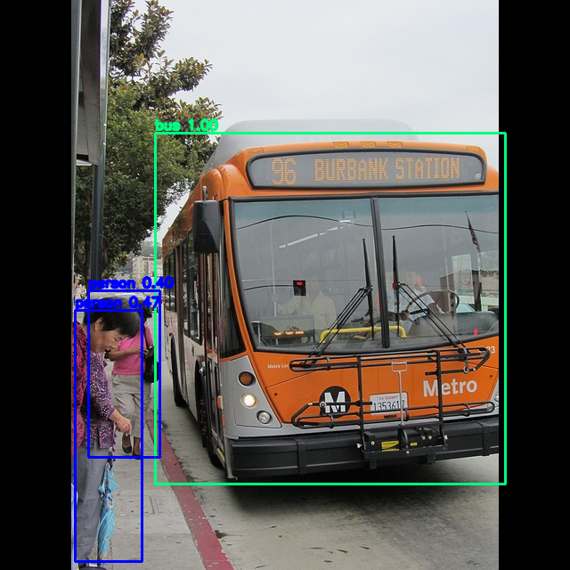

# SSD-MobileNet Object Detector

## Metadata

| Field | Value |
| --- | --- |
| Category | object-detection |
| Difficulty | Intermediate |
| Tags | ssd, mobilenet, object-detection, folder-input, coco |
| Languages | C++, Python |
| Status | experimental |
| Binary Name | ssd-mobilenet-object-detector |
| Model | ssd_mobilenet_v2_heads (default) |

## Concept

Folder-based object detection with a compiled **SSD** model. The app supports **four models**
through the model-managed `BoxDecodeType::Ssd` contract — SSD300 and the TensorFlow Object
Detection API SSD-MobileNet **v1**, **v2** and **v3** COCO detectors. Each image is inferred,
annotated with boxes and labels, and written to an output folder.

Decoding is **model-managed**: the app selects `BoxDecodeType::Ssd`, and the Neat Library pipeline
owns the priors, box decode, class scoring (softmax for SSD300, per-class sigmoid for MobileNet)
and NMS. The app only configures preprocess and decode, parses the `BBOX` output and draws the
detections.

Some COCO-trained SSD models emit a large `iscrowd` training region as an ordinary class box. The
runtime `BBOX` record has no crowd flag, so the app applies an optional, conservative aggregate
filter after decode: a large box is hidden only when it almost entirely contains multiple much
smaller boxes of the same class. This is an opt-in display policy, not part of SSD decoding. It is
disabled by default in code; this demo config explicitly enables it with
`output.aggregate_suppression: true`. Machine-readable JSON always retains every raw model
detection and marks overlay membership with a `displayed` boolean.

Preprocess is a direct **stretch** to the model frame with `[-1, 1]` normalization
(`(pixel / 127.5) - 1`, i.e. mean/stddev `0.5`). The models were trained with a
`fixed_shape_resizer`, and the SSD box back-projection inverts the same per-axis stretch — a
letterbox resize would squash every box vertically and pull it toward the frame center. The frame
is **300×300 for SSD300 and MobileNet v1/v2**, and **320×320 for v3**; set it via `model.frame`.

## Preview



## Prerequisites

- `sima-cli` ([documentation](https://developer.sima.ai/software/tools/sima-cli/)) on a supported Modalix or DevKit target.

## Install Apps

Install the latest Neat Apps runtime and enter the installed bundle:

```bash
sima-cli neat install apps
cd prebuilt-apps
```

Run the remaining commands from `prebuilt-apps/`.

## Prepare the Model

| Model file | Role | Frame (`model.frame`) |
| --- | --- | --- |
| `ssd_mobilenet_v2_heads_mpk.tar.gz` | Default | 300 |
| `ssd_mobilenet_v1_heads_mpk.tar.gz` | Supported | 300 |
| `ssd_mobilenet_v3_heads_mpk.tar.gz` | Supported | 320 |
| `ssd300_heads_mpk.tar.gz` | Supported | 300 |

Model packages come from the Model Zoo release below, which can differ from the installed platform
version.

```bash
export MODELZOO_VERSION="2.1.2"
mkdir -p models
cd models
sima-cli download "https://docs.sima.ai/pkg_downloads/SDK${MODELZOO_VERSION}/models/modalix/ssd_mobilenet_v2_heads_mpk.tar.gz"
cd ..
```

Set `model.path` in the config to the downloaded package. For **SSD-MobileNet v3**, also set
`model.frame: 320` (v1/v2 and SSD300 use the default `300`).

The only shipped asset is `src/common/coco_labels.txt` — 91 lines (`0=background`, `1..90` =
MS-COCO ids). No anchor asset is needed: the priors live in the model-managed SSD decode.

## Configure

Edit `examples/object-detection/ssd-mobilenet-object-detector/src/common/config.yaml`.

```yaml
model:
  path: <model-path>
  frame: 300                 # 300 for SSD300/v1/v2, 320 for v3.
  labels: examples/object-detection/ssd-mobilenet-object-detector/src/common/coco_labels.txt

io:
  input_dir: assets/datasets/coco
  output_dir: sandbox/ssd-mobilenet-object-detector
  detections_json: ""        # Optional machine-readable detections report.

decode:
  score_threshold: 0.55
  nms_iou: 0.60
  max_detections: 100

runtime:
  timeout_ms: 20000
  num_runs: 1
  profile: false
  verbose: false             # Python only: verbose runtime logging (ignored by the C++ app).

output:
  overlay: true              # Draw boxes and labels on output images.
  aggregate_suppression: true       # Explicit demo-only display policy opt-in.
  aggregate_min_parent_area_fraction: 0.20
  aggregate_min_child_containment: 0.90
  aggregate_max_child_area_ratio: 0.25
  aggregate_min_children: 2
```

The `labels` path is repo-relative. If the working directory differs, the app falls back to the
copy shipped next to the example under `src/common/`.

## Run

### C++

```bash
./examples/object-detection/ssd-mobilenet-object-detector/src/cpp/pre-built/ssd-mobilenet-object-detector \
  --config examples/object-detection/ssd-mobilenet-object-detector/src/common/config.yaml
```

### Python

```bash
source ~/pyneat/bin/activate
pip install -r examples/object-detection/ssd-mobilenet-object-detector/src/python/requirements.txt
python3 examples/object-detection/ssd-mobilenet-object-detector/src/python/main.py \
  --config examples/object-detection/ssd-mobilenet-object-detector/src/common/config.yaml
```

## Troubleshooting

- Verify `model.path` and the labels file if detections are missing.
- Confirm the input folder contains `.jpg`, `.jpeg`, `.png`, or `.bmp` files.
- If boxes look vertically squished or shifted toward the frame center, the resize mode is wrong.
  This model requires a **stretch** resize; the example already sets it.
- If detections are missing but the pipeline runs, lower `decode.score_threshold` — int8
  quantization of the classification heads can drop weak detections.
- Aggregate suppression affects overlays only. Set `output.aggregate_suppression: false` to render
  every raw box. The JSON report always preserves all raw detections and adds `displayed: false`
  for boxes omitted from the overlay. Source-versus-compiled agreement measures compiler fidelity;
  it does not by itself establish detection accuracy or visual usefulness.
- Set `runtime.profile: true` to print pipeline vs. output-parsing timing for the first image.
- Set `io.detections_json` to write per-image detections (class, score, box, displayed) for offline
  checks.

## Source Files

- C++ reference source: `src/cpp/main.cpp`
- Python source: `src/python/main.py`
- Shared config and labels: `src/common/`

The packaged C++ source is an implementation reference. Run the executable under `src/cpp/pre-built/`; the installed bundle does not include CMake files.

## Development From Source

To modify, compile, or test this example, use the [Apps contributor workflow](https://github.com/sima-neat/apps/blob/main/CONTRIBUTING.md).
