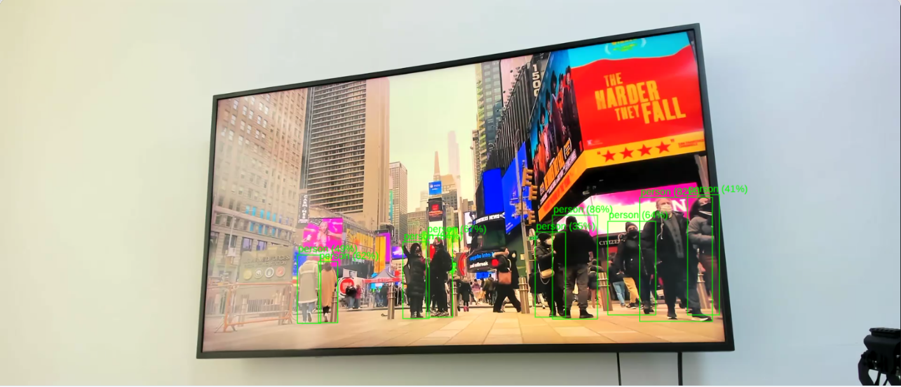

# USB Camera Object Detector

## Metadata

| Field | Value |
| --- | --- |
| Category | object-detection |
| Difficulty | Intermediate |
| Tags | object-detection, yolo26, usb-camera, uvc, v4l2, insight |
| Languages | C++, Python |
| Status | stable |
| Binary Name | usb-camera-object-detector |
| Model | yolo26m-det-bf16-mla_tess-b1 |

## Concept

Captures from a USB (UVC) webcam, runs YOLO26 detection on the MLA, and streams H.264 video plus detection metadata to Insight.

Neat has no V4L2 source node, so the camera is a GStreamer fragment behind the
`custom()` escape hatch. Everything after it is an ordinary Neat graph:

```text
v4l2src (MJPEG) -> neatdecoder (NV12) -> branch -+-> video_sender -> Insight
                                              `-> model -> detections -> Insight metadata
```

Both branches stay inside one Run so the encoder and the detections share a
GStreamer timeline. Insight correlates the RTP timestamp with the metadata
timestamp, and cannot render overlays if the two drift apart. The branch link
uses `RealtimeLatestByStream`, so a slow branch drops its own stale frames
instead of back-pressuring the camera.

The C++ and Python implementations read the same `src/common/config.yaml` and
build the same graph.

## Preview



## Prerequisites

- `sima-cli` ([documentation](https://developer.sima.ai/software/tools/sima-cli/)) on a supported Modalix or DevKit target.
- A UVC (USB Video Class) camera that offers MJPEG at the configured resolution, and an [Insight](https://developer.sima.ai/software/tools/insight/) URL reachable from the target.

## Install Apps

Install the latest Neat Apps runtime and enter the installed bundle:

```bash
sima-cli neat install apps
cd prebuilt-apps
APP_DIR=examples/object-detection/usb-camera-object-detector
```

Run the remaining commands from `prebuilt-apps/`.

## Prepare the Model

The default model is `yolo26m-det-bf16-mla_tess-b1`.

| Model | Role | Source |
| --- | --- | --- |
| `yolo26m-det-bf16-mla_tess-b1.tar.gz` | Default | Direct artifact |
| `yolo26n-det-bf16-mla_tess-b1.tar.gz` | Supported | Direct artifact |
| `yolo26s-det-bf16-mla_tess-b1.tar.gz` | Supported | Direct artifact |
| `yolo26l-det-bf16-mla_tess-b1.tar.gz` | Supported | Direct artifact |
| `yolo26x-det-bf16-mla_tess-b1.tar.gz` | Supported | Direct artifact |
| `yolo26m-det-bf16-b1.tar.gz` | Supported | Direct artifact |
| `yolo26m-det-int8-b1.tar.gz` | Supported | Direct artifact |

Model packages come from the Model Zoo release below, which can differ from the installed platform version. Replace `<model-file>` with a file from the table.

```bash
export MODELZOO_VERSION="2.1.3"
mkdir -p models
cd models
sima-cli download "https://docs.sima.ai/pkg_downloads/SDK${MODELZOO_VERSION}/models/modalix/yolo26-detection/yolo26m-det-bf16-mla_tess-b1.tar.gz"
sima-cli download "https://docs.sima.ai/pkg_downloads/SDK${MODELZOO_VERSION}/models/modalix/yolo26-detection/yolo26m-det-int8-b1.tar.gz"
cd ..
```

Set `model.path` in the config to the downloaded package.

All listed models share one code path: NV12 preprocessing, MLA inference, and
on-device YOLO26 box decode over the 80 COCO classes in
`src/common/coco_label.txt`.

**On the int8 package.** Its detections, classes, and box geometry match bf16,
but every confidence score is capped at 0.50, because its class-score heads
carry a zero-point at the top of the int8 range. If you select it, roughly halve
`inference.min_score` (0.30 becomes about 0.15); the default threshold would
otherwise discard most true detections.

## Prepare the Camera

The capture node number is assigned when the camera is plugged in. It differs
between cameras, USB ports, and reboots, and on a DevKit it sits among a hundred
or more platform video nodes that are not cameras. Always discover it; never
reuse a number from the docs or a previous session.

### 1. Find the camera by name

```bash
v4l2-ctl --list-devices
```

Match your camera's model name, not a node number. `ls /dev/video*` is no help
here, because the board's ISP nodes vastly outnumber the camera's:

```text
Logitech BRIO (usb-0003:01:00.0-2.1):
        /dev/video96
        /dev/video97
        /dev/video98
```

If the camera does not appear at all, confirm the kernel enumerated it with
`lsusb`.

### 2. Pick the Video Capture node

A UVC camera claims several nodes and only some carry image data.
`--list-devices` does not say which is which, so ask each node it listed:

```bash
for node in 96 97 98; do
  echo "/dev/video${node}:"
  v4l2-ctl --device /dev/video${node} --info | grep -A4 "Device Caps"
done
```

Use a node that reports `Video Capture`. A node reporting `Metadata Capture`
carries UVC headers rather than image data and produces no frames:

```text
/dev/video96:   Video Capture, Streaming        <- use this one
/dev/video97:   Metadata Capture, Streaming     <- not this one
/dev/video98:   Video Capture, Streaming
```

### 3. Confirm the capture mode

`source.width`, `source.height`, and `source.fps` are pinned into the capture
caps rather than negotiated, so the camera must offer that exact mode:

```bash
v4l2-ctl --device /dev/video96 --list-formats-ext | grep -A8 MJPG
```

```text
Size: Discrete 1920x1080
        Interval: Discrete 0.033s (30.000 fps)
```

MJPEG is not optional at 1080p. Raw YUYV at that size does not fit in USB 2.0
bandwidth, and the camera will only offer it at about 5 fps.

### 4. Set the node in the config

Put the node you chose in `source.device`, replacing the placeholder:

```yaml
source:
  device: /dev/video96
```

`--validate-config-only` prints the resolved GStreamer fragment, so you can
confirm the right node reached the pipeline before opening the camera.

## Configure

Open `${APP_DIR}/src/common/config.yaml`.

```yaml
model:
  path: <model-path>         # Example: models/<model-pack>.tar.gz
  labels: examples/object-detection/usb-camera-object-detector/src/common/coco_label.txt

source:
  device: <video-capture-node>   # from Prepare the Camera
  width: 1920
  height: 1080
  fps: 30
  flip: none
  override_fragment: ""

inference:
  frames: 0
  min_score: 0.30

output:
  insight:
    host: <insight-host-ip>
    video_port: <videoUDP-start-port>
    metadata_port: <metadataUDP-start-port>
```

`source.width`, `source.height`, and `source.fps` must be a mode the camera
actually offers; they are pinned into the capture caps rather than negotiated.

Set `source.flip` to `rotate-180` for an inverted camera mount. COCO models lose
confidence on upside-down scenes, and the flip is applied before inference.

`source.override_fragment` replaces the camera with any GStreamer fragment that
ends producing NV12 at `source.width` x `source.height`. It is a diagnostic
hook: it lets you exercise the whole graph with no camera attached, or validate
the model against an image with a known answer.

```yaml
source:
  override_fragment: "videotestsrc pattern=smpte is-live=true ! video/x-raw,format=NV12,width=1920,height=1080,framerate=30/1 ! queue leaky=downstream max-size-buffers=2"
```

## Run

### C++

```bash
./${APP_DIR}/src/cpp/pre-built/usb-camera-object-detector \
  --config ${APP_DIR}/src/common/config.yaml
```

### Python

```bash
source ~/pyneat/bin/activate
pip install -r ${APP_DIR}/src/python/requirements.txt
python3 ${APP_DIR}/src/python/main.py \
  --config ${APP_DIR}/src/common/config.yaml
```

Both accept `--validate-config-only`, which checks the configuration, prints the
resolved camera fragment, and exits without opening the camera or loading the
model:

```bash
./${APP_DIR}/src/cpp/pre-built/usb-camera-object-detector \
  --config ${APP_DIR}/src/common/config.yaml \
  --validate-config-only
```

## Expected Result

Startup prints the resolved source and the Insight endpoints:

```text
source=/dev/video96 stream=1920x1080@30 model=models/<model-pack>.tar.gz
  insight=<insight-host-ip> video=9000 metadata=9100 channel=0
```

Video appears on the Insight video port and detection metadata on the metadata
port. Set `runtime.profile: true` for windowed timing lines and the generated
backend pipeline. On exit the run prints its processed frame and detection
totals.

Model unpacking takes a noticeable time on the first run; nothing streams until
it completes.

## Troubleshooting

- Run either implementation with `--validate-config-only` to check the configuration and inspect the resolved camera fragment without opening the camera.
- If the camera fails to open, confirm `source.device` is the *Video Capture* node from `v4l2-ctl --list-devices`, not the Metadata Capture node.
- If capture negotiation fails, confirm the camera offers MJPEG at the configured resolution and rate with `v4l2-ctl --device <node> --list-formats-ext`.
- If the frame rate is far below `source.fps`, confirm the pipeline negotiated MJPEG rather than raw YUYV, which USB 2.0 cannot sustain at 1080p.
- If detections are weak on an inverted mount, set `source.flip: rotate-180`.
- If video and detections are absent, verify the Insight host and UDP ports.
- To separate a camera problem from a model problem, set `source.override_fragment` to a still image or `videotestsrc` and rerun.

## Source Files

- C++ reference source: `src/cpp/main.cpp`
- Python source: `src/python/main.py`
- Shared config: `src/common/config.yaml`
- Class labels: `src/common/coco_label.txt`

The packaged C++ source is an implementation reference. Run the executable under `src/cpp/pre-built/`; the installed bundle does not include CMake files.

## Development From Source

To modify, compile, or test this example, use the [Apps contributor workflow](https://github.com/sima-neat/apps/blob/main/CONTRIBUTING.md).
