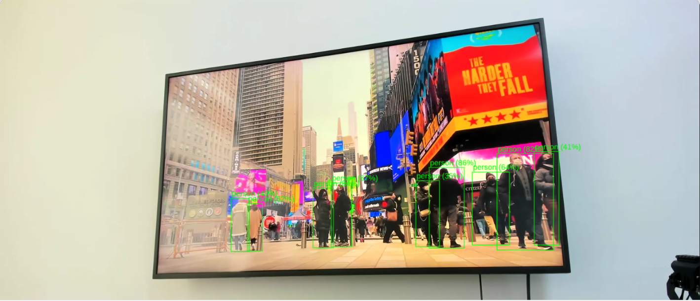

# USB Camera Object Detector

## Metadata

| Field | Value |
| --- | --- |
| Category | object-detection |
| Difficulty | Intermediate |
| Tags | object-detection, yolo26, usb-camera, uvc, v4l2, insight |
| Languages | C++, Python |
| Status | stable |
| Binary Name | usb-camera-object-detector |
| Model | yolo26m-det-bf16-mla_tess-b1 |

## Concept

Captures from a USB (UVC) webcam, runs YOLO26 detection on the MLA, and streams H.264 video plus detection metadata to Insight.

OpenCV captures compressed MJPEG bytes through V4L2 with RGB conversion
disabled. Each complete JPEG becomes a timestamped Neat encoded sample. Public
`Input`, `JpegParse`, and `SimaDecode` nodes decode it to NV12 on the hardware:

```text
USB camera -> compressed JPEG -> Input -> JpegParse -> SimaDecode(MJPEG)
                                                       |
                                                    NV12 branch
                                                    /         \
                                             video_sender     model
                                                  |             |
                                              Insight      detection metadata
```

Capture and input submission run on a worker while the main loop receives
detections and sends metadata. Both branches stay inside one Neat Run and share
the capture timestamps, allowing Insight to align overlays with video. The
`RealtimeLatestByStream` links drop stale frames independently when a branch
falls behind. Neat's configured input queue bounds pending work.

The capture helper verifies the negotiated resolution and frame rate and rejects
non-MJPEG output. It discards truncated JPEGs before they reach `JpegParse`, and
reports an error after eight consecutive incomplete frames. Shutdown closes the
Neat Run, joins the capture worker, and releases the camera.

The C++ and Python implementations read the same `src/common/config.yaml` and
build the same graph.

## Preview



## Prerequisites

- `sima-cli` ([documentation](https://developer.sima.ai/software/tools/sima-cli/)) on a supported Modalix or DevKit target.
- A UVC (USB Video Class) camera that offers MJPEG at the configured resolution, and an [Insight](https://developer.sima.ai/software/tools/insight/) URL reachable from the target.

## Install Apps

Install the latest Neat Apps runtime and enter the installed bundle:

```bash
sima-cli neat install apps
cd prebuilt-apps
APP_DIR=examples/object-detection/usb-camera-object-detector
```

Run the remaining commands from `prebuilt-apps/`.

## Prepare the Model

The default model is `yolo26m-det-bf16-mla_tess-b1`.

| Model | Role | Source |
| --- | --- | --- |
| `yolo26m-det-bf16-mla_tess-b1.tar.gz` | Default | Direct artifact |
| `yolo26n-det-bf16-mla_tess-b1.tar.gz` | Supported | Direct artifact |
| `yolo26s-det-bf16-mla_tess-b1.tar.gz` | Supported | Direct artifact |
| `yolo26l-det-bf16-mla_tess-b1.tar.gz` | Supported | Direct artifact |
| `yolo26x-det-bf16-mla_tess-b1.tar.gz` | Supported | Direct artifact |
| `yolo26m-det-bf16-b1.tar.gz` | Supported | Direct artifact |
| `yolo26m-det-int8-b1.tar.gz` | Supported | Direct artifact |
| `yolo_26n_mpk.tar.gz` | Supported YOLO26n | Model Zoo (`yolo_26n`) |

To download YOLO26n through Model Zoo, run these commands from `prebuilt-apps/`:

```bash
mkdir -p models
cd models
sima-cli modelzoo --version 2.1.3 --boardtype modalix get yolo_26n
cd ..
```

Set `model.path` to `models/yolo_26n_mpk.tar.gz`. The lookup name is
`yolo_26n`, including the underscore; `yolo_26n_cls` and `yolo_26n_seg`
are different tasks and are not supported by this detector.

For the default medium model or the alternate int8 package, use the direct
artifacts below. The Model Zoo version can differ from the installed platform version.

```bash
export MODELZOO_VERSION="2.1.3"
mkdir -p models
cd models
sima-cli download "https://docs.sima.ai/pkg_downloads/SDK${MODELZOO_VERSION}/models/modalix/yolo26-detection/yolo26m-det-bf16-mla_tess-b1.tar.gz"
sima-cli download "https://docs.sima.ai/pkg_downloads/SDK${MODELZOO_VERSION}/models/modalix/yolo26-detection/yolo26m-det-int8-b1.tar.gz"
cd ..
```

Set `model.path` in the config to the downloaded package.

For any other **Direct artifact** row in the table, replace `<model-file>` with
that row's exact filename and run from `prebuilt-apps/models/`:

```bash
sima-cli download "https://docs.sima.ai/pkg_downloads/SDK${MODELZOO_VERSION}/models/modalix/yolo26-detection/<model-file>"
```

All listed models share one code path: NV12 preprocessing, MLA inference, and
on-device YOLO26 box decode over the 80 COCO classes in
`src/common/coco_label.txt`.

**On `yolo26m-det-int8-b1.tar.gz`.** Its detections, classes, and box geometry match bf16,
but every confidence score is capped at 0.50, because its class-score heads
carry a zero-point at the top of the int8 range. If you select it, roughly halve
`inference.min_score` (0.30 becomes about 0.15); the default threshold would
otherwise discard most true detections.

## Prepare the Camera

The capture node number is assigned when the camera is plugged in. It differs
between cameras, USB ports, and reboots, and on a DevKit it sits among a hundred
or more platform video nodes that are not cameras. Always discover it; never
reuse a number from the docs or a previous session.

### 1. Find the camera by name

```bash
v4l2-ctl --list-devices
```

Match your camera's model name, not a node number. `ls /dev/video*` is no help
here, because the board's ISP nodes vastly outnumber the camera's:

```text
Logitech BRIO (usb-0003:01:00.0-2.1):
        /dev/video96
        /dev/video97
        /dev/video98
```

If the camera does not appear at all, confirm the kernel enumerated it with
`lsusb`.

### 2. Pick the Video Capture node

A UVC camera claims several nodes and only some carry image data.
`--list-devices` does not say which is which, so ask each node it listed:

```bash
for node in 96 97 98; do
  echo "/dev/video${node}:"
  v4l2-ctl --device /dev/video${node} --info | grep -A4 "Device Caps"
done
```

Use a node that reports `Video Capture`. A node reporting `Metadata Capture`
carries UVC headers rather than image data and produces no frames:

```text
/dev/video96:   Video Capture, Streaming        <- use this one
/dev/video97:   Metadata Capture, Streaming     <- not this one
/dev/video98:   Video Capture, Streaming
```

### 3. Confirm the capture mode

`source.width`, `source.height`, and `source.fps` are pinned into the capture
caps rather than negotiated, so the camera must offer that exact mode:

```bash
v4l2-ctl --device /dev/video96 --list-formats-ext | grep -A8 MJPG
```

```text
Size: Discrete 1920x1080
        Interval: Discrete 0.033s (30.000 fps)
```

MJPEG is not optional at 1080p. Raw YUYV at that size does not fit in USB 2.0
bandwidth, and the camera will only offer it at about 5 fps.

### 4. Set the node in the config

Put the node you chose in `source.device`, replacing the placeholder:

```yaml
source:
  device: /dev/video96
```

`--validate-config-only` prints the device, encoded caps, and Neat decoder route
without opening the camera. Actual camera-mode negotiation is checked at startup.

## Configure

Open `${APP_DIR}/src/common/config.yaml`.

```yaml
model:
  path: <model-path>         # Example: models/<model-pack>.tar.gz
  labels: examples/object-detection/usb-camera-object-detector/src/common/coco_label.txt

source:
  device: <video-capture-node>   # from Prepare the Camera
  width: 1920
  height: 1080
  fps: 30
  flip: none
  override_fragment: ""

inference:
  frames: 0
  min_score: 0.30

output:
  insight:
    host: <insight-host-ip>
    video_port: <videoUDP-start-port>
    metadata_port: <metadataUDP-start-port>
```

`source.width`, `source.height`, and `source.fps` must be a mode the camera
actually offers; they are pinned into the capture caps rather than negotiated.

Set `source.flip` to `rotate-180` for an inverted camera mount. COCO models lose
confidence on upside-down scenes, and the flip is applied to decoded NV12 before both video output and inference.
The optional flip uses a small `videoflip` custom node; capture and MJPEG decode
use OpenCV and public Neat APIs respectively.

`output.insight.video_port` and `output.insight.metadata_port` are the actual
destination UDP ports for channel 0. Match them to the Insight receiver's video
and metadata ports respectively; each must be between 1 and 65535. Both language
implementations exit with an error if metadata sending fails locally. A successful
UDP send does not acknowledge receipt by Insight.

`source.override_fragment` is the diagnostic escape hatch: it bypasses USB
capture and MJPEG decoding with a GStreamer fragment that
ends producing NV12 at `source.width` x `source.height`. It is a diagnostic
hook: it lets you exercise the whole graph with no camera attached, or validate
the model against an image with a known answer.

```yaml
source:
  override_fragment: "videotestsrc pattern=smpte is-live=true ! video/x-raw,format=NV12,width=1920,height=1080,framerate=30/1 ! queue leaky=downstream max-size-buffers=2"
```

## Run

### C++

```bash
./${APP_DIR}/src/cpp/pre-built/usb-camera-object-detector \
  --config ${APP_DIR}/src/common/config.yaml
```

### Python

```bash
source ~/pyneat/bin/activate
pip install -r ${APP_DIR}/src/python/requirements.txt
python3 ${APP_DIR}/src/python/main.py \
  --config ${APP_DIR}/src/common/config.yaml
```

Both accept `--validate-config-only`, which checks the configuration, prints the
resolved capture/decode route, and exits without opening the camera or loading the
model:

```bash
./${APP_DIR}/src/cpp/pre-built/usb-camera-object-detector \
  --config ${APP_DIR}/src/common/config.yaml \
  --validate-config-only
```

## Expected Result

Startup prints the resolved source and the Insight endpoints:

```text
source=/dev/video96 stream=1920x1080@30 model=models/<model-pack>.tar.gz
  insight=<insight-host-ip> video=9000 metadata=9100 channel=0
```

Video appears on the Insight video port and detection metadata on the metadata
port. Set `runtime.profile: true` for windowed timing lines and the generated
backend pipeline. On exit the run prints its processed frame and detection
totals.

Model unpacking takes a noticeable time on the first run; nothing streams until
it completes.

## Troubleshooting

- On `USB camera did not negotiate` errors, select a resolution/frame-rate combination listed by the camera.
- On repeated incomplete JPEG errors, check the USB connection and select a lower-bandwidth capture mode.
- Run either implementation with `--validate-config-only` to check the configuration and inspect the resolved capture/decode route without opening the camera.
- If the camera fails to open, confirm `source.device` is the *Video Capture* node from `v4l2-ctl --list-devices`, not the Metadata Capture node.
- If capture negotiation fails, confirm the camera offers MJPEG at the configured resolution and rate with `v4l2-ctl --device <node> --list-formats-ext`.
- If the frame rate is below `source.fps`, inspect the camera exposure settings and runtime profiling. Negotiating a mode does not guarantee the camera or complete pipeline sustains that rate.
- If detections are weak on an inverted mount, set `source.flip: rotate-180`.
- If video and detections are absent, verify the Insight host and UDP ports.
- To separate a camera problem from a model problem, set `source.override_fragment` to a still image or `videotestsrc` and rerun.

## Source Files

- C++ reference source: `src/cpp/main.cpp`
- Python source: `src/python/main.py`
- Shared config: `src/common/config.yaml`
- Class labels: `src/common/coco_label.txt`

The packaged C++ source is an implementation reference. Run the executable under `src/cpp/pre-built/`; the installed bundle does not include CMake files.

## Development From Source

To modify, compile, or test this example, use the [Apps contributor workflow](https://github.com/sima-neat/apps/blob/main/CONTRIBUTING.md).
