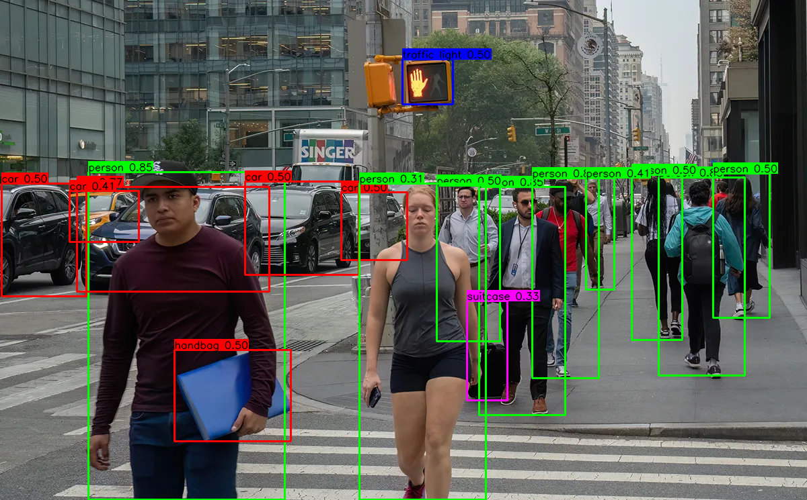

# Simple yolo26m Object Detection Overlay Pipeline

## Metadata
| Field | Value |
| --- | --- |
| Category | object-detection |
| Difficulty | Beginner |
| Tags | object-detection, yolo26m, folder-inference |
| Languages | C++, Python |
| Status | experimental |
| Binary Name | yolo26-object-detection-overlay |
| Model | yolo26m_mod [https://docs.sima.ai/pkg_downloads/SDK2.0.0/models/modalix/yolo26m_mod_mpk.tar.gz] |

## Concept
Minimal image-folder object detection pipeline using yolo26m, the newest iteration of the YOLO model family. Each image is inferred, annotated with bounding boxes and labels, and written to an output folder. The pipeline demonstrates the NEAT API for model loading, inference, and result decoding.

Compared to the older YOLOv8 variant, yolo26m outputs decoded box coordinates `(cx, cy, w, h)` directly (4-channel regression head) and post-sigmoid class scores. This simpler head is decoded via the NEAT hardware box decoder node (`SimaBoxDecode`) in the C++ graph; the Python implementation uses a vectorized NumPy decode path for clarity.

## Preview
Snippet from a pipeline run:



## Supported Models
Validated with: `yolo26m_mod`

Download into `assets/models/`:
- `mkdir -p assets/models && cd assets/models && sima-cli download https://docs.sima.ai/pkg_downloads/SDK2.0.0/models/modalix/yolo26m_mod_mpk.tar.gz && cd ../..`

## Prerequisites
- Installed Neat SDK.
- Model artifacts are user-managed and should be downloaded into `assets/models/`.
- yolo26m is not yet published in the SiMa modelzoo. Use the direct download URL below until a modelzoo entry is available.
- Direct URL download:
  `mkdir -p assets/models && cd assets/models && sima-cli download https://docs.sima.ai/pkg_downloads/SDK2.0.0/models/modalix/yolo26m_mod_mpk.tar.gz && cd ../..`
- Labels file: `examples/object-detection/yolo26-object-detection-overlay/common/coco_label.txt`

## Important Behavior
- C++ and Python read runtime values from `common/config.yaml`.
- Labels file is configured under `model.labels`.
- Output images are written as `.png` files.
- Use `runtime.profile` to print per-image and aggregate timing plus FPS.
- Use `runtime.num_runs` to repeat the image set for benchmarking.
- Use `output.overlay: false` to skip drawing bounding boxes and writing output images.

## Command-Line Options
### C++
- Invocation:
  `./build/examples/object-detection/yolo26-object-detection-overlay/yolo26-object-detection-overlay [--config <path>]`
- Optional arguments:
  `--config <path>`: YAML config path. Defaults to `common/config.yaml`.

### Python
- Invocation:
  `python examples/object-detection/yolo26-object-detection-overlay/python/main.py [--config <path>]`
- Optional arguments:
  `--config <path>`: YAML config path. Defaults to `common/config.yaml`.

## Build
### Build From The Apps Repo
```bash
cd <apps-repo-root>
./build.sh
```

Binary output:
```bash
./build/examples/object-detection/yolo26-object-detection-overlay/yolo26-object-detection-overlay
```

### Build This Example Directly With CMake
```bash
cd <apps-repo-root>/examples/object-detection/yolo26-object-detection-overlay
cmake -S cpp -B build
cmake --build build -j
```

Binary output:
```bash
./build/yolo26-object-detection-overlay
```

## Run
### C++
```bash
./build/examples/object-detection/yolo26-object-detection-overlay/yolo26-object-detection-overlay
```

### Python
```bash
source ~/pyneat/bin/activate
pip install -r examples/object-detection/yolo26-object-detection-overlay/python/requirements.txt
python examples/object-detection/yolo26-object-detection-overlay/python/main.py
```

## Testing
Run from the apps repository root:

```bash
cd <apps-repo-root>
```

### C++
Unit test:
```bash
./build/examples/object-detection/yolo26-object-detection-overlay/yolo26-object-detection-overlay_unit_test \
  ./build/examples/object-detection/yolo26-object-detection-overlay/yolo26-object-detection-overlay
```

E2E test:
```bash
SIMANEAT_APPS_TEST_MODELS_DIR="$PWD/assets/models" \
SIMANEAT_APPS_TEST_INPUT_DIR="$PWD/assets/test_images" \
SIMANEAT_APPS_TEST_TIMEOUT_MS=60000 \
./build/examples/object-detection/yolo26-object-detection-overlay/yolo26-object-detection-overlay_e2e_test \
  ./build/examples/object-detection/yolo26-object-detection-overlay/yolo26-object-detection-overlay
```

### Python
Unit test:
```bash
source ~/pyneat/bin/activate
pip install -r examples/object-detection/yolo26-object-detection-overlay/python/requirements.txt
pytest examples/object-detection/yolo26-object-detection-overlay/python/tests/test_unit.py -v
```

E2E test:
```bash
source ~/pyneat/bin/activate
pip install -r examples/object-detection/yolo26-object-detection-overlay/python/requirements.txt
SIMANEAT_APPS_TEST_MODELS_DIR="$PWD/assets/models" \
SIMANEAT_APPS_TEST_INPUT_DIR="$PWD/assets/test_images" \
SIMANEAT_APPS_TEST_TIMEOUT_MS=60000 \
SIMANEAT_APPS_TEST_REQUIRE_E2E=1 \
pytest examples/object-detection/yolo26-object-detection-overlay/python/tests/test_e2e.py -v
```

## Debugging Notes
- If detections are missing, validate label file ordering and score thresholds.
- If model load fails, verify `assets/models/yolo26m_mod_mpk.tar.gz` exists.
- Ensure input folder contains supported image extensions (`.jpg`, `.jpeg`, `.png`, `.bmp`).
- Use `--profile` to identify bottlenecks in the pipeline.
- Use `decode.score_threshold` and `decode.nms_iou` to tune detection sensitivity.

## Source Files
- C++ source: `cpp/main.cpp`
- C++ tests: `cpp/tests/unit_test.cpp`, `cpp/tests/e2e_test.cpp`
- Python source: `python/main.py`
- Python tests: `python/tests/test_unit.py`, `python/tests/test_e2e.py`
- Shared assets: `common/coco_label.txt`
