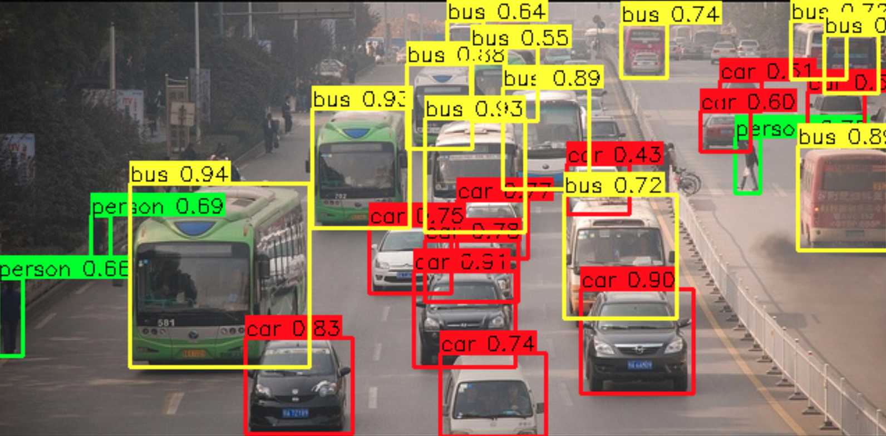

# YOLO26 Object Detector

## Metadata

| Field | Value |
| --- | --- |
| Category | object-detection |
| Difficulty | Beginner |
| Tags | object-detection, yolo26, folder-inference |
| Languages | C++, Python |
| Status | stable |
| Binary Name | yolo26-object-detector |
| Model | yolo26m-det-bf16-mla_tess-b1 |

## Concept

Detects objects in a folder of images with YOLO26 and saves copies annotated with boxes, labels, and confidence scores.

## Preview



## Prerequisites

- `sima-cli` ([documentation](https://developer.sima.ai/software/tools/sima-cli/)) on a supported Modalix or DevKit target.

## Install Apps

Install the latest Neat Apps runtime and enter the installed bundle:

```bash
sima-cli neat install apps
cd prebuilt-apps
APP_DIR=examples/object-detection/yolo26-object-detector
```

Run the remaining commands from `prebuilt-apps/`.

## Prepare the Model

| Model file | Role |
| --- | --- |
| `yolo26m-det-bf16-mla_tess-b1.tar.gz` | Default |
| `yolo26n-det-bf16-mla_tess-b1.tar.gz` | Supported |
| `yolo26s-det-bf16-mla_tess-b1.tar.gz` | Supported |
| `yolo26l-det-bf16-mla_tess-b1.tar.gz` | Supported |
| `yolo26x-det-bf16-mla_tess-b1.tar.gz` | Supported |
| `yolo26m-det-bf16-b1.tar.gz` | Supported |
| `yolo26m-det-int8-b1.tar.gz` | Supported |

Model packages come from the Model Zoo release below, which can differ from the installed platform version. Replace `<model-file>` with a file from the table.

```bash
export MODELZOO_VERSION="2.1.2"
mkdir -p models
cd models
sima-cli download "https://docs.sima.ai/pkg_downloads/SDK${MODELZOO_VERSION}/models/modalix/yolo26-detection/<model-file>"
cd ..
```

Set `model.path` in the config to the downloaded package.

## Configure

Open `${APP_DIR}/src/common/config.yaml` and set `model.path`, `io.input_dir`, and `io.output_dir`. Change the score threshold only if you want to show more or fewer detections.

## Run

### C++

```bash
./${APP_DIR}/src/cpp/pre-built/yolo26-object-detector \
  --config ${APP_DIR}/src/common/config.yaml
```

### Python

```bash
source ~/pyneat/bin/activate
pip install -r ${APP_DIR}/src/python/requirements.txt
python3 ${APP_DIR}/src/python/main.py \
  --config ${APP_DIR}/src/common/config.yaml
```

## Troubleshooting

- Verify `model.path` and the labels file if detections are missing.
- Confirm the input folder contains `.jpg`, `.jpeg`, `.png`, or `.bmp` files.
- Adjust `decode.score_threshold` and `decode.nms_iou` when tuning detections.
- Use `--profile` to inspect pipeline timing.

## Source Files

- C++ reference source: `src/cpp/main.cpp`
- Python source: `src/python/main.py`
- Shared config and labels: `src/common/`

The packaged C++ source is an implementation reference. Run the executable under `src/cpp/pre-built/`; the installed bundle does not include CMake files.

## Development From Source

To modify, compile, or test this example, use the [Apps contributor workflow](https://github.com/sima-neat/apps/blob/main/CONTRIBUTING.md).
