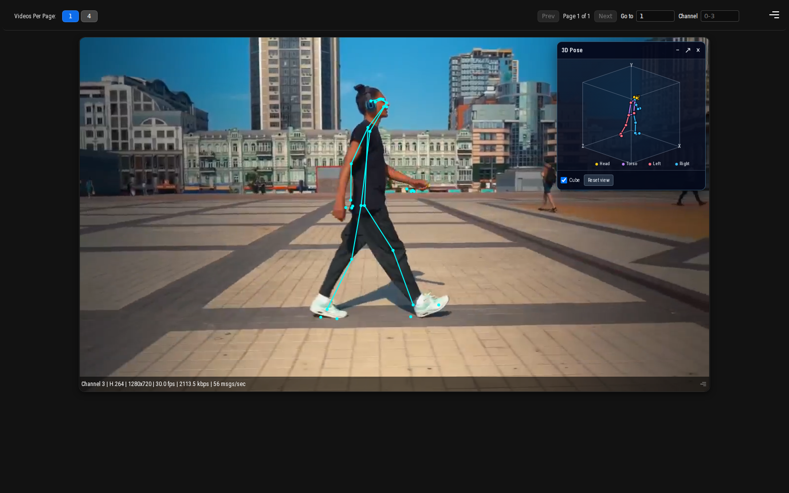

# Multi-Stream BlazePose 3D

## Metadata

| Field | Value |
| --- | --- |
| Category | pose-estimation |
| Difficulty | Advanced |
| Tags | blazepose, yolo26, keypoints, rtsp, multistream, insight |
| Languages | C++, Python |
| Status | stable |
| Binary Name | multi-stream-blazepose3d |
| Model | YOLO26 detection and BlazePose Heavy 3D |

## Concept

Detects people across RTSP streams with shared YOLO26 and BlazePose models, then publishes frame-correlated 2D landmarks and 3D world landmarks to separate Insight channels.

C++ and Python use the same configuration, graph topology, scheduling policy, ROI transform, and metadata schemas.

One source graph owns every RTSP input, encoded-video branch, decoder, admission edge, RGB conversion, and output. Frames stay NV12 through decode and freshness admission, then each admitted frame is converted once to packed RGB. Application-owned asynchronous queues feed one shared YOLO26 runner and one shared BlazePose runner through public push/pull APIs.

```text
Per stream: RTSP encoded ─┬─> codec passthrough ─> Insight video
                         └─> decode NV12 ─> RealtimeLatestByStream ─> RGB output

Application: latest RGB mailbox per stream ─> shared YOLO26 Model graph
             (Preproc ─> inference ─> BoxDecode) ─> person ROI mailbox per stream
             ─> BlazePose Preproc ROIs ─> owned EV74 ROI inputs
             ─> shared BlazePose runner
             ─> 33 image + world keypoints ─> paired correlated Insight metadata
```

The source graph and both model runners are fixed after startup. Add, remove, or edit cameras in the configuration and restart the application; there is no fixed camera-count limit in the application. Separate per-stream outputs let the source graph accept different resolutions without rebuilding a shared model graph.

## Preview



## Prerequisites

- `sima-cli` ([documentation](https://developer.sima.ai/software/tools/sima-cli/)) on a supported Modalix or DevKit target.
- H.264 or H.265 RTSP sources and an [Insight](https://developer.sima.ai/software/tools/insight/) host reachable from the target.
- A supported YOLO26 detection package and the existing BlazePose Heavy 3D package.

## Install Apps

Install the latest Neat Apps runtime and enter the installed bundle:

```bash
sima-cli neat install apps
cd prebuilt-apps
export APP_DIR=examples/pose-estimation/multi-stream-blazepose3d
```

Run the remaining commands from `prebuilt-apps/`.

## Prepare the Model

The detector supports the same Model Zoo packages as the multi-stream detector and tracker:

| Model file | Role |
| --- | --- |
| `yolo26m-det-int8-b1.tar.gz` | Default |
| `yolo26n-det-bf16-mla_tess-b1.tar.gz` | Supported |
| `yolo26s-det-bf16-mla_tess-b1.tar.gz` | Supported |
| `yolo26m-det-bf16-mla_tess-b1.tar.gz` | Supported |
| `yolo26l-det-bf16-mla_tess-b1.tar.gz` | Supported |
| `yolo26x-det-bf16-mla_tess-b1.tar.gz` | Supported |
| `yolo26m-det-bf16-b1.tar.gz` | Supported |

Replace `<model-file>` with one file from the table:

```bash
export MODELZOO_VERSION="2.1.2"
mkdir -p models
cd models
sima-cli download "https://docs.sima.ai/pkg_downloads/SDK${MODELZOO_VERSION}/models/modalix/yolo26-detection/<model-file>"
cd ..
```

Place the existing `blazepose_heavy_3d_bf16_nopad_neat_mpk.tar.gz` package in `models/`. Its versioned custom Model Zoo publication remains a release prerequisite.

## Model Contracts

The public YOLO26 route accepts dynamic HWC RGB images. Model preprocessing resizes and normalizes them for the internal 640×640 tensor; its six raw detection heads are decoded by `YoloV26` BoxDecode into one BBOX output consumed by the application.

The public BlazePose route also accepts dynamic HWC RGB images and preprocesses each selected ROI to 256×256. The existing artifact returns screen landmarks `[1,195]` (39 records of x, y, z, visibility logit, and presence logit), global pose presence `[1,1]`, and world landmarks `[1,117]` (39 x/y/z records). This application publishes the first 33 screen records as the normal `pose-estimation` overlay and the first 33 world records as a generic `auxiliary-visualization` view.

## Prepare Insight

Insight can host the input streams and render each output channel. Install videos from the Insight catalog or through Insight's YouTube support, start the streams in the Insight Web UI, and copy their RTSP URLs into `streams`.

The application sends the original encoded stream plus two correlated metadata messages on the configured channel. Insight draws `pose-estimation` over the video and renders `auxiliary-visualization` world landmarks in the separate 3D Pose panel. Both messages carry the same source PTS timestamp and frame ID. This requires an Insight build with multi-type frame metadata and the `blazepose-3d` auxiliary renderer.

## Configure

Edit `${APP_DIR}/src/common/config.yaml`:

```yaml
models:
  detector_path: models/yolo26m-det-int8-b1.tar.gz
  pose_path: models/blazepose_heavy_3d_bf16_nopad_neat_mpk.tar.gz

streams:
  - id: entrance
    url: rtsp://camera.example/entrance
    codec: h264
    insight_channel: 0
  - id: warehouse
    url: rtsp://camera.example/warehouse
    codec: h265
    insight_channel: 1

output:
  insight:
    host: <insight-host-ip>
```

Each stream needs a unique stable `id` and `insight_channel`. Sources may have different resolutions. `pose.max_people_per_frame` bounds how many highest-confidence person boxes are sent to BlazePose per admitted frame.

`pose.temporal_filter_enabled` defaults to `true`. The per-stream filter matches poses by person-box overlap, damps small coordinate and confidence fluctuations, and adapts toward the current frame during deliberate fast motion. It filters image and world landmarks together before either metadata message is built, so the 2D overlay and 3D view remain frame-correlated and cannot drift apart. Disable it only when raw model output is required for measurement.

## Run

Validate the configuration without opening streams:

```bash
"${APP_DIR}/src/cpp/pre-built/multi-stream-blazepose3d" \
  --config "${APP_DIR}/src/common/config.yaml" \
  --validate-config-only
```

### C++

```bash
"${APP_DIR}/src/cpp/pre-built/multi-stream-blazepose3d" \
  --config "${APP_DIR}/src/common/config.yaml"
```

### Python

```bash
source ~/pyneat/bin/activate
pip install -r "${APP_DIR}/src/python/requirements.txt"
python3 "${APP_DIR}/src/python/main.py" \
  --config "${APP_DIR}/src/common/config.yaml"
```

## Output Metadata

Every accepted frame produces a correlated pair of messages, including empty pose arrays when no person is selected. The existing `pose-estimation` message remains the 2D overlay contract; each pose carries its YOLO person box and 33 named image-space keypoints:

```json
{"poses":[{"id":"pose_1","label":"person","confidence":0.91,
  "bbox":[120,80,240,520],
  "keypoints":[{"name":"nose","x":242,"y":135,"confidence":0.98}]}]}
```

The separate `auxiliary-visualization` message uses the generic Insight schema
and selects the built-in BlazePose renderer:

```json
{"schema_version":1,"id":"world-pose","renderer":"blazepose-3d","title":"3D Pose",
  "payload":{"poses":[{"id":"pose_1","keypoints":[
    {"name":"nose","x":0.01,"y":-0.42,"z":-0.08,"confidence":0.98}
  ]}]}}
```

`MetadataSender` supplies the outer `type`, `timestamp`, and `frame_id` fields.
The two message types are sent while holding the same per-stream metadata lock,
so one channel cannot interleave identities from different frames.

The envelope builder accepts any renderer name and JSON object; it does not know
about BlazePose fields. This example's world-pose helper supplies the
`blazepose-3d` payload, while point clouds, meshes, trajectories, or other 3D
data can reuse the same envelope with a separately registered Insight renderer.

The keypoint confidence is the minimum of BlazePose landmark visibility and presence after sigmoid activation. The global pose-presence output gates each ROI.

The application retains the source `stream_id`, frame ID, PTS, DTS, duration, and sequence numbers in its bounded FIFO context. Detached MLA/postprocess runners do not echo all of that identity, so output order is correlated against this retained context and the original PTS/frame ID is sent to Insight. The hardware E2E tests listen on every configured metadata port and require a non-empty 2D/3D pair with an identical `(port, timestamp, frame_id)` identity.

## Performance and Scheduling

- `RealtimeLatestByStream` bounds admitted decoder-backed frames before the packed-RGB conversion.
- Latest-only detector and pose mailboxes plus round-robin dispatch prevent stale work from accumulating and preserve fairness across streams.
- Each stream owns independent temporal-filter state. Small landmark and confidence fluctuations are damped without buffering frames, while large motion receives a higher current-frame weight to limit visual lag.
- YOLO26 and BlazePose each use one shared model route. Increasing stream count does not create additional model routes.
- Video uses H.264 or H.265 encoded passthrough. The application does not draw on frames or re-encode them.
- The current public `VideoConvert` node performs the one NV12-to-RGB conversion on A65 after admission. The RGB frame remains holder-backed in application code; Python passes the `Tensor` directly and C++ maps a non-owning `cv::Mat` view.
- YOLO26 preprocessing stays inside the shared `Model::graph()` route; the application pushes each correlated RGB frame directly into that runner.
- The public `stages::Preproc(..., rois)` API receives the fixed-size source RGB frame and all selected BlazePose ROIs in one batched call. Keeping the input dimensions stable lets Neat reuse one preprocessing runner instead of caching a new graph for every changing person-box crop; returned affine metadata still maps landmarks directly into source-frame coordinates. Full RGB frames are not cloned.

The shutdown summary reports source and detector frames, selected and completed ROIs, both mailbox drop counts, timed-out jobs, metadata FPS, and pose FPS. These are application counters, not node profiling or graph visualization.

## Troubleshooting

- Replace all placeholders before running and verify both model paths.
- Set either detector inflight limit to `-1` to use the Core default.
- Increase `pose.job_timeout_ms` only if valid jobs expire under sustained load.
- Reduce `pose.max_people_per_frame` when pose throughput, rather than detection, is the bottleneck.
- H.265 input and video passthrough require an Insight/browser environment that can decode HEVC.

## Source Files

- C++ reference source: `src/cpp/main.cpp`
- Python source: `src/python/main.py`
- Shared configuration: `src/common/config.yaml`

The packaged C++ source is an implementation reference. Run the executable under `src/cpp/pre-built/`; the installed bundle does not include CMake files.

## Development From Source

To modify, compile, or test this example, use the [Apps contributor workflow](https://github.com/sima-neat/apps/blob/main/CONTRIBUTING.md).
