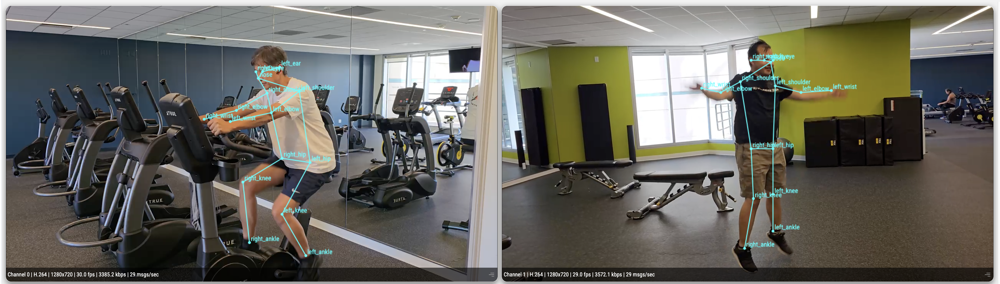

# Multi-Stream Pose Estimator

## Metadata

| Field | Value |
| --- | --- |
| Category | pose-estimation |
| Difficulty | Advanced |
| Tags | pose-estimation, keypoints, rtsp, multistream, insight, yolo26 |
| Languages | C++, Python |
| Status | experimental |
| Binary Name | multi-stream-pose-estimator |
| Model | yolo26m-pose-int8-b1 |

## Concept

Estimates 17-point COCO poses in multiple RTSP streams with YOLO26 Pose and sends synchronized video and pose metadata to Insight.

Every stream feeds one shared pose model. Each decoded branch is admitted through a real-time, keep-latest link, so an overloaded stream drops frames instead of building a backlog.

## Preview



## Prerequisites

- `sima-cli` ([documentation](https://developer.sima.ai/software/tools/sima-cli/)) on a supported Modalix or DevKit target.
- H.264 or H.265 RTSP sources matching `input.codec`, and an [Insight](https://developer.sima.ai/software/tools/insight/) URL reachable from the target.
- For H.265, the computer running the Insight viewer must support hardware HEVC decoding; Chromium does not provide a software decoder fallback for WebRTC H.265.

## Install Apps

Install the latest Neat Apps runtime and enter the installed bundle:

```bash
sima-cli neat install apps
cd prebuilt-apps
APP_DIR=examples/pose-estimation/multi-stream-pose-estimator
```

Run the remaining commands from `prebuilt-apps/`.

## Prepare the Model

| Model file | Role |
| --- | --- |
| `yolo26m-pose-int8-b1.tar.gz` | Default |
| `yolo26n-pose-bf16-mla_tess-b1.tar.gz` | Supported |
| `yolo26s-pose-bf16-mla_tess-b1.tar.gz` | Supported |
| `yolo26m-pose-bf16-mla_tess-b1.tar.gz` | Supported |
| `yolo26l-pose-bf16-mla_tess-b1.tar.gz` | Supported |
| `yolo26x-pose-bf16-mla_tess-b1.tar.gz` | Supported |
| `yolo26m-pose-bf16-b1.tar.gz` | Supported |

Model packages come from the Model Zoo release below, which can differ from the installed platform version. Replace `<model-file>` with a file from the table.

```bash
export MODELZOO_VERSION="2.1.2"
mkdir -p models
cd models
sima-cli download "https://docs.sima.ai/pkg_downloads/SDK${MODELZOO_VERSION}/models/modalix/yolo26-pose/<model-file>"
cd ..
```

Set `model.path` in the config to the downloaded package.

These pose packages are published as direct download artifacts and are not indexed in the Model Zoo catalog, so they cannot be resolved by name. Use the download command above.

## Prepare Insight

[Insight](https://developer.sima.ai/software/tools/insight/) can host the input streams and render each output channel. Install videos directly from the Insight catalog or through Insight's YouTube support.

In the Insight Web UI, start the required streams and copy their RTSP URLs into `streams`. Use the host and UDP port ranges reported by `neat` for the output settings.

Insight renders the skeleton from the published `pose-estimation` metadata and hides any joint at or below `0.3` confidence. Published metadata always carries all 17 keypoints; `output.min_keypoint_visibility` only controls saved debug overlays.

## Configure

Open `${APP_DIR}/src/common/config.yaml`. Set `model.path`, add each RTSP URL under `streams`, and set the Insight host and starting video and metadata ports. Set `input.codec` to match the streams.

The checked-in inference and keypoint thresholds are ready for a first run. Lower them only if poses or joints you expect are missing.

## Run

Validate the config without opening streams:

```bash
./${APP_DIR}/src/cpp/pre-built/multi-stream-pose-estimator \
  --config ${APP_DIR}/src/common/config.yaml \
  --validate-config-only
```

### C++

```bash
./${APP_DIR}/src/cpp/pre-built/multi-stream-pose-estimator \
  --config ${APP_DIR}/src/common/config.yaml
```

### Python

```bash
source ~/pyneat/bin/activate
pip install -r ${APP_DIR}/src/python/requirements.txt
python3 ${APP_DIR}/src/python/main.py \
  --config ${APP_DIR}/src/common/config.yaml
```

## Output Metadata

Each stream publishes `pose-estimation` metadata. Every pose carries the person box, the person score, and 17 named COCO keypoints:

```json
{
  "poses": [
    {
      "id": "pose_1",
      "label": "person",
      "confidence": 0.77,
      "bbox": [163, 403, 130, 315],
      "keypoints": [
        {
          "name": "nose",
          "x": 238,
          "y": 421,
          "confidence": 0.99
        }
      ]
    }
  ]
}
```

Keypoint coordinates are in source-frame pixels, matching the box.

## Troubleshooting

- Replace all placeholder stream URLs and the Insight host before running.
- The application supports up to four active streams.
- Set either inflight limit to `-1` to use the Core default.
- Verify host and UDP port ranges if Insight receives no output.
- If skeletons look sparse, lower `output.min_keypoint_visibility`; occluded joints are reported with low visibility by design.
- Use `output.debug_dir`, `output.save_every`, and profiling output for diagnosis.

## Source Files

- C++ reference source: `src/cpp/main.cpp`
- Python source: `src/python/main.py`
- Shared runtime files: `src/common/`

The packaged C++ source is an implementation reference. Run the executable under `src/cpp/pre-built/`; the installed bundle does not include CMake files.

## Development From Source

To modify, compile, or test this example, use the [Apps contributor workflow](https://github.com/sima-neat/apps/blob/main/CONTRIBUTING.md).
