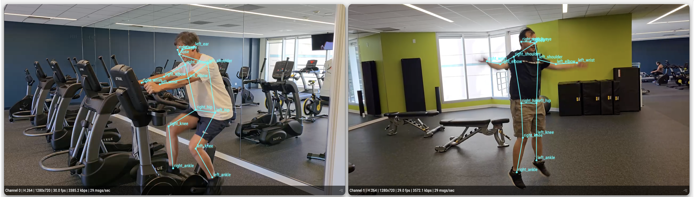

# Multi-Stream Pose Estimator

## Metadata

| Field | Value |
| --- | --- |
| Category | pose-estimation |
| Difficulty | Advanced |
| Tags | pose-estimation, keypoints, rtsp, multistream, insight, yolo26 |
| Languages | C++, Python |
| Status | stable |
| Binary Name | multi-stream-pose-estimator |
| Model | yolo26m_pose (w8a8) |

## Concept

Estimates 17-point COCO poses in multiple RTSP streams with YOLO26 Pose and sends synchronized video and pose metadata to Insight.

Every stream feeds one shared pose model. Each decoded branch is admitted through a real-time, keep-latest link, so an overloaded stream drops frames instead of building a backlog.

## Preview



## Prerequisites

- `sima-cli` ([documentation](https://developer.sima.ai/software/tools/sima-cli/)) on the Modalix DevKit, or in a Neat SDK container paired with it.
- H.264 or H.265 RTSP sources matching `input.codec`, and an [Insight](https://developer.sima.ai/software/tools/insight/) URL reachable from the target.
- For H.265, the computer running the Insight viewer must support hardware HEVC decoding; Chromium does not provide a software decoder fallback for WebRTC H.265.

## Install Apps

Install on the Modalix DevKit, or under `/workspace` in a Neat SDK container paired with it. Only the example itself must run on the DevKit. `sima-cli neat install apps` also offers to install the compatible Neat Library and Insight, and skips them when they are up to date. To keep the Neat Library and Insight you have without being asked, run the install as `NEAT_APPS_SKIP_DEPENDENCIES=1 sima-cli neat install apps`. See [Install Apps](https://github.com/sima-neat/apps/blob/main/README.md#install-apps).

Install the latest Neat Apps runtime and enter the installed bundle:

```bash
sima-cli neat install apps
cd prebuilt-apps
APP_DIR=examples/pose-estimation/multi-stream-pose-estimator
```

Run the remaining commands from `prebuilt-apps/`.

## Prepare the Model

The [model browser](https://developer.sima.ai/models/) has the YOLO26 pose models in five sizes, from n (nano) to x (extra large). The default is `yolo26m_pose` with the `w8a8` variant. Download it and unpack it with `sima-cli` 2.1.20 or newer:

```bash
sima-cli models download --id yolo26m_pose --variant w8a8
unzip -o models/yolo26m_pose/w8a8/yolo26m_pose_w8a8_default.zip -d models/yolo26m_pose/w8a8
```

The download is a ZIP file with the model package and its license. `unzip` puts the model package, `models/yolo26m_pose/w8a8/yolo26m_pose_w8a8_mpk.tar.gz`, next to the ZIP file. Set `model.path` in the config to that `.tar.gz` file, not to the ZIP file.

| ID | Variants | Role |
| --- | --- | --- |
| `yolo26m_pose` | `w8a8`, `w8a16`, `w16a16` | Default (`w8a8`) |
| `yolo26n_pose` | `w8a16`, `w16a16` | Supported |
| `yolo26s_pose` | `w8a8`, `w8a16`, `w16a16` | Supported |
| `yolo26l_pose` | `w8a8`, `w8a16`, `w16a16` | Supported |
| `yolo26x_pose` | `w8a8`, `w8a16`, `w16a16` | Supported |

To use another model, replace `yolo26m_pose` and `w8a8` in both commands and in `model.path`. The variant is the number format the model was compiled with: `w8a8` stores weights and activations as 8-bit integers, `w8a16` keeps 8-bit integer weights and stores activations in BF16, a 16-bit float format, and `w16a16` uses BF16 for both. The model browser lists the measured accuracy and speed of each size and variant.

## Prepare Insight

[Insight](https://developer.sima.ai/software/tools/insight/) can host the input streams and render each output channel. Install videos directly from the Insight catalog or through Insight's YouTube support.

In the Insight Web UI, start the required streams and copy their RTSP URLs into `streams`. Use the host and UDP port ranges reported by `neat` for the output settings. Use a host and published port that the target can reach, not `localhost` and not an address only Insight's own machine can resolve. Verify the URL from the target before running; the application prints the resolved source and its dimensions on startup.

Insight renders the skeleton from the published `pose-estimation` metadata and hides any joint at or below `0.3` confidence. Published metadata always carries all 17 keypoints; `output.min_keypoint_visibility` only controls saved debug overlays.

## Configure

Open `${APP_DIR}/src/common/config.yaml`. Set `model.path`, add each RTSP URL under `streams`, and set the Insight host and starting video and metadata ports. Set `input.codec` to match the streams.

The checked-in inference and keypoint thresholds are ready for a first run. Lower them only if poses or joints you expect are missing.

## Run

Validate the config without opening streams:

```bash
./${APP_DIR}/src/cpp/pre-built/multi-stream-pose-estimator \
  --config ${APP_DIR}/src/common/config.yaml \
  --validate-config-only
```

### C++

```bash
./${APP_DIR}/src/cpp/pre-built/multi-stream-pose-estimator \
  --config ${APP_DIR}/src/common/config.yaml
```

### Python

```bash
source ~/pyneat/bin/activate
pip install -r ${APP_DIR}/src/python/requirements.txt
python3 ${APP_DIR}/src/python/main.py \
  --config ${APP_DIR}/src/common/config.yaml
```

## Output Metadata

Each stream publishes `pose-estimation` metadata. Every pose carries the person box, the person score, and 17 named COCO keypoints:

```json
{
  "poses": [
    {
      "label": "person",
      "confidence": 0.77,
      "bbox": [163, 403, 130, 315],
      "keypoints": [
        {
          "name": "nose",
          "x": 238,
          "y": 421,
          "confidence": 0.99
        }
      ]
    }
  ]
}
```

Keypoint coordinates are in source-frame pixels, matching the box.

## Expected Result

Each stream reports its own progress while the run is in flight, once
`runtime.warmup_frames` has passed:

```text
[profile stream=0] frames=100 output_fps=27.2924 avg_detection_pull_ms=1.94374 avg_metadata_send_ms=0.197574 avg_poses=0.01
```

Every configured stream should appear. The two implementations format these numbers differently: Python prints the full
float, the C++ binary prints at the default stream precision of six significant
digits. Compare the magnitudes rather than the digits.

`avg_poses` is the mean number of poses per processed frame. It is low on footage
where people are distant or sparse, so a small value is not itself a problem. A
stream that never reports frames at all is the signal worth investigating.

## Troubleshooting

- Replace all placeholder stream URLs and the Insight host before running.
- The application supports up to four active streams.
- Set either inflight limit to `-1` to use the Core default.
- Verify host and UDP port ranges if Insight receives no output.
- If skeletons look sparse, lower `output.min_keypoint_visibility`; occluded joints are reported with low visibility by design.
- Use `output.debug_dir`, `output.save_every`, and profiling output for diagnosis.

## Source Files

- C++ reference source: `src/cpp/main.cpp`
- Python source: `src/python/main.py`
- Shared runtime files: `src/common/`

The packaged C++ source is an implementation reference. Run the executable under `src/cpp/pre-built/`; the installed bundle does not include CMake files.

## Development From Source

To modify, compile, or test this example, use the [Apps contributor workflow](https://github.com/sima-neat/apps/blob/main/CONTRIBUTING.md).
