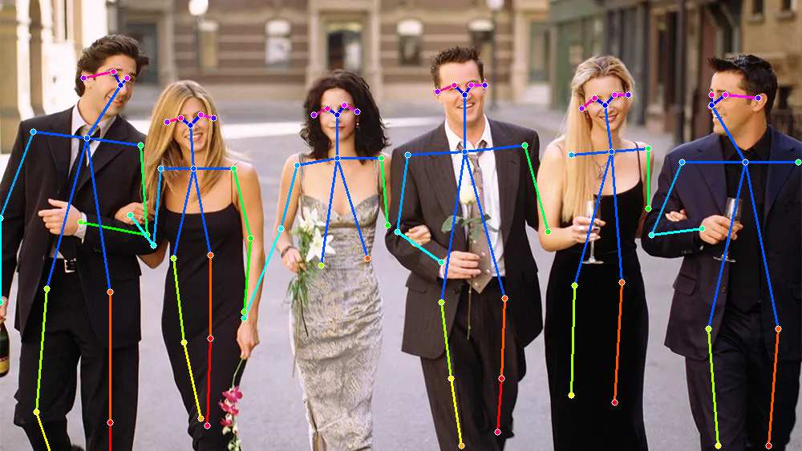

# Simple Pose Estimation Overlay Pipeline

## Metadata
| Field | Value |
| --- | --- |
| Category | pose-estimation |
| Difficulty | Intermediate |
| Tags | pose-estimation, openpose, skeleton-detection |
| Languages | C++, Python |
| Status | experimental |
| Binary Name | simple-pose-estimation-overlay-pipeline |
| Model | open_pose |

## Concept
Minimal image-folder pose estimation pipeline. Each image is inferred to extract human pose keypoints, annotated with skeleton overlays (joints and limbs), and written to an output folder. Uses heatmap and Part Affinity Field (PAF) outputs to group keypoints into full-body poses.

## Preview


## Supported Models
Download variants into `assets/models/`:
- `mkdir -p assets/models && cd assets/models && sima-cli modelzoo get open_pose && cd ../..`

## Prerequisites
- Model artifacts are user-managed and should be downloaded into `assets/models/`.
- Download command: `mkdir -p assets/models && cd assets/models && sima-cli modelzoo get open_pose && cd ../..`
- Shared runtime and decode parameters live in `common/config.yaml`.

## Important Behavior
- C++ and Python both load model, input/output paths, and pose decode settings from `common/config.yaml`.
- Both entrypoints accept `--config <path>` to load a different YAML configuration file.
- `--profile` remains a CLI-only flag for per-run timing output.
- Keypoint detection uses heatmaps with dynamic filtering based on confidence threshold (default: 0.1 in `decode.keypoint_score`).
- Pose grouping uses greedy bipartite matching on Part Affinity Field vectors with configurable thresholds in `decode.*`.
- Output images are written as `.png` files.

## Command-Line Options
### C++
- Invocation:
  `./build/examples/pose-estimation/simple-pose-estimation-overlay-pipeline/simple-pose-estimation-overlay-pipeline [--config <path>] [--profile]`
- Optional arguments:
  - `--config <path>` - Path to YAML configuration. Default: `examples/pose-estimation/simple-pose-estimation-overlay-pipeline/common/config.yaml`
  - `--profile` - Enable performance profiling (reports end-to-end and model-inference timing)

### Python
- Invocation:
  `python examples/pose-estimation/simple-pose-estimation-overlay-pipeline/python/main.py [--config <path>] [--profile]`
- Optional arguments:
  - `--config <path>` - Path to YAML configuration. Default: `examples/pose-estimation/simple-pose-estimation-overlay-pipeline/common/config.yaml`
  - `--profile` - Enable performance profiling (reports end-to-end and model-inference timing)

### Shared Config
`common/config.yaml` contains the shared defaults for:
- `model.path`
- `io.input_dir`
- `io.output_dir`
- `runtime.infer_size`
- `runtime.timeout_ms`
- `runtime.upsample_factor`
- `decode.keypoint_score`
- `decode.nms_radius`
- `decode.paf_score`
- `decode.paf_success_ratio`
- `decode.paf_samples`
- `decode.min_valid_joints`
- `decode.min_avg_person_score`

## Build
### Build From The Apps Repo
```bash
cd <apps-repo-root>
./build.sh
```

Binary output:
```bash
./build/examples/pose-estimation/simple-pose-estimation-overlay-pipeline/simple-pose-estimation-overlay-pipeline
```

### Build This Example Directly With CMake
```bash
cd <apps-repo-root>/examples/pose-estimation/simple-pose-estimation-overlay-pipeline
cmake -S cpp -B build
cmake --build build -j
```

Binary output:
```bash
./build/simple-pose-estimation-overlay-pipeline
```

## Run
### C++
```bash
source ~/pyneat/bin/activate
pip install -r examples/pose-estimation/simple-pose-estimation-overlay-pipeline/python/requirements.txt
./build/examples/pose-estimation/simple-pose-estimation-overlay-pipeline/simple-pose-estimation-overlay-pipeline \
  --config examples/pose-estimation/simple-pose-estimation-overlay-pipeline/common/config.yaml
```

### Python
```bash
source ~/pyneat/bin/activate
pip install -r examples/pose-estimation/simple-pose-estimation-overlay-pipeline/python/requirements.txt
python examples/pose-estimation/simple-pose-estimation-overlay-pipeline/python/main.py \
  --config examples/pose-estimation/simple-pose-estimation-overlay-pipeline/common/config.yaml
```

### Example with Profiling (Both C++ and Python)
C++:
```bash
./build/examples/pose-estimation/simple-pose-estimation-overlay-pipeline/simple-pose-estimation-overlay-pipeline \
  --config examples/pose-estimation/simple-pose-estimation-overlay-pipeline/common/config.yaml \
  --profile
```

Python:
```bash
python examples/pose-estimation/simple-pose-estimation-overlay-pipeline/python/main.py \
  --config examples/pose-estimation/simple-pose-estimation-overlay-pipeline/common/config.yaml \
  --profile
```

### Example with Custom Parameters
C++ and Python read these values from `common/config.yaml`. To customize a run, copy the shared config, change the fields you need, and pass the new file with `--config`.

Example custom config:
```yaml
model:
  path: assets/models/open_pose_mpk.tar.gz

io:
  input_dir: assets/test_images
  output_dir: output/pose_estimation

runtime:
  infer_size: 768
  timeout_ms: 1000
  upsample_factor: 2.0

decode:
  keypoint_score: 0.15
  nms_radius: 8
  paf_score: 0.04
  paf_success_ratio: 0.7
  paf_samples: 10
  min_valid_joints: 3
  min_avg_person_score: 0.2
```

C++:
```bash
./build/examples/pose-estimation/simple-pose-estimation-overlay-pipeline/simple-pose-estimation-overlay-pipeline \
  --config /tmp/pose_config.yaml \
  --profile
```

Python:
```bash
python examples/pose-estimation/simple-pose-estimation-overlay-pipeline/python/main.py \
  --config /tmp/pose_config.yaml \
  --profile
```

## Troubleshooting
- If model load fails, verify `assets/models/open_pose_mpk.tar.gz` exists.
- Ensure input folder contains supported image extensions (`.jpg`, `.jpeg`, `.png`, `.bmp`).
- Confirm both input and output directories are writable and paths are correct in `common/config.yaml`.
- If too few keypoints are detected, lower `decode.keypoint_score` (e.g., 0.05 instead of 0.1).
- If too many false keypoints appear, raise `decode.keypoint_score` (e.g., 0.15 instead of 0.1).
- If poses are incomplete or fragmented, adjust `decode.paf_score` and `decode.paf_success_ratio` to be more lenient.
- If inference timeout occurs, increase `runtime.timeout_ms`.
- Adjust `runtime.infer_size` if you need different precision levels (larger values use more memory but may improve accuracy).

## Profiling
Use the `--profile` flag to measure performance:
- Per-image output includes end-to-end time and model inference time
- Summary statistics at the end report average times
- Useful for comparing performance between C++ and Python implementations

## Source Files
- C++ source: `cpp/main.cpp`
- C++ config loader: `cpp/utils/config.cpp`, `cpp/utils/config.h`
- Python source: `python/main.py`
- Python config loader: `python/utils/config.py`
- Shared config: `common/config.yaml`
- C++ tests: `cpp/tests/unit_test.cpp`, `cpp/tests/e2e_test.cpp`
- Python tests: `python/tests/test_unit.py`, `python/tests/test_e2e.py`
