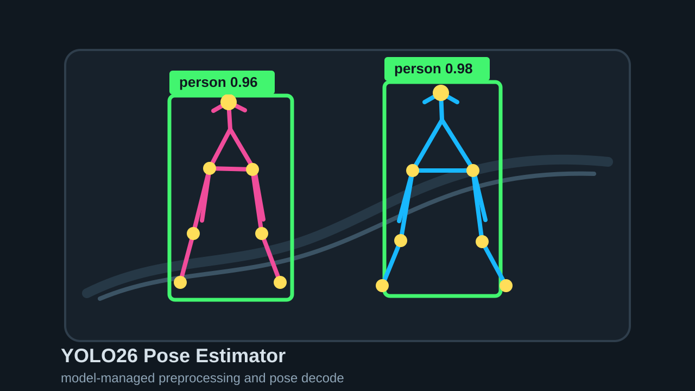

# YOLO26 Pose Estimator

## Metadata
| Field | Value |
| --- | --- |
| Category | pose-estimation |
| Difficulty | Intermediate |
| Tags | pose-estimation, yolo26, image-folder |
| Languages | C++, Python |
| Status | experimental |
| Binary Name | yolo26-pose-estimator |
| Model | yolo26m-pose-bf16-b1 [https://docs.sima.ai/pkg_downloads/SDK2.0.0/models/modalix/yolo26-pose/yolo26m-pose-bf16-b1.tar.gz] |

## Concept
`yolo26-pose-estimator` runs a YOLO26 pose model on every image in a folder and
writes annotated output images with person boxes, skeleton lines, and keypoints.
The example uses Neat model-managed preprocessing with `COCO_YOLO`
normalization and `YoloV26Pose` decode.

## Preview
Snippet from a pipeline run:



## Supported Models
Supported YOLO26 pose models:

- `yolo26n-pose-bf16-mla_tess-b1.tar.gz`
- `yolo26s-pose-bf16-mla_tess-b1.tar.gz`
- `yolo26m-pose-bf16-mla_tess-b1.tar.gz`
- `yolo26l-pose-bf16-mla_tess-b1.tar.gz`
- `yolo26x-pose-bf16-mla_tess-b1.tar.gz`
- `yolo26m-pose-bf16-b1.tar.gz`
- `yolo26m-pose-int8-b1.tar.gz`
- `yolo26m-pose-int8-b4.tar.gz`

Download the supported variants:

```bash
SDK_VERSION=${NEAT_APPS_MODEL_SDK_VERSION:-2.0.0}
mkdir -p assets/models/YOLO26-POSE
cd assets/models/YOLO26-POSE

sima-cli download "https://docs.sima.ai/pkg_downloads/SDK${SDK_VERSION}/models/modalix/yolo26-pose/yolo26n-pose-bf16-mla_tess-b1.tar.gz"
sima-cli download "https://docs.sima.ai/pkg_downloads/SDK${SDK_VERSION}/models/modalix/yolo26-pose/yolo26s-pose-bf16-mla_tess-b1.tar.gz"
sima-cli download "https://docs.sima.ai/pkg_downloads/SDK${SDK_VERSION}/models/modalix/yolo26-pose/yolo26m-pose-bf16-mla_tess-b1.tar.gz"
sima-cli download "https://docs.sima.ai/pkg_downloads/SDK${SDK_VERSION}/models/modalix/yolo26-pose/yolo26l-pose-bf16-mla_tess-b1.tar.gz"
sima-cli download "https://docs.sima.ai/pkg_downloads/SDK${SDK_VERSION}/models/modalix/yolo26-pose/yolo26x-pose-bf16-mla_tess-b1.tar.gz"
sima-cli download "https://docs.sima.ai/pkg_downloads/SDK${SDK_VERSION}/models/modalix/yolo26-pose/yolo26m-pose-bf16-b1.tar.gz"
sima-cli download "https://docs.sima.ai/pkg_downloads/SDK${SDK_VERSION}/models/modalix/yolo26-pose/yolo26m-pose-int8-b1.tar.gz"
sima-cli download "https://docs.sima.ai/pkg_downloads/SDK${SDK_VERSION}/models/modalix/yolo26-pose/yolo26m-pose-int8-b4.tar.gz"

cd ../../..
```

## Prerequisites
- Installed Neat framework on the DevKit.
- A YOLO26 pose model package downloaded locally.
- `model.path` set in `src/common/config.yaml`.
- Input images available under `io.input_dir`.

## Important Behavior
- C++ and Python read runtime values from `src/common/config.yaml`.
- `model.path` must point to a valid YOLO26 pose model package.
- `io.input_dir` may contain `.jpg`, `.jpeg`, `.png`, or `.bmp` images.
- `io.output_dir` receives annotated `.png` output files.
- Use `output.overlay: false` to skip drawing and writing output images.
- The model path uses model-managed preprocessing with `COCO_YOLO` normalization and `YoloV26Pose` decode.

## Command-Line Options
- `--config <path>`
  Optional. YAML config path. Defaults to `src/common/config.yaml`.

## Build
### Build From The Apps Repo
```bash
cd <apps-repo-root>
./build.sh
```

Binary output:
```bash
./build/examples/pose-estimation/yolo26-pose-estimator/yolo26-pose-estimator
```

### Build This Example Directly With CMake
```bash
cd <apps-repo-root>/examples/pose-estimation/yolo26-pose-estimator
cmake -S src/cpp -B build
cmake --build build -j
```

Binary output:
```bash
./build/yolo26-pose-estimator
```

## Run
### C++
```bash
./build/examples/pose-estimation/yolo26-pose-estimator/yolo26-pose-estimator \
  --config examples/pose-estimation/yolo26-pose-estimator/src/common/config.yaml
```

### Python
```bash
source ~/pyneat/bin/activate
pip install -r examples/pose-estimation/yolo26-pose-estimator/src/python/requirements.txt
python3 examples/pose-estimation/yolo26-pose-estimator/src/python/main.py \
  --config examples/pose-estimation/yolo26-pose-estimator/src/common/config.yaml
```

Example config:

```yaml
model:
  path: assets/models/YOLO26-POSE/yolo26m-pose-bf16-b1.tar.gz

io:
  input_dir: assets/test_images
  output_dir: sandbox/yolo26-pose-estimator

decode:
  score_threshold: 0.55
  nms_iou: 0.60
  max_detections: 50

runtime:
  timeout_ms: 20000
  num_runs: 1
  profile: false

output:
  overlay: true
```

## Debugging Notes
- If startup fails, verify `model.path`.
- If no images are processed, verify `io.input_dir`.
- If output images are missing, verify `output.overlay` is `true` and `io.output_dir` is writable.
- If poses look wrong, first verify the model path and that `decode_type` is `YoloV26Pose`.

## Source Files
- C++ source: `src/cpp/main.cpp`
- C++ tests: `tests/cpp/test_unit.cpp`, `tests/cpp/test_e2e.cpp`
- Python source: `src/python/main.py`
- Python tests: `tests/python/test_unit.py`, `tests/python/test_e2e.py`
- Shared config: `src/common/config.yaml`
