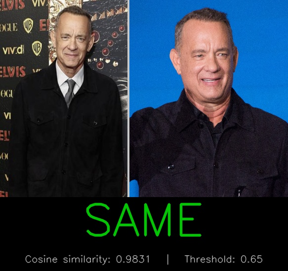

# Person Re-Identification

## Metadata
| Field | Value |
| --- | --- |
| Category | re-identification |
| Difficulty | Intermediate |
| Tags | re-identification, embeddings, similarity, pairwise-comparison |
| Languages | C++, Python |
| Status | experimental |
| Binary Name | person-re-identification |
| Model | reid |

## Preview


## Concept
This example performs pairwise person re-identification by computing embeddings for two input images and comparing them with a selectable metric. It is designed as a minimal synchronous pipeline that focuses on practical runtime behavior: model warmup, deterministic preprocessing, inference, score computation, threshold-based decision, and artifact output.

Both C++ and Python implementations follow the same user-facing flow and produce the same output artifacts (`comparison.jpg` and/or `result.json`). The sample demonstrates how to use Neat for embedding extraction and how to build a lightweight post-processing layer for similarity-based identity matching.

## Supported Models
Also works with: other ReID variants compatible with 128x256 RGB input.

Download the default variant into `assets/models/`:
- `mkdir -p assets/models && cd assets/models && sima-cli modelzoo -v 2.0.0 get reid && cd ../..`

## Prerequisites
- Installed Neat SDK.
- Model artifacts are user-managed and should be downloaded into `assets/models/`.
- Download command: `mkdir -p assets/models && cd assets/models && sima-cli modelzoo -v 2.0.0 get reid && cd ../..`

## Important Behavior
- Runtime inputs are read from `common/config.yaml`.
- Default model path is `assets/models/reid_mpk.tar.gz`.
- Default output directory is `sandbox/person-re-identification`.
- Metric options: `cosine` (default threshold 0.65) or `euclidean` (default threshold 25.0).
- Output artifact mode is configured as `image`, `json`, or `both` (default: `both`).
- One warmup inference is executed before timing/profile reporting.

## Command-Line Options
### C++
- Invocation:
  `./build/examples/re-identification/person-re-identification/person-re-identification [--config <path>]`
- Optional arguments:
  `--config <path>`

### Python
- Invocation:
  `python3 examples/re-identification/person-re-identification/python/main.py [--config <path>]`
- Optional arguments:
  `--config <path>`

## Build
### Build From The Apps Repo
```bash
cd <apps-repo-root>
./build.sh
```

Binary output:
```bash
./build/examples/re-identification/person-re-identification/person-re-identification
```

### Build This Example Directly With CMake
```bash
cd <apps-repo-root>
cmake -S examples/re-identification/person-re-identification/cpp -B build/person-re-identification
cmake --build build/person-re-identification -j
```

Binary output:
```bash
./build/person-re-identification/person-re-identification
```

## Run
### C++
```bash
./build/examples/re-identification/person-re-identification/person-re-identification \
  --config examples/re-identification/person-re-identification/common/config.yaml
```

### Python
```bash
source ~/pyneat/bin/activate
pip install -r examples/re-identification/person-re-identification/python/requirements.txt
python3 examples/re-identification/person-re-identification/python/main.py \
  --config examples/re-identification/person-re-identification/common/config.yaml
```

## Debugging Notes
- Confirm the configured model file exists.
- Confirm both configured input image paths are valid image files.
- Confirm output directory is writable.
- If score/decision seems unexpected, verify metric selection and threshold values.

## Source Files
- C++ source: `cpp/main.cpp`
- C++ tests: `cpp/tests/unit_test.cpp`, `cpp/tests/e2e_test.cpp`
- Python source: `python/main.py`
- Python tests: `python/tests/test_unit.py`, `python/tests/test_e2e.py`
- Shared assets: `common/`
