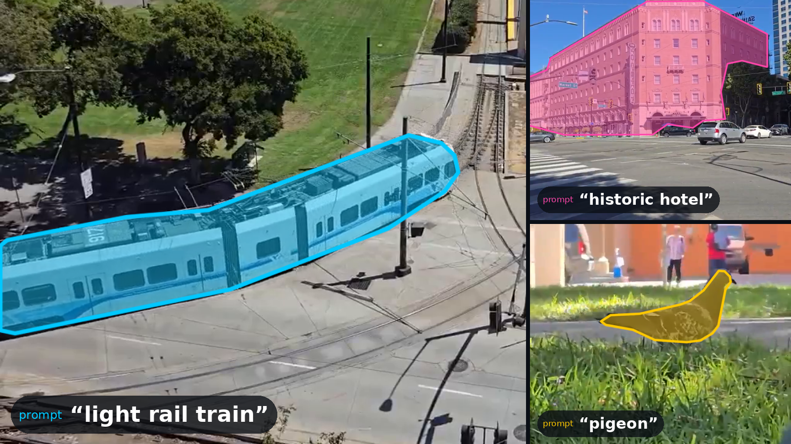

# EfficientSAM3 Promptable Segmenter

## Metadata

| Field | Value |
| --- | --- |
| Category | segmentation |
| Difficulty | Advanced |
| Tags | segmentation, efficientsam3, sam3, promptable-segmentation, open-vocabulary, rtsp, insight |
| Languages | C++, Python |
| Status | stable |
| Binary Name | efficientsam3-promptable-segmenter |
| Model | efficientsam3_rv_e48xt_flash_mpk |

## Concept

Segments whatever a text prompt names, such as a person or a red car, in one RTSP H.264 stream with EfficientSAM3 and sends H.264 video and mask outlines to Insight.

The prompt is any short noun phrase. At startup the application splits it into CLIP tokens and the EfficientSAM3 text encoder turns them into text features, once, on the MLA. The segmentation model then runs on the MLA for every frame it takes, on a 1008x1008 copy of the frame, with the same text features each time.

```
prompt --> CLIP tokens --> text encoder (MLA, once) --> text features --+
                                                                         |
RTSP decode (NV12) --> frame --> 1008x1008 RGB --> EfficientSAM3 (MLA) --> outlines --> metadata
         |                                                                  (JSON UDP -> Insight)
         +--> video_sender (H264 RTP/UDP -> Insight)
```

The decoded stream feeds the H.264 sender and the application inside one graph, so the video and the metadata carry timestamps from the same frame. Three frames are on the model at once, which keeps the MLA busy while the CPU prepares the next frame and reads the last result. The model segments about every second or third video frame, so every video frame is sent the nearest finished result: the overlay shows at the video rate while the masks refresh at the model rate.

Metadata is sent as `type: "segmentation"` with one `data.segments[]` entry per instance, labelled with the prompt and outlined by its largest region. Each mask is sent as `mask_format: "polygon"` in frame pixels.

## Preview



## Prerequisites

- `sima-cli` ([documentation](https://developer.sima.ai/software/tools/sima-cli/)) on a supported Modalix or DevKit target.
- An RTSP H.264 source and an [Insight](https://developer.sima.ai/software/tools/insight/) URL reachable from the target.

## Install Apps

Install the latest Neat Apps runtime and enter the installed bundle:

```bash
sima-cli neat install apps
cd prebuilt-apps
APP_DIR=examples/segmentation/efficientsam3-promptable-segmenter
```

Run the remaining commands from `prebuilt-apps/`.

## Prepare the Model

The application needs two model packages:

| Model package | Role | Source |
| --- | --- | --- |
| `efficientsam3_rv_e48xt_flash_mpk.tar.gz` | Default segmentation model, runs for every segmented frame | Not published yet |
| `efficientsam3_text_encoder_mpk.tar.gz` | Text encoder, runs once at startup | Not published yet |

Neither package can be downloaded yet. Place both under `models/efficientsam3/` and set `model.path` and `model.text_encoder` in the config to them.

## Prepare Insight

[Insight](https://developer.sima.ai/software/tools/insight/) can host the input stream and render segmentation metadata.

In the Insight Web UI, start a stream on `src1`; its source URL is `rtsp://<insight-host-ip>:8554/src1`. From a board, replace `8554` with the published host port that `neat --json` reports. Use a host the target can reach, not `localhost`.

## Configure

Open `${APP_DIR}/src/common/config.yaml`. Set:

- `model.path` and `model.text_encoder` to the two model packages.
- `prompt.text` to what you want to segment, for example `"person"`, `"red car"`, or `"traffic sign"`.
- `source.rtsp_url` to the stream, for example the Insight `src1` stream.
- `output.insight.host`, and the video and metadata ports if Insight uses other ports.

Raise or lower `inference.min_score` to keep fewer or more instances. Set `output.save_dir` and `output.save_every` only if you also want sampled annotated images.

## Run

### C++

```bash
./${APP_DIR}/src/cpp/pre-built/efficientsam3-promptable-segmenter \
  --config ${APP_DIR}/src/common/config.yaml
```

### Python

```bash
source ~/pyneat/bin/activate
pip install -r ${APP_DIR}/src/python/requirements.txt
python3 ${APP_DIR}/src/python/main.py \
  --config ${APP_DIR}/src/common/config.yaml
```

## Expected Result

On startup both applications print the stream and the encoded prompt:

```text
rtsp=rtsp://<insight-host-ip>:8554/src1 stream=<width>x<height>@<fps> prompt='person' tokens=<n> insight=<insight-host-ip> video=9000 metadata=9100 channel=0
```

Open the Insight Video Viewer for channel 0. Instances that match the prompt are outlined and labelled with it. The application runs until Ctrl-C, or until it has segmented `inference.frames` frames when that is positive, and then prints a summary:

```text
processed=<n> video_sender=<insight-host-ip>:9000
```

With `runtime.profile` set, it also prints the segmentation rate every `runtime.profile_interval` segmented frames, about 13 FPS on Modalix:

```text
[profile] frames=100 segmentation_fps=<fps> avg_instances=<n>
```

## Troubleshooting

- Verify `model.path` and `model.text_encoder` if startup fails.
- Verify stream reachability if the first frame times out. From a board, use the published host port instead of the container port.
- Verify the Insight host and UDP ports if no output arrives.
- Lower `inference.min_score` or use a more specific prompt if nothing is outlined.

## Source Files

- C++ reference source: `src/cpp/main.cpp` and the tokenizer `src/cpp/clip_tokenizer.h`
- Python source: `src/python/main.py` and the tokenizer `src/python/clip_tokenizer.py`
- Shared config: `src/common/config.yaml`
- Shared CLIP vocabulary: `src/common/bpe_simple_vocab_16e6.txt.gz`, under the MIT license in `src/common/LICENSE-CLIP.txt`

The packaged C++ source is an implementation reference. Run the executable under `src/cpp/pre-built/`; the installed bundle does not include CMake files.

## Development From Source

To modify, compile, or test this example, use the [Apps contributor workflow](https://github.com/sima-neat/apps/blob/main/CONTRIBUTING.md).
