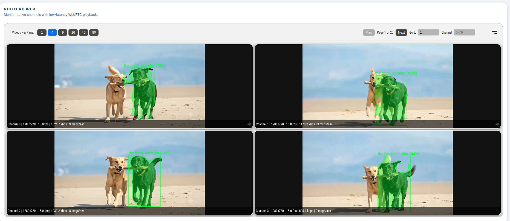

# FastSAM Multistream

## Metadata
| Field | Value |
| --- | --- |
| Category | segmentation |
| Difficulty | Advanced |
| Tags | segmentation, fastsam, mobileclip, clip, text-prompt, multistream, rtsp, insight |
| Languages | C++, Python |
| Status | experimental |
| Binary Name | fastsam-multistream |
| Model | FastSAM-x (+ MobileCLIP2-S0 image/text encoders) |

## Concept
`fastsam-multistream` runs FastSAM with a MobileCLIP **text prompt** across up to four RTSP cameras on
a single Modalix MLA and publishes per-stream video plus `segmentation` polygons to Neat Insight. One
natural-language query (e.g. `"the black labrador"`) is matched and tracked in every stream at once.

The pipeline decouples decode from inference: every stream decodes into a latest-frame mailbox and a
single detector loop serves them all — the pattern used to scale one detector across many streams.

Architecture:
- one decode per stream, `branch`ed to an inference output and an H.264 video sender
- a **drain thread** per stream that keeps only the freshest frame in a latest-frame **mailbox**
- one shared **detector loop**: round-robin the mailboxes → FastSAM → CLIP reselect + IoU track
- shared FastSAM runner + MobileCLIP image tower + crop pool (the MLA serializes execution anyway)
- metadata stamped with each frame's own **PTS**, so Insight overlays land on the matching frame

## Preview
Four RTSP streams in Neat Insight's video viewer, each running FastSAM + MobileCLIP with the prompt
`"the black labrador"` — the matched dog is segmented and tracked in every channel:



## Insight Setup
[Neat Insight](https://developer.sima.ai/software/tools/insight/) can host RTSP sources, receive video
from `VideoSender` and metadata from `MetadataSender`, and render the overlays plus runtime metrics in
the browser.

In the Neat Development Environment, install the sample video assets:

```bash
sima-cli install assets/multi-video-sources
```

This provides 720p and 480p videos that Insight can stream as RTSP sources.

To create reproducible RTSP inputs:
1. Run `neat` in the Neat Development Environment and open the reported `Insight Web UI`.
2. In Insight, open `RTSP Source`.
3. Use sample videos or upload your own videos.
4. Start each stream and copy the RTSP URLs.
5. Put those RTSP URLs into `source.rtsp_urls`.

Use the same `neat` output to set `output.insight.host`, `video_port_base`, and `metadata_port_base`
from the reported `videoUDP` and `metadataUDP` ranges. Stream N uses `video_port_base + N` and
`metadata_port_base + N`.

## Supported Models
This example needs two custom Modalix ports rather than a single modelzoo package:

- **FastSAM-x** — the segmentation model (on-device YOLO26-seg decode).
- **MobileCLIP2-S0** — the image and text encoders that score each mask against the prompt.

These are not distributed through `sima-cli modelzoo`; they are produced by the FastSAM and MobileCLIP
model-preparation pipelines. Store the compiled `_mpk.tar.gz` packages under `assets/models/` (the
repo-local convention) and point `model.path` and `clip.*` at the readable package paths:

```yaml
model:
  path: assets/models/fastsam/FastSAM-x_quant_mpk.tar.gz
clip:
  image_encoder_path: assets/models/mobileclip/MobileCLIP2-S0_image_encoder_reparam_mpk.tar.gz
  text_encoder_path:  assets/models/mobileclip/MobileCLIP2-S0_text_mpk.tar.gz
  text_host_consts:   assets/models/mobileclip/MobileCLIP2-S0_text_host_consts.npz
```

## Prerequisites
- Installed Neat Development Environment + Neat Library.
- One to four reachable RTSP sources created in Insight or provided by your cameras.
- FastSAM-x and MobileCLIP2-S0 compiled for Modalix, referenced from `src/common/config.yaml`.
- For the C++ app, precomputed `[M,512]` text features (see **Text prompt (C++)**).

## Get The Apps Repo
Use the [Neat Development Environment](https://developer.sima.ai/software/getting-started/dev-environment/) with the [Neat Library](https://developer.sima.ai/software/getting-started/neat-library/) installed for setup and compilation.

Clone and build the apps repo inside the Neat Development Environment:

```bash
git clone https://github.com/sima-neat/apps.git
cd apps
./build.sh --clean
```

After building, run the example commands below on the Modalix/DevKit board.

## Configure
Edit `examples/segmentation/fastsam-multistream/src/common/config.yaml`.

```yaml
model:
  path: <fastsam-model-path>                 # FastSAM-x package.

clip:
  image_encoder_path: <clip-image-encoder-path>   # MobileCLIP2-S0 image tower.
  text_encoder_path:  <clip-text-encoder-path>    # MobileCLIP2-S0 text tower (Python prompt encode).
  text_host_consts:   <clip-text-host-consts>     # MobileCLIP2-S0 text host constants.

source:
  rtsp_urls:                                 # 1-4 RTSP stream URLs.
    - <rtsp-url-1>
    - <rtsp-url-2>

runtime:
  max_fps: 25                                # Cap each stream's rate (0 = source rate).
  warmup_frames: 30                          # Skip metadata + profiling for the first N frames per stream.
  profile: true                              # Per-stream + aggregate rolling host-stage timings.

prompt:
  text: "the black labrador"                 # The query matched and tracked across every stream.

output:
  insight:
    host: <insight-host-ip>                  # Host running the Insight receiver/viewer.
    video_port_base: 9000                    # Stream N video    = base + N.
    metadata_port_base: 9100                 # Stream N metadata = base + N.
```

See the comments in `config.yaml` for the CLIP tuning and decode thresholds.

## Run
### C++
The C++ binary takes the config path as a positional argument:

```bash
./build/examples/segmentation/fastsam-multistream/fastsam-multistream \
  examples/segmentation/fastsam-multistream/src/common/config.yaml
```

### Python
```bash
source ~/pyneat/bin/activate
pip install -r examples/segmentation/fastsam-multistream/src/python/requirements.txt
python3 examples/segmentation/fastsam-multistream/src/python/main.py \
  --config examples/segmentation/fastsam-multistream/src/common/config.yaml
```

Stop with `Ctrl+C` (or set `runtime.frames`). At shutdown the app prints per-stream and aggregate
frame rates. Streams degrade independently — a dead source is reported, not fatal to the app.

### Text prompt (C++)
The C++ app reads precomputed `[M,512]` text features instead of running the text tower. Regenerate
them whenever you change `prompt.text` (runs on the board, where pyneat + the MLA are available):

```bash
python3 examples/segmentation/fastsam-multistream/src/tools/precompute_text_features.py \
  examples/segmentation/fastsam-multistream/src/common/config.yaml
# writes clip.text_features_path (default src/common/text_features.npy)
```

## Debugging Notes
- If a stream fails to start, check its `source.rtsp_urls[N]` is reachable and the model paths are readable.
- If Insight shows no video for stream N, verify `output.insight.host` and that `video_port_base + N` is free.
- A high `drops=` in the per-stream profile line means the MLA can't keep up with that stream's rate —
  lower `runtime.max_fps`, raise `clip.interval`, or reduce `clip.max_crops`.
- If overlays trail or lead the video, the PTS sync depends on the decoded frame carrying `pts_ns`.
- Set `runtime.profile: true` for the host-stage breakdown; add `FASTSAM_GST_PROFILE=1` for the
  heavyweight GStreamer element timings (off by default).

## Expectations
FastSAM plus a CLIP encode is far heavier than a plain detector, and all four streams share one MLA,
so throughput is modest — expect roughly **8 fps aggregate at four streams**. The lever for more is
cutting MLA time per frame (fewer `clip.max_crops`, a larger `clip.interval`), not more host threads.
The mailbox makes extra streams degrade gracefully: the detector always works on the freshest frame
and drops the rest (watch `drops=` in the profile line).

## Source Files
- C++ source: `src/cpp/main.cpp`
- C++ pipeline/model helpers: `src/cpp/pipeline.cpp`, `src/cpp/fastsam.cpp`, `src/cpp/config.cpp`
- C++ CLIP retrieval: `src/cpp/clip/image_encoder.cpp`
- C++ tensor helpers: `src/cpp/utils/tensors.cpp`
- Text-feature tool (for the C++ app): `src/tools/precompute_text_features.py`
- Python source: `src/python/main.py`
- Python pipeline/model helpers: `src/python/pipeline.py`, `src/python/fastsam.py`, `src/python/config.py`, `src/python/profiling.py`
- Python CLIP retrieval + text encode: `src/python/clip/` (`image_encoder.py`, `crop_pool.py`, `text_encoder.py`, `tokenizer.py`)
- Shared config: `src/common/config.yaml`
- Precomputed text features (C++ app only): `src/common/text_features.npy`
