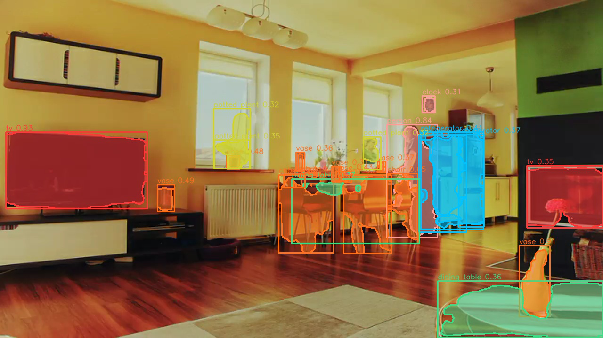

# RF-DETR Stream Instance Segmenter

## Metadata

| Field | Value |
| --- | --- |
| Category | segmentation |
| Difficulty | Advanced |
| Tags | segmentation, rfdetr, instance-segmentation, rtsp, insight |
| Languages | C++, Python |
| Status | stable |
| Binary Name | rfdetr-stream-instance-segmenter |
| Model | rfdetr-seg-432-base |

## Concept

Segments objects in one RTSP H.264 stream with RF-DETR-Seg and sends synchronized H.264 video and mask metadata to Insight.

The model ships as a two-stage split -- an INT8 backbone (MLA) and a BF16 transformer and segmentation head (MLA) -- with a top-k+gather hop between them. Following the same pattern as this repo's RF-DETR object-detection example, the backbone runs embedded in the same async graph as the RTSP decode and the (passthrough) video sender, and a bridge thread does the top-k+gather and feeds the transformer, which runs as a separately-built runner; this overlaps the stages across frames instead of running each one to completion before the next starts. The RTSP source is kept encoded and forwarded to Insight as a true passthrough (no decode-then-re-encode round trip); it is decoded once, separately, for the model.

Metadata is sent as `type: "segmentation"` with one `data.segments[]` entry per instance, the same wire format the other segmentation examples in this category use. Each of the 200 query masks is a 108x108 grid over the model's stretched (non-letterboxed) 432x432 input, so a detection's silhouette is mapped back through that plain per-axis scale, upscaled to the detection rectangle, and only then thresholded. The silhouette is sent as `mask_format: "polygon"` in frame pixels. Each frame stays inside a 32 KB payload budget; over it, the lowest-confidence segments are dropped and counted in the run summary.

## Preview



## Prerequisites

- `sima-cli` ([documentation](https://developer.sima.ai/software/tools/sima-cli/)) on a supported Modalix or DevKit target.
- An RTSP H.264 source and an [Insight](https://developer.sima.ai/software/tools/insight/) URL reachable from the target.

## Install Apps

Install the latest Neat Apps runtime and enter the installed bundle:

```bash
sima-cli neat install apps
cd prebuilt-apps
APP_DIR=examples/segmentation/rfdetr-stream-instance-segmenter
```

Run the remaining commands from `prebuilt-apps/`.

## Prepare the Model

The default model is `rfdetr-seg-432-base`, a two-stage split package (backbone, transformer+seg-head). It is not yet in the Model Zoo, so it ships as a direct artifact.

| Model | Role | Source |
| --- | --- | --- |
| `rfdetr-seg-432-base` | Default | Direct artifact |

```bash
sima-cli download "https://drive.usercontent.google.com/download?id=1jN7igMyQPvRlknuZ5KT9SRA3M9NOTOX5&export=download&confirm=t"
unzip download
```

`sima-cli download` has no output-filename option, so the archive lands as `download` with no extension. `unzip` reads it regardless and creates `models/` holding the stage subfolders: `rfdetr_seg_432_simplified_backbone_before_topk_base_mpk/` and `rfdetr_seg_432_simplified_transformer_after_gather_base_mpk/`. (The archive also contains a `rfdetr_seg_432_simplified_topk_to_gather_base_mpk/` folder from an earlier compiled top-k stage; this example does not use it -- see "Development From Source" for why.)

Set `model.path` in the config to the extracted `models` folder (the one containing the subfolders above), not to the archive itself.

## Prepare Insight

[Insight](https://developer.sima.ai/software/tools/insight/) can host the input stream and render segmentation metadata. Install videos directly from the Insight catalog or through Insight's YouTube support.

In the Insight Web UI, start the required RTSP H.264 stream and copy its source URL. The encoded stream is forwarded to Insight as-is (no decode-then-re-encode round trip).

## Configure

Open `${APP_DIR}/src/common/config.yaml`. Set `model.path`, `source.url`, and the Insight host and video and metadata ports.

Set `output.save_dir` only if you also want sampled annotated images.

## Run

### C++

```bash
./${APP_DIR}/src/cpp/pre-built/rfdetr-stream-instance-segmenter \
  --config ${APP_DIR}/src/common/config.yaml
```

### Python

```bash
source ~/pyneat/bin/activate
pip install -r ${APP_DIR}/src/python/requirements.txt
python3 ${APP_DIR}/src/python/main.py \
  --config ${APP_DIR}/src/common/config.yaml
```

## Troubleshooting

- Verify `model.path` and `source.url` if startup fails.
- Verify stream reachability if the first frame times out.
- Verify the Insight host and UDP ports if no output arrives.
- Set `output.save_dir` and `output.save_every` to save sampled frames.
- Raise `runtime.profile` to see per-stage timings if a stream falls behind.
- Validated sustained on a 1280x720 stream at 20 fps (C++) and 15 fps (Python) with zero dropped
  segments. Pushed further -- 30+ fps in this same setup -- the transformer stage's output pool
  eventually exhausts (`resource.output_pool_exhausted`) because it fills faster than the main loop
  drains it. If your source runs faster than that, lower `source.fps` or reduce `inference.frames`
  per burst rather than feeding the model at the source's native rate.

## Source Files

- C++ reference source: `src/cpp/main.cpp`
- Python source: `src/python/main.py`
- Shared config and labels: `src/common/`

The packaged C++ source is an implementation reference. Run the executable under `src/cpp/pre-built/`; the installed bundle does not include CMake files.

## Development From Source

The model's top-k+gather stage was originally compiled as a separate TVM module; captured device
tensors showed it is bit-exact with a plain stable argsort-by-score + gather, so this example
implements that step directly (in C++ and Python) instead of loading the compiled stage, and never
depends on the TVM runtime.

To modify, compile, or test this example, use the [Apps contributor workflow](https://github.com/sima-neat/apps/blob/main/CONTRIBUTING.md).
