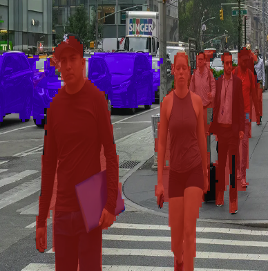

# Semantic Overlay

## Metadata
| Field | Value |
| --- | --- |
| Category | segmentation |
| Difficulty | Intermediate |
| Tags | segmentation |
| Status | experimental |
| Binary Name | semantic-overlay |
| Model | fcn_hrnet48 |

## Concept
Semantic segmentation overlay for image folders using FCN-HRNet output tensors.

## Preview
Snippet from a pipeline run:



## Supported Models
Also works with: `fcn_hrnet18`

Download any variant into `assets/models/`:
- `mkdir -p assets/models && cd assets/models && sima-cli modelzoo -v 2.0.0 get fcn_hrnet48 && cd ../..`

## Prerequisites
- Installed Neat SDK.
- Model artifacts are user-managed and should be downloaded into `assets/models/`.
- Download command: `mkdir -p assets/models && cd assets/models && sima-cli modelzoo -v 2.0.0 get fcn_hrnet48 && cd ../..`

## Important Behavior
- Model path is positional and required.
- Input directory is scanned for image files.
- Output files are segmentation overlays.
- Every pixel receives a class label via per-pixel argmax, but the overlay intentionally leaves class `0`/background untinted so the original image remains visible in background regions.

## Command-Line Options
### C++
- Invocation:
  `./build/examples/segmentation/semantic-overlay/semantic-overlay <model.tar.gz> <input_dir> <output_dir>`
- Required arguments:
  `<model.tar.gz> <input_dir> <output_dir>`
- Optional arguments:
  None.

### Python
- Invocation:
  `python examples/segmentation/semantic-overlay/python/main.py <model.tar.gz> <input_dir> <output_dir>`
- Required arguments:
  `<model.tar.gz> <input_dir> <output_dir>`
- Optional arguments:
  None.

## Build
### Build From The Apps Repo
```bash
cd <apps-repo-root>
./build.sh
```

Binary output:
```bash
./build/examples/segmentation/semantic-overlay/semantic-overlay
```

### Build This Example Directly With CMake
```bash
cd <apps-repo-root>/examples/segmentation/semantic-overlay
cmake -S cpp -B build
cmake --build build -j
```

Binary output:
```bash
./build/semantic-overlay
```

## Run
### C++
```bash
./build/examples/segmentation/semantic-overlay/semantic-overlay \
  assets/models/fcn_hrnet48_mpk.tar.gz <input_dir> <output_dir>
```

### Python
```bash
source ~/pyneat/bin/activate
pip install -r examples/segmentation/semantic-overlay/python/requirements.txt
python examples/segmentation/semantic-overlay/python/main.py \
  assets/models/fcn_hrnet48_mpk.tar.gz <input_dir> <output_dir>
```

## Debugging Notes
- If output is blank, verify label-map parsing and output tensor shape in logs.
- Validate image decode for all files in input folder.
- Ensure output directory is writable.

## Source Files
- C++ source: `cpp/main.cpp`
- Python source: `python/main.py`
