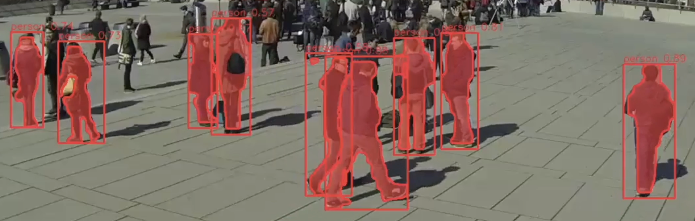

# Single Stream Instance Segmenter

## Metadata

| Field | Value |
| --- | --- |
| Category | segmentation |
| Difficulty | Intermediate |
| Tags | segmentation, yolo26, instance-segmentation, rtsp, insight |
| Languages | C++, Python |
| Status | experimental |
| Binary Name | single-stream-instance-segmenter |
| Model | yolo26m-seg-bf16-b1 |

## Concept

This example ingests one RTSP H.264/MJPEG or HTTP MJPEG stream, runs YOLO26 instance segmentation, renders masks, and sends H.264 video plus segmentation metadata to Insight.

## Preview



## Prerequisites

- `sima-cli` on a supported Modalix or DevKit target.
- An RTSP H.264, RTSP MJPEG, or HTTP MJPEG source.

## Install Apps

1. Choose a version from the [Neat Apps releases](https://github.com/sima-neat/apps/releases).
2. Install that version and enter the installed bundle:

```bash
sima-cli neat install apps@<release-version>
cd prebuilt-apps
```

Run the remaining commands from `prebuilt-apps/`.

## Prepare the Model

| Model file | Role |
| --- | --- |
| `yolo26m-seg-bf16-b1.tar.gz` | Default |
| `yolo26n-seg-bf16-mla_tess.tar.gz` | Supported |
| `yolo26s-seg-bf16-mla_tess.tar.gz` | Supported |
| `yolo26m-seg-bf16-mla_tess.tar.gz` | Supported |
| `yolo26l-seg-bf16-mla_tess.tar.gz` | Supported |
| `yolo26x-seg-bf16-mla_tess.tar.gz` | Supported |
| `yolo26m-seg-bf16-mla_tess-b1.tar.gz` | Supported |
| `yolo26m-seg-int8-b1.tar.gz` | Supported |

The required platform version is recorded in `manifest.json`. Replace `<model-file>` with a file from the table.

```bash
mkdir -p models
cd models
sima-cli download https://docs.sima.ai/pkg_downloads/SDK<platform-version>/models/modalix/yolo26-segmentation/<model-file>
cd ..
```

Set `model.path` in the config to the downloaded package.

## Prepare Insight

Insight can host the input stream and render segmentation metadata. Install its sample video assets when needed:

```bash
sima-cli install assets/multi-video-sources
```

In the Insight Web UI, start a source and copy its RTSP URL. Use the host and UDP port ranges reported by `neat` for the output settings.

## Configure

Edit `examples/segmentation/single-stream-instance-segmenter/src/common/config.yaml`.

```yaml
model:
  path: <model-path>

source:
  type: rtsp
  codec: h264
  url: <rtsp-url>
  tcp: true
  fps: 0

inference:
  frames: 0
  min_score: 0.55

output:
  insight:
    host: <insight-host-ip>
    video_port: <videoUDP-start-port>
    metadata_port: <metadataUDP-start-port>
```

## Run

### C++

```bash
./examples/segmentation/single-stream-instance-segmenter/src/cpp/pre-built/single-stream-instance-segmenter \
  --config examples/segmentation/single-stream-instance-segmenter/src/common/config.yaml
```

### Python

```bash
source ~/pyneat/bin/activate
pip install -r examples/segmentation/single-stream-instance-segmenter/src/python/requirements.txt
python3 examples/segmentation/single-stream-instance-segmenter/src/python/main.py \
  --config examples/segmentation/single-stream-instance-segmenter/src/common/config.yaml
```

## Troubleshooting

- Verify `model.path` and the source URL if startup fails.
- Verify stream reachability if the first frame times out.
- Verify the Insight host and UDP ports if no output arrives.
- Set `output.save_dir` and `output.save_every` to save sampled frames.

## Source Files

- C++ reference source: `src/cpp/main.cpp`
- Python source: `src/python/main.py`
- Shared config and labels: `src/common/`

The packaged C++ source is an implementation reference. Run the executable under `src/cpp/pre-built/`; the installed bundle does not include CMake files.

## Development From Source

To modify, compile, or test this example, use the [Apps contributor workflow](https://github.com/sima-neat/apps/blob/main/CONTRIBUTING.md).
