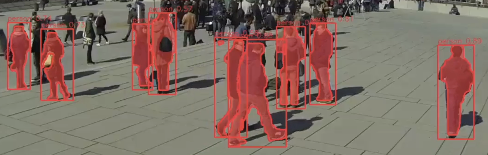

# Single Stream Instance Segmenter

## Metadata

| Field | Value |
| --- | --- |
| Category | segmentation |
| Difficulty | Intermediate |
| Tags | segmentation, yolo26, yolov8, instance-segmentation, rtsp, insight |
| Languages | C++, Python |
| Status | stable |
| Binary Name | single-stream-instance-segmenter |
| Model | yolo26m-seg-bf16-b1 |

## Concept

Segments objects in one RTSP or MJPEG stream with a YOLO26 or YOLOv8 model and sends synchronized H.264 video and mask metadata to Insight.

The decoded frame branches inside a single graph to the segmenter and to the H.264 sender. Both outputs therefore carry timestamps from the same frame, which is what lets Insight draw each mask on the frame it came from. Setting `output.save_dir` adds a third branch that returns the decoded frame to the application so it can write annotated JPEGs.

`model.family` selects the model family. It is configuration, never inferred from the package file name, because the two families reach their results differently. YOLO26 packages decode on the MLA and hand the application finished instances. YOLOv8 packages emit raw detection heads that the application decodes on the host: distribution-focal-loss boxes, per-class probabilities, and prototype masks. Both paths produce the same class IDs, confidence scores, boxes, and instance masks, so configuration, overlays, metadata, and saved frames behave the same whichever family runs.

Metadata is sent as `type: "segmentation"` with one `data.segments[]` entry per instance. Masks arrive on a grid one quarter of the model input per dimension, covering the letterboxed model input rather than the detection box, so each mask is mapped back through that scale and padding, upscaled to the detection rectangle, and only then thresholded. The silhouette is sent as `mask_format: "polygon"` in frame pixels: a polygon keeps the crisp contour the mask has at frame resolution, while run-length encoding would ship a mask crop only a few pixels across and leave Insight to stretch it. Each frame stays inside a 32 KB payload budget; over it, the lowest-confidence segments are dropped and counted in the run summary.

## Preview



## Prerequisites

- `sima-cli` ([documentation](https://developer.sima.ai/software/tools/sima-cli/)) on a supported Modalix or DevKit target.
- An RTSP H.264, RTSP H.265, RTSP MJPEG, or HTTP MJPEG source and an [Insight](https://developer.sima.ai/software/tools/insight/) URL reachable from the target.

## Install Apps

Install the latest Neat Apps runtime and enter the installed bundle:

```bash
sima-cli neat install apps
cd prebuilt-apps
APP_DIR=examples/segmentation/single-stream-instance-segmenter
```

Run the remaining commands from `prebuilt-apps/`.

## Prepare the Model

Model packages come from the Model Zoo release below, which can differ from the installed platform version.

```bash
export MODELZOO_VERSION="2.1.3"
mkdir -p models
cd models
```

### YOLO26 (`model.family: yolo26`)

| Model file | Role |
| --- | --- |
| `yolo26m-seg-bf16-b1.tar.gz` | Default |
| `yolo26n-seg-bf16-mla_tess.tar.gz` | Supported |
| `yolo26s-seg-bf16-mla_tess.tar.gz` | Supported |
| `yolo26m-seg-bf16-mla_tess.tar.gz` | Supported |
| `yolo26l-seg-bf16-mla_tess.tar.gz` | Supported |
| `yolo26x-seg-bf16-mla_tess.tar.gz` | Supported |
| `yolo26m-seg-bf16-mla_tess-b1.tar.gz` | Supported |
| `yolo26m-seg-int8-b1.tar.gz` | Supported |

These packages are direct artifacts. Replace `<model-file>` with a file from the table.

```bash
sima-cli download "https://docs.sima.ai/pkg_downloads/SDK${MODELZOO_VERSION}/models/modalix/yolo26-segmentation/<model-file>"
```

### YOLOv8 (`model.family: yolov8`)

| Model package | Role | Model Zoo name |
| --- | --- | --- |
| `yolo_v8n_seg_mpk.tar.gz` | Default for this family | `yolo_v8n_seg` |
| `yolo_v8s_seg_mpk.tar.gz` | Supported | `yolo_v8s_seg` |
| `yolo_v8m_seg_mpk.tar.gz` | Supported | `yolo_v8m_seg` |
| `yolo_v8l_seg_mpk.tar.gz` | Supported | `yolo_v8l_seg` |

These packages come from the Model Zoo. Replace `<model-name>` with a model from the table.

```bash
sima-cli modelzoo -v "${MODELZOO_VERSION}" get <model-name>
```

Return to the bundle root once the package is downloaded:

```bash
cd ..
```

Set `model.path` to the downloaded package and `model.family` to the family it belongs to. Every model listed above was compiled for a 640x640 input, which is what `model.input_size` expects.

## Prepare Insight

[Insight](https://developer.sima.ai/software/tools/insight/) can host the input stream and render segmentation metadata. Install videos directly from the Insight catalog or through Insight's YouTube support.

In the Insight Web UI, start the required stream and copy its source URL. Use RTSP for H.264 or H.265; for MJPEG, Insight supports both RTSP and HTTP URLs. Set `source.codec` to `h264`/`avc`, `h265`/`hevc`, or `mjpeg`. Decoded frames are encoded as H.264 for Insight output. Use a host and published port that the target can reach, not `localhost` and not an address only Insight's own machine can resolve. Verify the URL from the target before running; the application prints the resolved source and its dimensions on startup.

## Configure

Open `${APP_DIR}/src/common/config.yaml`. Set `model.family`, `model.path`, the source type, codec, and URL, and the Insight host and video and metadata ports.

The source, inference thresholds, and output settings are shared by both families, so switching model family changes only the `model` section. The source supports RTSP H.264, H.265, and MJPEG, plus HTTP MJPEG. Set `output.save_dir` only if you also want sampled annotated images.

## Run

### C++

```bash
./${APP_DIR}/src/cpp/pre-built/single-stream-instance-segmenter \
  --config ${APP_DIR}/src/common/config.yaml
```

### Python

```bash
source ~/pyneat/bin/activate
pip install -r ${APP_DIR}/src/python/requirements.txt
python3 ${APP_DIR}/src/python/main.py \
  --config ${APP_DIR}/src/common/config.yaml
```

## Expected Result

Startup prints the resolved source, model family, stream geometry, and Insight ports, for example:

```text
source=rtsp://192.0.2.10:8554/stream type=rtsp codec=h264 model=yolo26 stream=1920x1080@30 insight=192.0.2.20 video=9000 metadata=9100 channel=0
```

Insight then shows the live stream with one colored mask and label per detected instance.

The application prints a count when the frame limit is reached:

```text
processed=200 dropped_segments=0 saved=0 unpaired=0 video_sender=<insight-host>:9000
```

The packaged config ships `inference.frames: 0`, which runs continuously. The
closing line prints only when a finite limit is reached, and interrupting the
run with Ctrl-C skips it. For a bounded check that ends by itself, set a
positive limit first:

```yaml
inference:
  frames: 200
```

Left at `0`, the live Insight stream is the success signal instead.
`dropped_segments` counts segments the pipeline discarded and should stay at or
near `0`. To confirm masks without watching Insight, set `output.save_dir` to a
directory and `output.save_every` to a non-zero interval; the application then
writes annotated frames there as it runs, and `saved` counts them.

## Troubleshooting

- Verify `model.path` and the source URL if startup fails.
- Verify that `model.family` matches the downloaded package if decoding fails or reports unexpected head shapes.
- Verify stream reachability if the first frame times out.
- Verify the Insight host and UDP ports if no output arrives.
- Set `output.save_dir` and `output.save_every` to save sampled frames.

## Source Files

- C++ reference source: `src/cpp/main.cpp`
- Python source: `src/python/main.py`
- Shared config and labels: `src/common/`

The packaged C++ source is an implementation reference. Run the executable under `src/cpp/pre-built/`; the installed bundle does not include CMake files.

## Development From Source

To modify, compile, or test this example, use the [Apps contributor workflow](https://github.com/sima-neat/apps/blob/main/CONTRIBUTING.md).
