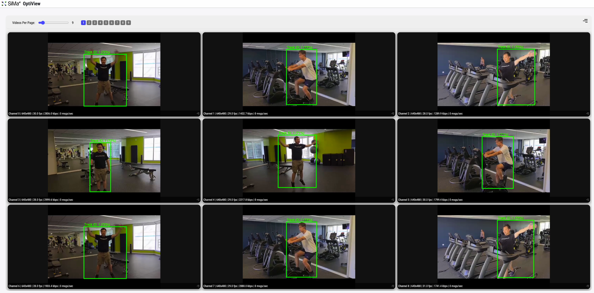

# Performant Multi-Camera People Detection, Tracking, and OptiView Rendering

## Metadata
| Field | Value |
| --- | --- |
| Category | tracking |
| Difficulty | Intermediate |
| Tags | object-detection, rtsp, tracking, optiview |
| Languages | C++, Python |
| Status | experimental |
| Binary Name | multi-camera-people-detection-and-tracking-optiview |
| Model | yolo_v8m |

## Concept
Multi-camera people detection and tracking example with RTSP inputs,
mixed-resolution support, per-stream worker threads, OptiView live video plus
JSON metadata output, and optional sampled overlay saves.

Both the Python and C++ entrypoints keep the detector graph explicit rather than
hiding it behind a single `model.run(...)` call:

`RTSP decode -> CPU letterbox/normalize -> QuantTess -> MLA -> SimaBoxDecode -> tracker -> clean H264/OptiView + tracked JSON`

Each RTSP stream gets its own source, detection, tracker, encoder, and OptiView
publisher runtime so
native stream resolution can be preserved per camera.

Demo screenshot from a live run:



## Supported Models
Also works with: `yolo_v8n`, `yolo_v8s`, `yolo_v8l`, `yolo_v8x`

Download any variant into `assets/models/`:

```bash
mkdir -p assets/models
cd assets/models
sima-cli modelzoo get object_detection/yolo_v8n
sima-cli modelzoo get object_detection/yolo_v8s
sima-cli modelzoo get object_detection/yolo_v8m
sima-cli modelzoo get object_detection/yolo_v8l
sima-cli modelzoo get object_detection/yolo_v8x
cd ../..
```

## Prerequisites
- A NEAT Python environment with `pyneat`, `numpy`, and OpenCV available.
- One or more reachable RTSP camera URLs.
- A YOLOv8 detector model pack downloaded into `assets/models/`.
- An OptiView viewer instance reachable from the board/host running this example.

## Important Behavior
- The Python and C++ implementations follow the same config-driven structure: config loading, pipeline builders, tracker helpers, image helpers, sample helpers, and worker orchestration.
- The `streams:` list in `common/config.yaml` controls the number of cameras dynamically.
- The checked-in `common/config.yaml` uses placeholder RTSP and OptiView values; fill them with your own camera URLs and receiver host before running.
- Stream `i` publishes clean video to `output.optiview.video_port_base + i` and tracked JSON to `output.optiview.json_port_base + i`.
- `inference.frames: 0` runs indefinitely.
- `output.debug_dir: null` and `output.save_every: 0` disable saved overlay frames while keeping live OptiView output enabled.
- `inference.detection_threshold`, `inference.nms_iou_threshold`, and `inference.top_k` are optional; if omitted, `SimaBoxDecode` keeps the model-pack defaults.
- The example defaults to person class id `0`, and tracker behavior is configurable from the config file.

## Command-Line Options
### C++
- Invocation:
  ```bash
  ./build/examples/tracking/multi-camera-people-detection-and-tracking-optiview/multi-camera-people-detection-and-tracking-optiview \
    --config examples/tracking/multi-camera-people-detection-and-tracking-optiview/common/config.yaml
  ```
- Required arguments:
  None.
- Optional arguments:
  `--config <path>` to load a different YAML configuration file.

### Python
- Invocation:
  ```bash
  python3 examples/tracking/multi-camera-people-detection-and-tracking-optiview/python/main.py \
    --config examples/tracking/multi-camera-people-detection-and-tracking-optiview/common/config.yaml
  ```
- Required arguments:
  None.
- Optional arguments:
  `--config <path>` to load a different YAML configuration file.

## Build
### Build From The Apps Repo
```bash
cd <apps-repo-root>
./build.sh
```

Binary output:
```bash
./build/examples/tracking/multi-camera-people-detection-and-tracking-optiview/multi-camera-people-detection-and-tracking-optiview
```

### Build This Example Directly With CMake
```bash
cd <apps-repo-root>
cmake -S examples/tracking/multi-camera-people-detection-and-tracking-optiview/cpp -B build/multi-camera-people-detection-and-tracking-optiview
cmake --build build/multi-camera-people-detection-and-tracking-optiview -j
```

Binary output:
```bash
./build/multi-camera-people-detection-and-tracking-optiview/multi-camera-people-detection-and-tracking-optiview
```

## Run
Before running either entrypoint, edit `examples/tracking/multi-camera-people-detection-and-tracking-optiview/common/config.yaml` and replace the placeholder values in:

- `streams`
- `output.optiview.host`

### C++
```bash
./build/examples/tracking/multi-camera-people-detection-and-tracking-optiview/multi-camera-people-detection-and-tracking-optiview \
  --config examples/tracking/multi-camera-people-detection-and-tracking-optiview/common/config.yaml
```

The C++ binary follows the same config contract and worker topology as the Python example.

### Python
Install the small Python-side dependencies:

```bash
source ~/pyneat/bin/activate
pip install -r examples/tracking/multi-camera-people-detection-and-tracking-optiview/python/requirements.txt
```

Edit the example config in `common/config.yaml`, especially the placeholder values in:

- `streams`
- `output.optiview.host`

The `streams:` list controls the number of cameras dynamically.

Run the Python example with that config:

```bash
python3 examples/tracking/multi-camera-people-detection-and-tracking-optiview/python/main.py \
  --config examples/tracking/multi-camera-people-detection-and-tracking-optiview/common/config.yaml
```

Notes:

- stream `i` publishes clean video to `output.optiview.video_port_base + i` and tracked JSON to
  `output.optiview.json_port_base + i`
- the default config runs indefinitely and does not save frames because
  `output.debug_dir` is `null` and `output.save_every` is `0`
- set `inference.frames` for a bounded smoke run
- set `output.debug_dir` and `output.save_every` if you want sampled overlay frames
  written under `stream_<index>/`; the live OptiView video stays clean
- if the app runs on a DevKit, set `output.optiview.host` to the OptiView host IP,
  not `127.0.0.1`
- `pyneat.Model(...)` is still used, but as the model-pack contract source for
  the explicit `QuantTess -> MLA -> SimaBoxDecode` session, not as a black-box
  one-call inference path
- the example uses CPU-side OpenCV letterbox + normalize on A65 and feeds the
  detector through the model's tensor-input `QuantTess` contract
- live metadata is emitted separately from video in OptiView JSON format, with
  one channel per stream

## Debugging Notes
- Start with one RTSP stream and confirm the config before scaling to multiple cameras.
- Confirm the model file exists under `assets/models/`.
- Confirm each RTSP URL is reachable from the board or host running the example.
- If OptiView appears idle, verify `output.optiview.host`, `video_port_base`, and `json_port_base`.
- If you want saved overlay frames, set both `output.debug_dir` and `output.save_every`.

## Source Files
- C++ source: `cpp/main.cpp`
- C++ config loader: `cpp/utils/config_api.cpp`, `cpp/utils/config.cpp`
- C++ tracker helpers: `cpp/utils/tracker_api.cpp`, `cpp/utils/tracker.cpp`
- C++ sample helpers: `cpp/utils/sample_utils_api.cpp`, `cpp/utils/sample_utils.cpp`
- C++ pipeline builders: `cpp/utils/pipeline_api.cpp`, `cpp/utils/pipeline.cpp`
- C++ image helpers: `cpp/utils/image_utils_api.cpp`, `cpp/utils/image_utils.cpp`
- C++ worker orchestration: `cpp/utils/workers_api.cpp`, `cpp/utils/workers.cpp`
- C++ tests: `cpp/tests/unit_test.cpp`, `cpp/tests/e2e_test.cpp`
- Python source: `python/main.py`
- Example config: `common/config.yaml`
- Python utilities: `python/utils/`
- Python tests: `python/tests/test_config.py`, `python/tests/test_main.py`, `python/tests/test_e2e.py`
- Python pipeline tests: `python/tests/test_pipeline.py`, `python/tests/test_workers.py`, `python/tests/test_tracker.py`, `python/tests/test_sample_utils.py`, `python/tests/test_image_utils.py`
- Shared example data: `common/`
