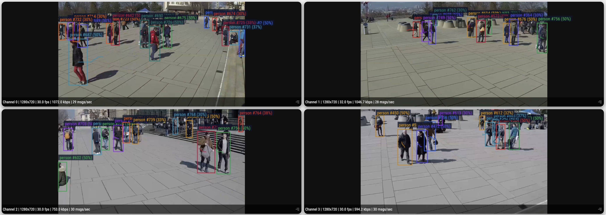

# Multi-Stream People Tracker

## Metadata
| Field | Value |
| --- | --- |
| Category | tracking |
| Difficulty | Advanced |
| Tags | object-detection, yolo26, rtsp, multistream, insight, people-tracking |
| Languages | C++, Python |
| Status | experimental |
| Binary Name | multi-stream-people-tracker |
| Model | yolo26m-det-int8-b1 |

## Concept
Multi-stream people tracking example with RTSP inputs, mixed-resolution support, Insight live video plus metadata output, and optional sampled overlay saves. The pipeline filters detector output to the configured person class and assigns stable track IDs per stream.

## Preview
Preview image from a live run:



## Insight Setup
[Neat Insight](https://developer.sima.ai/software/tools/insight/) can host RTSP streams, receive video from `VideoSender`, receive tracking metadata from `MetadataSender`, and show rendered overlays plus runtime metrics in the browser.

In the Neat Development Environment, install the sample video assets:

```bash
sima-cli install assets/multi-video-sources
```

This provides 720p and 480p videos that Insight can stream as RTSP sources.

To create reproducible RTSP inputs:
1. Run `neat` in the Neat Development Environment and open the reported `Insight Web UI`.
2. In Insight, open `RTSP Source`.
3. Use sample videos or upload your own videos.
4. Start each stream and copy the RTSP URLs.
5. Put those RTSP URLs into `streams`.

Use the same `neat` output to set `output.insight.host`, `video_port_base`, and `metadata_port_base` from the reported `videoUDP` and `metadataUDP` ranges.

## Supported Models
Use the SDK platform version wherever `<platform-version>` appears.

Default model: `yolo26m-det-int8-b1.tar.gz`.

Download the default model:

```bash
mkdir -p assets/models
cd assets/models

sima-cli download https://docs.sima.ai/pkg_downloads/SDK<platform-version>/models/modalix/yolo26-detection/yolo26m-det-int8-b1.tar.gz

cd ../..
```

The command stores the model under `assets/models/` as a repo-local convention. `model.path` can point to any readable model package path.

## Prerequisites
- Installed Neat Development Environment + Neat Library.
- A Neat Library Python environment with `pyneat`, `numpy`, and OpenCV available.
- RTSP sources created in Insight or provided by your cameras.
- Model artifacts are user-managed and should be downloaded into `assets/models/`. Download the default YOLO26 detector model, or set `model.path` to another readable model package.
- An Insight viewer instance reachable from the board/host running this example.

## Get The Apps Repo
Use the [Neat Development Environment](https://developer.sima.ai/software/getting-started/dev-environment/) with the [Neat Library](https://developer.sima.ai/software/getting-started/neat-library/) installed for setup and compilation.

Clone and build the apps repo inside the Neat Development Environment:

```bash
git clone https://github.com/sima-neat/apps.git
cd apps
./build.sh --clean
```

After building, run the example commands below on the Modalix/DevKit board.

## Configure
Edit `examples/tracking/multi-stream-people-tracker/src/common/config.yaml`.

```yaml
model:
  path: <model-path>                                   # Path to the model package.

streams:
  - <first-rtsp-url-copied-from-insight>               # First RTSP stream.
  - <second-rtsp-url-copied-from-insight>              # Second RTSP stream.

inference:
  frames: 0                                            # Frame limit per stream. 0 runs continuously.
  max_inflight_per_stream: 4                           # Raw frames admitted per stream to the detector.
  max_inflight_total: 16                               # Raw frames admitted across detector streams.
  min_score: 0.30                                      # Minimum person confidence.

tracking:
  max_missing_frames: 15                               # Frames to keep a missing track alive.

output:
  insight:
    host: <insight-host-ip>                            # Host running Insight.
    video_port_base: <videoUDP start port from neat>   # First UDP video port.
    metadata_port_base: <metadataUDP start port from neat> # First UDP metadata port.
```

## Run
### C++
```bash
./build/examples/tracking/multi-stream-people-tracker/multi-stream-people-tracker \
  --config examples/tracking/multi-stream-people-tracker/src/common/config.yaml
```

### Python
```bash
source ~/pyneat/bin/activate
pip install -r examples/tracking/multi-stream-people-tracker/src/python/requirements.txt
python3 examples/tracking/multi-stream-people-tracker/src/python/main.py \
  --config examples/tracking/multi-stream-people-tracker/src/common/config.yaml
```

## Debugging Notes
- Start with one RTSP stream and confirm the config before scaling to multiple cameras.
- Confirm `model.path` points to a readable model package.
- Confirm each RTSP URL is reachable from the board or host running the example.
- `max_inflight_per_stream` and `max_inflight_total` tune raw decoder-backed frame admission at the shared detector fan-in. Set either to `-1` to use Core defaults.
- If Insight appears idle, verify `output.insight.host`, `video_port_base`, and `metadata_port_base`.
- If you want saved overlay frames, set both `output.debug_dir` and `output.save_every`.

## Appendix: Additional Models
Other supported batch-1 YOLO26 detection models:
- `yolo26n-det-bf16-mla_tess-b1.tar.gz`
- `yolo26s-det-bf16-mla_tess-b1.tar.gz`
- `yolo26m-det-bf16-mla_tess-b1.tar.gz`
- `yolo26l-det-bf16-mla_tess-b1.tar.gz`
- `yolo26x-det-bf16-mla_tess-b1.tar.gz`
- `yolo26m-det-bf16-b1.tar.gz`

Replace the default filename in the download command and `model.path`.

## Source Files
- C++ source: `src/cpp/main.cpp`
- C++ tracker helpers: `src/cpp/utils/tracker_api.cpp`, `src/cpp/utils/tracker.cpp`
- C++ tests: `tests/cpp/test_unit.cpp`, `tests/cpp/test_e2e.cpp`
- Python source: `src/python/main.py`
- Python tracker helpers: `src/python/utils/tracker.py`
- Example config: `src/common/config.yaml`
- Python tests: `tests/python/test_unit.py`, `tests/python/test_e2e.py`
- Shared example data: `src/common/`
