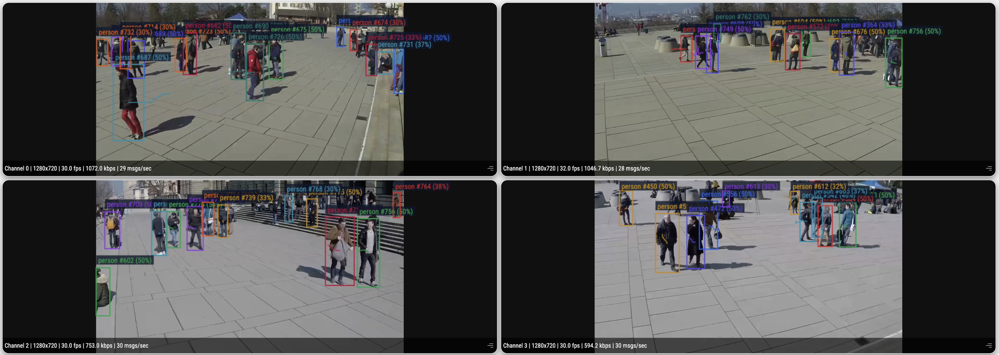

# Multi-Stream People Tracker

## Metadata

| Field | Value |
| --- | --- |
| Category | tracking |
| Difficulty | Advanced |
| Tags | object-detection, yolo26, rtsp, multistream, insight, people-tracking |
| Languages | C++, Python |
| Status | stable |
| Binary Name | multi-stream-people-tracker |
| Model | yolo26m-det-int8-b1 |

## Concept

Tracks people across multiple RTSP streams with YOLO26, assigns a stable ID to each person, and sends live video and tracking metadata to Insight.

## Preview



## Prerequisites

- `sima-cli` ([documentation](https://developer.sima.ai/software/tools/sima-cli/)) on a supported Modalix or DevKit target.
- H.264 or H.265 RTSP sources matching `input.codec`, and an [Insight](https://developer.sima.ai/software/tools/insight/) URL reachable from the target.
- For H.265, the computer running the Insight viewer must support hardware HEVC decoding; Chromium does not provide a software decoder fallback for WebRTC H.265.

## Install Apps

Install the latest Neat Apps runtime and enter the installed bundle:

```bash
sima-cli neat install apps
cd prebuilt-apps
APP_DIR=examples/tracking/multi-stream-people-tracker
```

Run the remaining commands from `prebuilt-apps/`.

## Prepare the Model

| Model file | Role |
| --- | --- |
| `yolo26m-det-int8-b1.tar.gz` | Default |
| `yolo26n-det-bf16-mla_tess-b1.tar.gz` | Supported |
| `yolo26s-det-bf16-mla_tess-b1.tar.gz` | Supported |
| `yolo26m-det-bf16-mla_tess-b1.tar.gz` | Supported |
| `yolo26l-det-bf16-mla_tess-b1.tar.gz` | Supported |
| `yolo26x-det-bf16-mla_tess-b1.tar.gz` | Supported |
| `yolo26m-det-bf16-b1.tar.gz` | Supported |

This model comes from the direct SDK artifact release below, which can differ from the installed platform version. Replace `<model-file>` with a file from the table.

```bash
export MODELZOO_VERSION="2.1.3"
mkdir -p models
cd models
sima-cli download "https://docs.sima.ai/pkg_downloads/SDK${MODELZOO_VERSION}/models/modalix/yolo26-detection/<model-file>"
cd ..
```

Set `model.path` in the config to the downloaded package.

## Prepare Insight

[Insight](https://developer.sima.ai/software/tools/insight/) can host the input streams and render tracking metadata. Install videos directly from the Insight catalog or through Insight's YouTube support.

In the Insight Web UI, start the required streams and copy their RTSP URLs into `streams`. Use the host and UDP port ranges reported by `neat` for the output settings. Use a host and published port that the target can reach, not `localhost` and not an address only Insight's own machine can resolve. Verify the URL from the target before running; the application prints the resolved source and its dimensions on startup.

## Configure

Open `${APP_DIR}/src/common/config.yaml`. Set `model.path`, add each RTSP URL under `streams`, and set the Insight host and starting video and metadata ports. Set `input.codec` to match the streams.

The checked-in inference and tracking values are ready for a first run. Change `tracking.max_missing_frames` only if tracks disappear too quickly or linger too long.

## Run

### C++

```bash
./${APP_DIR}/src/cpp/pre-built/multi-stream-people-tracker \
  --config ${APP_DIR}/src/common/config.yaml
```

### Python

```bash
source ~/pyneat/bin/activate
pip install -r ${APP_DIR}/src/python/requirements.txt
python3 ${APP_DIR}/src/python/main.py \
  --config ${APP_DIR}/src/common/config.yaml
```

## Expected Result

Each stream reports its own progress while the run is in flight, once
`runtime.warmup_frames` has passed, and a processed count for every stream when
the run ends:

```text
[profile stream=0] frames=100 output_fps=27.457433020280778 avg_detection_pull_ms=0.2998168100975454 avg_tracker_ms=0.04532290995121002 avg_metadata_send_ms=0.2007424901984632 avg_tracks=0.08
[stream 0] processed=150
```

Every configured stream should appear in both. Unlike the single-stream examples,
both implementations here still print the closing counts on Ctrl-C.

The two implementations format these numbers differently: Python prints the full
float, the C++ binary prints at the default stream precision of six significant
digits. Compare the magnitudes rather than the digits.

`avg_tracks` is the mean number of active person tracks per processed frame, so
it follows the footage rather than the health of the run. Across four sources in
one run it read `0.08` on a street scene, `2.09` on a clip of a single person,
and `0` on two highway feeds that carry vehicles but almost no pedestrians. A
stream reporting `avg_tracks=0` is therefore only meaningful if you know people
are in that source; a stream that never reports frames at all is the real signal
to chase.

## Troubleshooting

- Start with one stream before scaling to multiple inputs.
- Verify `model.path`, every RTSP URL, and the Insight port ranges.
- Set either inflight limit to `-1` to use the Core default.
- Use `output.debug_dir` and `output.save_every` to save sampled overlays.

## Source Files

- C++ reference source: `src/cpp/main.cpp`
- C++ tracker helpers: `src/cpp/utils/`
- Python source: `src/python/main.py`
- Python tracker helpers: `src/python/utils/`
- Shared runtime files: `src/common/`

The packaged C++ source is an implementation reference. Run the executable under `src/cpp/pre-built/`; the installed bundle does not include CMake files.

## Development From Source

To modify, compile, or test this example, use the [Apps contributor workflow](https://github.com/sima-neat/apps/blob/main/CONTRIBUTING.md).
